> GHMiter huge in batch

> Wijzigingen in table-meta

> \<Solver\> in batch mogelijk

> \<SBS-output\>

> \<Rounder extensions\>

> SPSS system files

> Nog verwijzingen naar het handboek

> Revision overview

> December 2019

-   All batch file issues from release notes version 4.1.7 have been
    > included

-   Some errors on the solver issues have been corrected.

-   Obsolete neon server has been replaced by research.cbs

-   The story of frozen cells in the Hypercube has been suppressed as it
    > is no longer displayed. Needs nevertheless attention. Old text has
    > been made hidden now.

-   All screen shots have been updated, except the SPSS_story.

> τ

> []{#anchor}ARGUS

> {width="14.637cm"
> height="10.663cm"}[]{#anchor-1}Version 4.1 (revised)

> User's Manual

+----------------------------------+----------------------------------+
| > Project: Argus Open            | > Statistics Netherlands, P.O.   |
| > Source-project                 | > Box 24500                      |
+----------------------------------+----------------------------------+
| > Date: January 2020             | > 2490 HA The Hague, The         |
|                                  | > Netherlands                    |
+----------------------------------+----------------------------------+
|                                  | > email:                         |
|                                  | > [**argu                        |
|                                  | s@cbs.nl**](mailto:argus@cbs.nl) |
+----------------------------------+----------------------------------+

+------------------+--------------------------------------------------+
| > Contributors:  | > Peter-Paul de Wolf (Modular), Anco Hundepool,  |
|                  | > Sarah Giessing (ghmiter, audit), Juan-José     |
|                  | > Salazar (Optimisation methods), Jordi Castro   |
|                  | > (Network solutions, CTA)                       |
+------------------+--------------------------------------------------+

> Contents

# []{#anchor-2}[]{#anchor-3}[]{#anchor-4}Introduction

## []{#anchor-5}Preface

> This is the user\'s manual for τ-argus version 4.1. τ-argus is a
> software tool designed to assist a data protector in producing safe
> tables. This manual describes the first Open Source version of
> τ-argus. After a long history of development at Statistics Netherlands
> (CBS) as closed software, CBS has decided to convert τ-argus towards
> Open Source. This process coincides with the formal retirement of the
> main developer, Anco Hundepool. With the financial support of Eurostat
> we have been able to do this transformation and we hope that the
> future of τ-argus is secured. The main aim of this transition project
> was to port the current (version 3.5) of τ-argus to an open
> environment. So this version 4.1 does not contain many new extensions.
> The whole user-interface has been rewritten in java, replacing the old
> Visual Basic version. The aim of this transition is to be in an open
> environment and also be platform independent. So also a unix version
> is possible now.

> Nevertheless with respect to the previous release of τ-argus we have
> made a few steps forward, and τ-argus now has facilities to protect
> tables via Controlled Tabular Adjustment (CTA). These routines for
> this have been developed by Jordi Castro of the Polytechnic University
> of Catalonia.

> We have also added the option to use a free open solver (soplex) in
> addition to the classical commercial solvers like cplex and Xpress.
> However we expect that these commercial solvers are still very much
> needed, when we want to protect large serious tables.

> The purpose of τ-argus is to protect tables against the risk of
> disclosure, i.e. the accidental or deliberate disclosure of
> information related to individuals from a statistical table. This is
> achieved by modifying the table so that it contains less detailed
> information. τ-argus allows for several modifications of a table: a
> table can be redesigned, meaning that rows and columns can be
> combined; sensitive cells can be suppressed and additional cells to
> protect these can be found in some optimum way (secondary cell
> suppression). Also rounding and CTA can be used to protect sensitive
> tables.

> The purpose of the present manual is to give a potential user enough
> information so that he can understand the general principles on which
> τ-argus is based, and also allow him to use the package. So it
> contains both general background information and detailed program
> information. For a more in-depth theoretical background we refer to
> the handbook "[Statistical Disclosure
> Control](http://eu.wiley.com/WileyCDA/WileyTitle/productCd-1119978157.html)"
> by Anco Hundepool, Josep Domingo-Ferrer, Luisa Franconi, Sarah
> Giessing, Eric Schulte Nordholt, Keith Spicer and Peter-Paul de Wolf
> (ISBN: 978-1-119-97815-2, Wiley, 2012).

> τ-argus is one of a twin set of disclosure control packages. For the
> protection of microdata - μ-argus - has been developed, which is the
> twin brother of τ-argus.^[^1]^ Also μ-argus has been ported to Open
> Source.

## []{#anchor-6}About the name ARGUS

> Somewhat jokingly the name argus can be interpreted as the acronym of
> 'Anti-Re-identification General Utility System'^[^2]^. As a matter of
> fact, the name argus was inspired by a myth of the ancient Greeks. In
> this myth Zeus has a girl friend named Io. Hera, Zeus' wife, did not
> approve of this relationship and turned Io into a cow. She let the
> monster argus guard Io. argus seemed to be particularly well qualified
> for this job, because it had a hundred eyes that could watch over Io.
> If it would fall asleep only two of its eyes were closed. That would
> leave plenty of eyes to watch Io. Zeus was eager to find a way to get
> Io back. He hired Hermes who could make argus fall asleep by the
> enchanting music on his flute. When Hermes played his flute to argus
> this indeed happened: all its eyes closed, one by one. When Hermes had
> succeeded in making argus fall asleep, argus was decapitated. argus'
> eyes were planted onto a bird's tail - a type of bird that we now know
> under the name of peacock. That explains why a peacock has these
> eye-shaped marks on its tail. This also explains the picture on the
> cover of this manual. It is a copperplate engraving of Gerard de
> Lairesse (1641-1711) depicting the process where the eyes of argus are
> being removed and placed on the peacock's tail.^[^3]^

> Like the mythological argus, the software is supposed to guard
> something, in this case data. This is where the similarity between the
> myth and the package is supposed to end, as we believe that the
> package is a winner and not a loser as the mythological argus is.

## []{#anchor-7}Contact

> Feedback from users will help improve future versions of τ-argus and
> is therefore greatly appreciated. The authors of this manual can be
> contacted directly for suggestions that may lead to improved versions
> of τ-argus in writing or otherwise; e-mail messages can also be sent
> to [*argus@cbs.nl*](mailto:argus@cbs.nl).

## []{#anchor-8}Open Source

> In the open source world the responsibility for the software is
> different. The idea behind open source is that the software code is no
> longer owned by one institute (Statistics Netherlands), but the source
> is available for anybody. Anybody can also contribute to the code and
> make his own extensions. Nevertheless we do not want to have many
> different versions of the software and many diversions.

> Therefore there will always be one official version of τ-argus. In
> order to achieve this we need a body to make decisions about further
> developments and extensions for the official τ-argus. This
> responsibility will be in the hands of a small committee. This
> committee will be a sub-group of the Eurostat technical working group
> on Statistical Confidentiality. They will make decisions on whether a
> new extension/correction will be allowed in the official versions of
> τ-argus, and also make recommendations for future extensions.

> Nevertheless the above mentioned email address
> ([**argus@cbs.nl**](mailto:argus@cbs.nl)) will remain open for
> questions.

## []{#anchor-9}[]{#anchor-10}Acknowledgments 

> τ-argus was started as part of the EU 4^th^ framework SDC-project and
> became a mature software tool as part of the CASC project that was
> partly sponsored by the EU under contract number IST-2000-25069. This
> support is highly appreciated. The CASC (Computational Aspects of
> Statistical Confidentiality) project is part of the Fifth Framework of
> the European Union. The main part of τ-argus has been developed at
> Statistics Netherlands by Aad van de Wetering and Ramya Ramaswamy (who
> wrote the kernel) and Anco Hundepool (who wrote the interface).
> However this software would not have been possible without the
> contributions of several others, both partners in the CASC-project and
> outsiders. Recent extensions of τ-argus have been made possible during
> the European CENEX-SDC-project (grant agreement
> 25200.2005.001-2005.619), the ESSNet-SDC project (grant agreement
> 25200.2005.003-2007.670.) and the ESSnet SDC harmonisation
> (61102.2010.004-2010.579).

> The Open Source transition was supported by a Eurostat grant
> (61102.2012.001-2012.102).

> The German partners ****Statistisches Bundesamt (Sarah Giessing and
> Dietz Repsilber) have contributed the ****ghmiter**** software, which
> offers a solution for secondary cell suppression based on hypercubes.
> Peter-Paul de Wolf has built a ****search algorithm based on
> non-hierarchical optimal solutions. This algorithm breaks down a large
> hierarchical table into small non-hierarchical subtables, which are
> then individually protected. A team led by JJ Salazar of the
> University La Laguna Tenerif****e, Spain, has developed the
> optimisation routines. Additionally Jordi Castro, Universitat
> Politècnica de Catalunya. Barcelona, has developed a solution based on
> networks. Jordi Castro also developed the CTA solution.****

> ****The controlled rounding procedure has been developed by JJ
> Sala****zar in a project sponsored by ONS. In order to enhance the
> usability τ-****argus**** now also can handle SPSS-system files. For
> using τ-****argus**** in combination with SAS, several reports have
> been produced during the ESSnet projects. These reports and also the
> SAS-tools are available from the CASC/ESSNet website.****

> ****The audit routine was first developed by Karl Luhn of the
> University of ****Ilmenau and further developed by Destatis.

> For solving these optimisation problems, τ-argus traditionally uses
> commercial LP-solvers. Traditionally we use Xpress as an LP-solver.
> This package is kindly made available for users of τ-argus in a
> special agreement between the τ-argus-team and FICO, the developers of
> Xpress. Alternatively τ-argus can also use the cplex-package. Users
> can choose either solver to link to τ-argus (provided, of course, they
> purchase a license for the solver chosen). However users already
> having a licence for one of these packages for other applications can
> use their current licence for τ-argus as well.

> Starting with this Open Source version also free and open solver
> (Soplex) can now be used to solve the optimisation models behind Cell
> Suppression, rounding and CTA.

## []{#anchor-11}Latest improvements

> The latest extensions in version 4.1 of τ‑argus are :

-   New structure of the interface, making the table itself the central
    > window.

-   Controlled Tabular Adjustment.

-   Rewritten Open Source Code in JAVA.

-   C++ dlls for data manipulation and the modular approach have been
    > adapted for the Open Source compilers.

-   The use of free Open Solvers complementary to the commercial
    > solvers.

## []{#anchor-12}The structure of this manual

> The remaining part of this manual consists of four chapters and an
> index.

> In Chapter [2](#anchor-13) we will give a short introduction to the
> theory and methodology. However for a more fundamental description we
> refer to the Wiley handbook on Statistical Disclosure Control^[^4]^.
> This handbook is the result of the joined work of the SDC specialists
> in Europe working together for a long period.

> In Chapter [3](#anchor-14) a short tour of τ‑argus will be given as a
> first impression of the program.

> Chapter [4](#anchor-15) is the reference manual of τ‑argus. It will
> describe in detail the program. This chapter is organized by the menu
> items of τ‑argus.

> Chapter [5](#anchor-16) gives details of files used by τ‑argus.

> The manual is concluded with an index.

# []{#anchor-17}[]{#anchor-13}[]{#anchor-18}[]{#anchor-19}Producing Safe tables

## []{#anchor-20}Introduction

> The growing demands from researchers, policy makers and others for
> more and more detailed statistical information lead to a conflict.
> Statistical offices collect large amounts of data for statistical
> purposes. The respondents are only willing to provide the statistical
> offices with the required information if they can be certain that
> these statistical offices will treat their data with the utmost care.
> This implies that respondents\' confidentiality must be guaranteed.
> This imposes limitations on the amount of detail in the publications.
> Practice and research have generated insights into how to protect
> tables, but the problem is not yet definitively solved.

> Before we go into more details of the basic ideas on which τ-argus is
> based, we give a sketch of the general ideas. At first sight one might
> find it difficult to understand that information presented in tabular
> form presents a disclosure risk. After all, one might say that the
> information is presented only in aggregate form.

> Safe tables are produced from unsafe ones by applying certain SDC
> measures to the tables. These SDC measures - as far as they are
> implemented in τ-argus - are discussed in the present section. Some
> key concepts such as sensitive cells, information loss and the like
> are discussed as well.

## []{#anchor-21}[]{#anchor-22}[]{#anchor-23}Sensitive cells in magnitude tables^[^5]^

> The well-known dominance rule is often used to find the sensitive
> cells in tables, i.e. the cells that cannot be published as they might
> reveal information on individual respondents. More particularly, this
> rule states that a cell of a table is unsafe for publication if a few
> (*n*) major (largest) contributors to a cell are responsible for a
> certain percentage (*k*) of the total of that cell. The idea behind
> this rule is that in that case at least the major contributors
> themselves can determine with sufficient precision the contributions
> of the other contributors to that cell. The choice *n*=3 and *k*=70%
> is not uncommon, but τ-argus will allow the users to specify their own
> values of *n* and *k*.

> As an alternative the prior-posterior rule has been proposed. The
> basic idea is that a contributor to a cell has a better chance to
> estimate competitors in a cell than an outsider, and also that these
> kind of intrusions can occur rather often. The precision with which a
> competitor can estimate is a measure of the sensitivity of a cell. The
> worst case is that the second largest contributor will be able to
> estimate the largest contributor. If this precision is more than *p*%,
> the cell is considered unsafe. An extension is that also the global
> knowledge about each cell is taken into account. In that case we
> assume that each intruder has a basic knowledge of the value of each
> contributor of *q*%. Note, that it is actually the ratio p/q that
> determines which cells are considered safe, or unsafe. In this version
> of τ-argus, the q‑parameter is fixed to 100. Literature refers to this
> rule as (minimum protection of) p%‑rule. If the intention is to state
> a prior-posterior rule with parameters p~0~ and q~0~, where
> q~0~[]{#anchor-27}~ ~\<~ ~100, choose the parameter p of the p%‑rule
> as p = p~0~/q~0~\*100. See Loeve (2001)^[^6]^

> With these rules as a starting point it is easy to identify the
> sensitive cells, provided that the tabulation package has the facility
> not only to calculate the cell totals, but also to calculate the
> number of contributors and the n individual contributions of the major
> contributors. Tabulation packages like ABACUS (from Statistics
> Netherlands) and the package 'SuperCross' developed in Australia by
> Space-Time Research have that capacity. In fact τ-argus not only
> stores the sum of the n major contributions for each cell, but the
> individual major contributions themselves. The reason for this is that
> this is very handy in case rows and columns etc. in a table are
> combined. By merging and sorting the sets of individual contributions
> of the cells to be combined, one can quickly determine the major
> contributions of the new cell, without going back to the original
> file. This implies that one can quickly apply the dominance rule or
> the p%-rule to the combined cells. Combining rows and columns (table
> redesign) is one of the major tools for reducing the number of unsafe
> cells.

> This too is the reason why τ-argus can read microdata files and build
> the tables itself. However due to continuous demands from users we
> have now also provide the option to read ready-made tables, but with
> the restriction that the options for table redesign will not be
> available in that case.

> A problem, however, arises when also the marginals of the table are
> published. It is no longer enough to just suppress the sensitive
> cells, as they can be easily recalculated using the marginals. Even if
> it is not possible to exactly recalculate the suppressed cell, it is
> possible to calculate an interval that contains the suppressed cell.
> This is possible if some constraints are known to hold for the cell
> values in a table. A commonly found constraint is that the cell values
> are all nonnegative.

> If the size of such an interval is rather small, then the suppressed
> cell can be estimated rather precisely. This is not acceptable either.
> Therefore it is necessary to suppress additional information to
> achieve sufficiently large intervals.

> Several solutions are available to protect the information of the
> sensitive cells:

-   Combining categories of the spanning variables (table redesign).
    > Larger cells tend to protect the information about the individual
    > contributors better.

-   Suppression of additional (secondary) cells to prevent the
    > recalculation of the sensitive (primary) cells.

> The calculation of the optimal set (with respect to the loss of
> information) of secondary cells is a complex OR-problem. τ-argus has
> been built around this solution, and takes care of the whole process.
> A typical τ-argus session will be one in which the users will first be
> presented with the table containing only the primary unsafe cells. The
> user can then choose how to protect these cells. This can involve the
> combining of categories, equivalent to the global recoding of μ-argus.
> The result will be an update of the table with fewer unsafe cells
> (certainly not more) if the recoding has worked. At a certain stage
> the user requests the system to solve the remaining unsafe cells by
> finding secondary cells to protect the primary cells.

> At this stage the user can choose between several options to protect
> the primary sensitive cells. Either they choose the hypercube method
> or the optimal solution. In this case they also has to select the
> solver to be used, Xpress or cplex or the free solver soplex. After
> this, the table can be stored for further processing if necessary, and
> eventual publication.

## []{#anchor-28}Sensitive cells in frequency count tables[]{#anchor-29}

> In the simplest way of using τ-argus, sensitive cells in frequency
> count tables are defined as those cells that contain a frequency that
> is below a certain threshold value. This threshold value is to be
> provided by the data protector. This way of identifying unsafe cells
> in a table is the one that is implemented in the current version of
> τ-argus It should be remarked, however, that this is not always an
> adequate way to protect a frequency count table.[^7] Yet it is applied
> a lot. Applying a dominance rule or a p% rule is useless in this
> context. One should think about possible disclosure risks that a
> frequency count table poses and possible disclosure scenarios in order
> to simulate the behaviour of an intruder. Such an analysis would
> probably come up with different insights than using a simple
> thresholding rule, *e.g.* like the one sketched in the reference just
> mentioned. We just mention here the risks of group-disclosure; when a
> (small) group of respondents have all the same score on a certain
> category. This risk is often also referred to as the problem of
> 100%-cells. Further research on this topic is being carried out at
> a.o. Statistics Netherlands.

## []{#anchor-30}Table redesign

> If a large number of sensitive cells are present in a table, it might
> be an indication that the spanning variables are too detailed. In that
> case one could consider combining certain rows and columns in the
> table. (This might not always be possible because of publication
> policy.) Otherwise the number of secondary cell suppressions might
> just be too enormous. The situation is comparable to the case of
> microdata containing many unsafe combinations. Rather than eliminating
> them with local suppressions one can remove them by using global
> recodings. For tabular data we use the phrase "table redesign" to
> denote an operation analogous to global recoding in microdata sets.
> The idea of table redesign is to combine rows, columns etc., by adding
> the cell contents of corresponding cells from the different rows,
> columns etc. It is a property of the sensitivity rules that a joint
> cell is safer than any of the individual cells. So as a result of this
> operation the number of unsafe cells is reduced. One can try to
> eliminate all unsafe combinations in this way, but that might lead to
> an unacceptably high information loss. Instead, one could stop at some
> point, and eliminate the remaining unsafe combinations by using other
> techniques such as cell suppression.

## []{#anchor-31}[]{#anchor-32}Secondary cell suppression

> Once the sensitive cells in a table have been identified, possibly
> following table redesign it might be a good idea to suppress these
> values. In case no constraints on the possible values in the cells of
> a table exist this is easy: one simply removes the cell values
> concerned and the problem is solved. In practice, however, this
> situation hardly ever occurs. Instead one has constraints on the
> values in the cells due to the presence of marginals and lower bounds
> for the cell values (typically 0). The problem then is to find
> additional cells that should be suppressed in order to protect the
> sensitive cells. The additional cells should be chosen in such a way
> that the interval of possible values for each sensitive cell value is
> sufficiently large. What is "sufficiently large" can be specified by
> the data protector in τ-argus by specifying the protection intervals.

> In general the secondary cell suppression problem turns out to be a
> hard problem, provided the aim is to retain as much information in the
> table as possible, which, of course, is a quite natural requirement.
> The optimisation problems that will then result are quite difficult to
> solve and require expert knowledge in the area of combinatorial
> optimisation.

## []{#anchor-33}[]{#anchor-34}Information loss in terms of cell costs^[^8]^

> In case of secondary cell suppression it is possible that a data
> protector might want to differentiate between the candidate cells for
> secondary suppression. It is possible that they would strongly prefer
> to preserve the content of certain cells, and are willing to sacrifice
> the values of other cells instead. A mechanism that can be used to
> make such a distinction between cells in a table is that of cell
> costs. In τ-argus it is possible to associate different costs with the
> cells in a table. The higher the cost the more important the
> corresponding cell value is considered and the less likely it will be
> suppressed. We shall interpret this by saying that the cells with the
> higher associated costs have a higher information content. The aim of
> secondary cell suppression can be summarised by saying that a safe
> table should be produced from an unsafe one, by minimising the
> information loss, expressed as the sum of the costs associated with
> the cells that have secondarily been suppressed.

> τ-argus offers several ways to compute these costs. The first option
> is to compute the costs as the sum of the contributions to a cell.
> Alternatively another variable in the data file can be used as the
> cost function. Secondly this cost can be the frequency of the
> contributors to a cell, and finally each cell can have cost = 1,
> minimising the number of suppressed cells.

## []{#anchor-35}Series of tables

> In τ-argus it is possible to specify a series of tables that will be
> protected one by one, and independently of each other. It is more
> efficient to choose this option since τ-argus requires only a single
> run through the microdata in order to produce the tables. But also for
> the user it is often more attractive to specify a series of tables and
> let τ-argus protect them in a single session, rather than have several
> independent sessions.

## []{#anchor-36}[]{#anchor-37}[]{#anchor-38}[]{#anchor-39}[]{#anchor-40}The Hypercube/GHMITER method^[^9]^

> In order to ensure tractability also of big applications, τ‑argus
> interfaces with the ghmiter hypercube method of R. D. Repsilber of the
> Landesamt für Datenverarbeitung und Statistik in
> Nordrhein-Westfalen/Germany, offering a quick heuristic solution. The
> method has been described in depth in Repsilber (1994), Repsilber
> (1999) and Repsilber (2002), for a briefer description see Giessing
> and Repsilber (2002).

### []{#anchor-41}The hypercube method

> The approach builds on the fact that a suppressed cell in a simple
> *n*‑dimensional table without substructure cannot be disclosed exactly
> if that cell is contained in a pattern of suppressed, nonzero cells,
> forming the corner points of a hypercube.

> The algorithm subdivides n-dimensional tables with hierarchical
> structure into a set of n-dimensional sub-tables without substructure.
> These sub-tables are then protected successively in an iterative
> procedure that starts from the highest level. Successively, for each
> primary suppression in the current sub-table, all possible hypercubes
> with this cell as one of the corner points are constructed.

> If protection against inferential disclosure is requested, for each
> hypercube, a lower bound for the width of the suppression interval for
> the primary suppression that would result from the suppression of all
> corner points of the particular hypercube will be estimated. To
> estimate that bound, it is not necessary to implement the time
> consuming solution to the corresponding Linear Programming problem.
> Only if it turns out that the bound is sufficiently large, the
> hypercube becomes a feasible solution.

> If no protection against inferential disclosure is requested, any
> hypercube will be considered feasible. This may of course lead to some
> cases of underprotection.

> For any of the feasible hypercubes, the loss of information associated
> with the suppression of its corner points is computed. The particular
> hypercube that leads to minimum information loss is selected, and all
> its corner points are suppressed.

> Note that the information loss concept of the hypercube method is
> slightly different from the one of the other, linear programming based
> methods for secondary cell suppression offered by τ‑argus it operates
> rather like a two-stage concept. In the first way, the algorithm will
> look at the number of additional suppressions (additional to those
> that are already suppressed because they a primary unsafe, or because
> they were selected as secondary suppression in another subtable) that
> would be caused by the selection of a particular candidate hypercube.
> If there is more than one hypercube that would result in the same,
> smallest number of additional secondary suppressions, at second
> priority the method will select the one with the smallest sum of costs
> associated to the suppression of the corresponding additional
> secondary suppressions. Cell costs associated to a cell are indeed a
> logarithmic transformation of the cell value plus eventually a large
> constant, if the cell is a marginal cell of the current sub-table.

> After all sub-tables have been protected once, the procedure is
> repeated in an iterative fashion. Within this procedure, when cells
> belonging to more than one sub-table are chosen as secondary
> suppressions in one of these sub-tables, in further processing they
> will be treated like sensitive cells in the other sub-tables they
> belong to. The same iterative approach is used for sets of linked
> tables.

> It should be mentioned here that the 'hypercube criterion' is a
> sufficient but not a necessary criterion for a 'safe' suppression
> pattern. Thus, for particular subtables the 'best' suppression pattern
> may not be a set of hypercubes -- in which case, of course, the
> hypercube method will miss the best solution and lead to some
> overprotection. Other simplifications of the heuristic approach that
> add to this tendency for over‑suppression are the following: when
> assessing the feasibility of a hypercube to protect specific target
> suppressions against interval disclosure, the method

-   is not able to consider protection maybe already provided by other
    > cell suppressions (suppressed cells that are not corner points of
    > this hypercube) within the same sub‑table,

-   does not consider the sensitivity of multi‑contributor primary
    > suppressions properly, that is, it does not consider the
    > protection already provided in advance of cell suppression through
    > aggregation of these contributions,

-   attempts to provide the same *relative* ambiguity to (eventually
    > large) secondary suppressions that have been selected to protect
    > cells in a linked sub‑table, as if they were single‑respondent
    > primary suppressions, while actually it would be enough to provide
    > the same *absolute* ambiguity as required by the corresponding
    > primary suppressions.

### []{#anchor-42}[]{#anchor-43}The ARGUS implementation of GHMITER

-   In the implementation offered by argus, ghmiter makes sure that a
    > single respondent cell will never appear to be corner point of one
    > hypercube only, but of two hypercubes at least. Otherwise it could
    > happen that a single respondent, who often can be reasonably
    > assumed to know that he is the only respondent, could use his
    > knowledge on the amount of his own contribution to recalculate the
    > value of any other suppressed corner point of this hypercube.

-   As explained above, ghmiter uses an elaborate internal cost
    > assignment mechanism which is essential to achieve an optimal
    > performance (given the natural restrictions of the simple
    > heuristic approach, of course). This mechanism should not be cast
    > out of balance. Therefore, the user's choice of the cell costs
    > (c.f. [3.1.4](#anchor-44), [4.4.4](#anchor-45)) does not have any
    > impact, when using the hypercube method.

-   For tables presenting magnitude data, if protection against
    > inferential disclosure is requested (see the upper part of the
    > pop-up window below) τ-argus will ensure that ghmiter selects
    > secondary suppressions that protect the sensitive cells properly.
    > Only cells will be considered feasible as secondary suppressions
    > that are large enough to give enough protection to the target
    > sensitive cell as explained in Giessing (2003).

> {width="10.689cm"
> height="8.599cm"}

-   The standard implementation of the hypercube is that extra
    > protection is given to singleton cells, i.e. cells with only one
    > contributor. As this contributor knows exactly the cell value he
    > might be able to undo the protection. But this extra protecting
    > can be disabled.

-   In order to achieve this, τ-argus computes a suitable *sliding
    > protection ratio* (for explanation see Giessing (2003), τ-argus
    > will display the value of this ratio in the report file) to be
    > used by ghmiter. If in the screen above the option "*Protection
    > against inferential disclosure required*" is inactivated, ghmiter
    > will not check whether secondary suppressions are sufficiently
    > large.

-   As mentioned above, ghmiter is unable to \'add\' the protection
    > given by multiple hypercubes. In certain situations, it is not
    > possible to provide sufficient protection to a particular
    > sensitive cell (or secondary suppression) by suppression of one
    > single hypercube. In such a case, ghmiter is unable to confirm
    > that this cell has been protected properly, according to the
    > specified *sliding protection ratio*. It will then reduce the
    > *sliding protection ratio* automatically, and individually, step
    > by step for those cells, the protection of which the program
    > cannot confirm otherwise. In steps 1 to 9 we divide the original
    > ratio by k, values of k from 2 to 10, and if this still does not
    > help, in step 10 we divide by an extremely large value, and
    > finally, if even that does not solve the problem, step 11 will set
    > the ratio to zero). The τ-argus report file will display the
    > number of cases where the sliding protection range was reduced by
    > finally confirmed sliding protection ratio.

-   Note, that that the number of cases with range reduction reported by
    > this statistic in the report file is very likely to exceed the
    > actual number of cells concerned, because cells belonging to
    > multiple (sub-) tables are counted multiple times. In our
    > experience this concerns particularly the cases, where the
    > protection level was reduced to an‚ 'infinitely' small (positive)
    > value (in step 10, see above). Step 10 is usually required to
    > confirm protection of large, high level secondary suppressions,
    > which are likely to appear in multiple tables, especially in
    > processing of linked tables. By the way, terms "reduction of the
    > *sliding protection ratio*" and "reduction of the *protection
    > level*" are used synonymously in the report file.

-   Note that step 11 will make cells eligible for secondary suppression
    > that τ-argus considers as 'protected' (so called '*frozen*' cells,
    > for discussion of this option see for instance Giessing (2003).

> As this is inconsistent with the current view on protected cells in
> τ-argus this will lead to the following error message:

>
> {width="10.301cm"
> height="4.713cm"}\
> The cell value and the codes of those suppressed *frozen* cells are
> then displayed by τ-argus :This information is also written in the
> file "frozen.txt" in the temp-directory.

> {width="11.007cm"
> height="13.547cm"}

> When the status of these cells is changed into 'unprotected' before
> re-running the hypercube method, the solution will be a feasible
> solution for τ‑argus. Zero cells are consider to be frozen as well in
> the hypercube. Those frozen cells can be ignored

> Negative values

> The hypercube method has no problems when certain cells are negative.

> []{#anchor-46}References on GHMITER

1.  Repsilber, R. D. (1994), 'Preservation of Confidentiality in
    > Aggregated data', paper presented at the Second International
    > Seminar on Statistical Confidentiality, Luxembourg, 1994

    > Repsilber, D. (1999), 'Das Quaderverfahren' - in Forum der
    > Bundesstatistik, Band 31/1999: Methoden zur Sicherung der
    > Statistischen Geheimhaltung, (in German)

    > Repsilber, D. (2002), 'Sicherung persönlicher Angaben in
    > Tabellendaten' - in Statistische Analysen und Studien
    > Nordrhein-Westfalen, Landesamt für Datenverarbeitung und Statistik
    > NRW, Ausgabe 1/2002 (in German)

    > Giessing, S. and Repsilber, D. (2002), 'Tools and Strategies to
    > Protect Multiple Tables with the GHQUAR Cell Suppression Engine',
    > in '*Inference Control in Statistical Databases'* Domingo-Ferrer
    > (Editor), Springer Lecture Notes in Computer Science Vol. 2316.

    > Giessing, S. (2003), 'Co-ordination of Cell Suppressions:
    > strategies for use of GHM*ITER*', Proceedings of the Joint
    > ECE/Eurostat work session on statistical data confidentiality
    > (Luxembourg, 7-9 April 2003)

## []{#anchor-47}[]{#anchor-48}Optimisation models for secondary cell suppression^[^10]^

> τ-argus applies different approaches to find optimal and near-optimal
> solutions. One of these approaches is based on a Mathematical
> Programming technique which consists of solving Integer Linear
> Programming programs modelling the combinatorial problems under
> different methodologies (Cell Suppression and Controlled Rounding).
> The main characteristic of these models is that they share the same
> structure, thus based only on a 0-1 variable for each cell. In the
> Cell Suppression methodology, the variable is 1 if and only if the
> cell value must be suppressed. In the Controlled Rounding methodology,
> the variable is 1 if and only if the cell value must be rounded up. No
> other variables are necessary, so the number of variables in the model
> is exactly the number of cells in the table to be protected. In
> addition, the model also imposes the protection level requirements
> (upper, lower and sliding) in the same way for the different
> methodologies (Cell Suppression and Controlled Rounding). These
> requirements ask for a guarantee that an attacker will not get too
> narrow an interval of potential values for a sensitive cell, which
> he/she will compute by solving two linear programming programs (called
> attacker problems). Even if a first model containing this two-attacker
> problem would lead to a bi-level programming model, complex to be
> solved in practice, a Benders\' decomposition approach allows us to
> convert the attacker problems into a set of linear inequalities. This
> conversion provides a second model for each methodology that can be
> efficiently solved by a modern cutting-plane approach. Since the
> variables are 0-1, a branching phase can be necessary, and the whole
> approach is named \"branch-and-cut algorithm\".

> Branch-and-cut algorithms are modern techniques in Operations Research
> that provide excellent results when solving larger and complicated
> combinatorial problems arising in many applied fields (like routing,
> scheduling, planning, telecomunications, etc.). Shortly, the idea is
> to solve a compact 0-1 model containing a large number of linear
> inequalities (as the ones above mentioned for the Cell Suppression and
> for the Controlled Rounding) through an iterative procedure that does
> not consider all the inequalities at the same time, but generates the
> important ones when needed. This dynamic procedure of dealing with
> large models allows the program to replace the resolution of a huge
> large model by a short sequence of small models, which is termed a
> \"decomposition approach\". The on-line generation of the linear
> inequalities (rows) was also extended in this work to the variables
> (columns), thus the algorithm can also works on tables with a large
> number of cells, and the overall algorithm is named
> \"branch-and-cut-and-price\" in the Operations Research literature.

> To obtain good performance, the implementation has also considered
> many other ingredients, standard in branch-and-cut-and-price
> approaches. For example, it is fundamentally the implementation of a
> pre-processing approach where redundant equations defining the table
> are eliminated, where variables associated to non-relevant cells are
> removed, and where dominated protection levels are detected. The
> pre-processing is fundamental to make the problem as small as possible
> before starting the optimization phase. Another fundamental ingredient
> is the heuristic routine, which allows the algorithm to start with an
> upper bound of the optimal loss of information. This heuristic routine
> ensures the production of a protected pattern if the algorithm is
> interrupted by the user before the end. In other words, thanks to the
> heuristic routine, the implemented algorithm provide a near-optimal
> solution if the execution is cancelled before having a proof of
> optimality. During the implicit enumeration approach (i.e., the
> branch-and-cut-and-price) the heuristic routine is called several
> times, thus providing different protected patterns, and the best one
> will be the optimal solution if its loss of information is equal to
> the lower bound. This lower bound is computed by solving a relaxed
> model, which consists of removing the integrability condition on the
> integer model. Since the relaxed model is a linear program, a linear
> programming solver must be called.

> We have not implemented our own linear programming solver, but used a
> commercial solver which is already tested by other programmers for
> many years. A robust linear programming solver is a guarantee that no
> numerical trouble will appear during the computation.

> That is the reason to requires either cplex (from ILOG) or Xpress
> (from FICO). Because the model to be solved can be applied to all type
> of table structures (2-dim, 3-dim, 4-dim, etc), including hierarchical
> and linked tables, we cannot use special simplex algorithm
> implementations, like the min-cost flow computation which would
> required to work with tables that can be modelled as a network (e.g.,
> 2-dimensional tables or collections of 2-dim tables linked by one
> link). On this special table, ad-hoc approaches (solving network flows
> or short path problems) could be implemented to avoid using general
> linear programming solvers.

> Since τ‑argus has been transformed to an open source project we have
> also included an open source solver Soplex as an alternative for
> Xpress and cplex. We have obtained a licence that is included in the
> software that grants to the European National Statistical Institutes a
> non-exclusive, non-transferable, non-sub-licensable, perpetual right
> to use Soplex version 2.0.x and SCIP version 3.1.x, linked to the
> τ‑argus software. This enables you to use the τ‑argus software without
> buying a licence for the commercial solvers. However it should be
> noted that commercial solvers are more powerful and might be needed to
> solve larger instances.

## []{#anchor-49}[]{#anchor-50}The Modular approach^[^11]^

> The modular (HiTaS) solution is a heuristic approach to cell
> suppression in hierarchical tables. Hierarchical tables are specially
> linked tables: at least one of the spanning variables exhibits a
> hierarchical structure, *i.e*. contains (many) sub-totals.

> In Fischetti and Salazar (1998) a theoretical framework is presented
> that should be able to deal with hierarchical and generally linked
> tables. In what follows, this will be called the mixed integer
> approach. In this framework, additional constraints to a linear
> programming problem are generated. The number of added constraints
> however, grows rapidly when dealing with hierarchical tables, since
> many dependencies exist between all possible (sub-)tables containing
> many (sub-)totals. The implemented heuristic approach (HiTaS) deals
> with a large set of (sub)-tables in a particular order. A non
> hierarchical table can be considered to be a hierarchical table with
> just one level. In that case, the approach reduces to the original
> mixed integer approach and hence provides the optimal solution. In
> case of a hierarchical table, the approach will provide a sub-optimal
> solution that minimises the information loss per sub-table, but not
> necessarily the global information loss of the complete set of
> hierarchically linked tables.

> In the following section, a short description of the approach is
> given. For a more detailed description of the method, including some
> examples, see *e.g*., De Wolf (2002).

> HiTaS deals with cell suppression in hierarchical tables using a
> top-down approach. The first step is to determine the primary unsafe
> cells in the base-table consisting of all the cells that appear when
> crossing the hierarchical spanning variables. This way all cells,
> whether representing a (sub-)total or not, are checked for primary
> suppression. Knowing all primary unsafe cells, the secondary cell
> suppressions have to be found in such a way that each (sub-)table of
> the base-table is protected and that the different tables cannot be
> combined to undo the protection of any of the other (sub-)tables. The
> basic idea behind the top-down approach is to start with the highest
> levels of the variables and calculate the secondary suppressions for
> the resulting table. The suppressions in the interior of the protected
> table is then transported to the corresponding marginal cells of the
> tables that appear when crossing lower levels of the two variables.
> All marginal cells, both suppressed and not suppressed, are then
> 'fixed' in the calculation of the secondary suppressions of that lower
> level table, i.e., they are not allowed to be (secondarily)
> suppressed. This procedure is then repeated until the tables that are
> constructed by crossing the lowest levels of the spanning variables
> are dealt with.

> A suppression pattern at a higher level only introduces restrictions
> on the marginal cells of lower level tables. Calculating secondary
> suppressions in the interior while keeping the marginal cells fixed,
> is then independent between the tables on that lower level, i.e., all
> these (sub)-tables can be dealt with independently of each other.
> Moreover, added primary suppressions in the interior of a lower level
> table are dealt with at that same level: secondary suppressions can
> only occur in the same interior, since the marginal cells are kept
> fixed.

> However, when several empty cells are apparent in a low level table,
> it might be the case that no solution can be found if one is
> restricted to suppress interior cells only. Unfortunately,
> backtracking is then needed.

> Obviously, all possible (sub)tables should be dealt with in a
> particular order, such that the marginal cells of the table under
> consideration have been protected as the interior of a previously
> considered table. To that end, certain groups of tables are formed in
> a specific way (see De Wolf (2002)). All tables within such a group
> are dealt separately, using the mixed integer approach.

> The number of tables within a group is determined by the number of
> parent-categories the variables have one level up in the hierarchy. A
> parent-category is defined as a category that has one or more
> sub-categories. Note that the total number of (sub)-tables that have
> to be considered thus grows rapidly.

> Singletons

> Singleton cells should be treated with extra care. The single
> respondent in this cell could easily undo the protection if no extra
> measures were taken. The most dangerous situation is that there are
> only two singletons in a row, or one and one other primary unsafe
> cell. These singletons could easily disclose the other cell.

> We have added options for extra singleton protection in the following
> situations.

1.  If on a row or column of a subtable there are only two singletons
    > and no other primary suppressions.

2.  If there is only one singleton and one multiple primary unsafe cell.

3.  If a frequency rule is used, it could happen that two cells on a
    > row/column are primary unsafe, but the sum of the two cells could
    > still be unsafe. In that case it should be prevented that these
    > two cells protect each other.

> Cells within a table sometimes consist of exactly one contributor.
> Such a cell is called a singleton. Linear sensitivity rules will
> usually label this cell as (primary) unsafe. When cell suppression is
> used to protect a table with unsafe cells, these singletons need to be
> taken care of in a special way.

> Within a suppression pattern, contributors in singletons may be able
> to recalculate other suppressed cells. Obviously, a contributor could
> always insert its own contribution and thereby recalculate its own
> suppressed cell. This could in turn lead to the possibility of
> recalculating other suppressed cells in the same suppression pattern.
> Whenever such a recalculated cell is (primary) unsafe, this means
> disclosure.

> Within the current models used to determine suppression patterns, it
> is not possible to take all possible situations into account when
> singletons are part of a suppression pattern. However, an important
> group of instances of disclosure by singletons, is when a singleton is
> part of a row with exactly one additional (also primary) suppression.

1.  If on a row or column of a subtable there are only two singletons
    > and no other primary suppressions.

2.  If there is only one singleton and one multiple primary unsafe cell.

3.  If a frequency rule is used, it could happen that two cells on a
    > row/column are primary unsafe, but the sum of the two cells could
    > still be unsafe. In that case it should be prevented that these
    > two cells protect each other.

> Note that the last situation is not really a singleton problem, but
> this problem is handeled in the same way.

> To prevent this kind of disclosure, it would be sufficient to force an
> additional (third) suppression in the same row. In prior versions of
> τ‑argus this was accomplished by increasing the protection levels of
> one of the (primary) unsafe cells in the row. In short, the protection
> level of one of the primary suppressed cells was raised in such a way
> that the other primary suppression would not be able to give
> sufficient protection. The largest primary unsafe cell in the row got
> the *cell value* of the other unsafe cell in the row, plus a small
> value, as protection level. Indeed, this forces a third suppression in
> the row.

> However, since the *cell value* of one of the suppressed cells was
> involved, this meant that the increased protection level of this cell
> could become quite large, which would have an effect on the
> suppression pattern in one of the other dimensions. In certain
> situations this led to oversuppression.

> To circumvent this problem, the newly implemented approach adds a
> virtual cell to the table. That virtual cell is assigned a value equal
> to the sum of the two primary suppressed cells in the row, and is
> given the status \`(primary) unsafe\'. That virtual cell then only has
> to be protected against exact disclosure, i.e., it suffices to impose
> a small protection interval.

> The table below shows an example table, displaying the singleton
> problem. In the first table the values of the cells are given, with in
> bold, red, italic the (primary) unsafe cells. The second table shows
> the names of the cells, where *c*~*ij*~ stands for the cell with
> coordinates (i, j).

+---------+---------+------+------+------+------+
|         | > Total | > X1 | > X2 | > X3 | > X4 |
+---------+---------+------+------+------+------+
| > Total | > 227   | > 73 | > 33 | > 93 | > 25 |
+---------+---------+------+------+------+------+
| > A     | > 146   | > 52 | > 15 | > 62 | > 17 |
+---------+---------+------+------+------+------+
| > B     | > 81    | > 24 | > 18 | > 31 | > 8  |
+---------+---------+------+------+------+------+

+---------+---------+---------+---------------------+---------+-----------------------+
|         | > Total | > X1    | > X2                | > X3    | > X4                  |
+---------+---------+---------+---------------------+---------+-----------------------+
| > Total | > c~00~ | > c~01~ | > c~02~             | > c~03~ | > c~04~               |
+---------+---------+---------+---------------------+---------+-----------------------+
| > A     | > c~10~ | > c~11~ | > ***c***~***12***~ | > c~13~ | > ***c***~***\ 14***~ |
+---------+---------+---------+---------------------+---------+-----------------------+
| > B     | > c~20~ | > c~21~ | > c~22~             | > c~23~ | > c~24~               |
+---------+---------+---------+---------------------+---------+-----------------------+

> Example table to explain Singleton Problem.

> Bold and red means (primary) unsafe.

> Now assume that cell *c*~*12*~ = (A,X2) is a singleton and cell
> *c*~*14*~ = (A,X4) is unsafe according to a p%-rule with p=10. Hence,
> cell *c*~*14*\ ~is the only other (primary) unsafe cell in that row.
> To protect cell *c*~*14*~ against disclosure by the contributor of
> singleton *c*~*12*~, a \`virtual cell *c*~*v*~ is defined with value
> 32. Moreover, that virtual cell is given a small protection interval,
> (32,33) say. The relations that define the table structure, including
> the virtual cell, are given below:

> \_\_\_\_\_\_\_\_\_\_\_\_\_\_\_\_\_\_\_\_\_\_\_\_\_\_\_

> c~00~ = c~01\ ~+ c~02\ ~+ c~03\ ~+ c~04~

> c~10~ = c~11\ ~+ c~12\ ~+ c~13\ ~+ c~04~

> c~20~ = c~21\ ~+ c~22\ ~+ c~23\ ~+ c~24~

> c~00~ = c~10\ ~+ c~20~

> c~01~ = c~11\ ~+ c~21~

> c~02~ = c~12\ ~+ c~22~

> c~03~ = c~13\ ~+ c~23~

> c~04~ = c~14\ ~+ c~24~

> c~v~ = c~12\ ~+ c~14~

> \_\_\_\_\_\_\_\_\_\_\_\_\_\_\_\_\_\_\_\_\_\_\_\_\_\_\_\_\_

> Table showing the relations defining table structure of table above

> Within τ‑argus, this procedure is implemented in both the optimal
> approach as well as in the modular approach. For the modular approach,
> this procedure is applied to each subtable separately, whenever a
> subtable is dealt with within the modular approach.

> This special attention to singletons is only given when the other
> suppressed cell in the same row is a \`true\' primary suppression.
> This is natural, since it has to be done prior to the search for
> secondary suppressions. In the modular approach, a hierarchical table
> is divided into many, non-hierarchical, subtables. Secondary
> suppressions in one table sometimes temporarily become primary
> suppressions in other tables during the process. I.e., those
> suppression are not \`true\' primary suppressions. It is therefore
> also natural not to construct virtual cells in case a singleton is in
> the same row with exactly one other primary suppression that was
> originally a secondary suppression. This is indeed the way it is
> implemented in the modular approach.

> In previous versions of τ‑argus a similar procedure was available. But
> then the additional protection was achieved by increasing the
> protection level of the singleton cell. This would lead however also
> in additional protection in other dimensions and would create
> over-protection

> Negative values

> The implementation by Fischetti and Salazar does not allow for
> negative values. However it is not uncommon, that some cells in a
> table have negative values. Therefore additional measures have been
> taken. If in a subtable during the process negative values are found,
> all cell values are increased such that the lowest value becomes
> positive. Of course the margins have to be recalculated, but a safe
> protection pattern will be found.

> References on the modular method

> Fischetti, M. and J.J. Salazar-González (1998). Models and Algorithms
> for Optimizing Cell Suppression in Tabular Data with Linear
> Constraints. Technical Paper, University of La Laguna, Tenerife.

> P.P. de Wolf (2002). HiTaS: a heuristic approach to cell suppression
> in hierarchical tables. Proceedings of the AMRADS meeting in
> Luxembourg (2002).

> Additional reading on the optimisation models can be found at the
> CASC-website
> [**(http://research.cbs.nl/casc/Related/99wol-heu-r.pdf)**](http://research.cbs.nl/casc/Related/99wol-heu-r.pdf)

## []{#anchor-51}[]{#anchor-52}The modular approach for linked tables

> When tables are linked through simple linear constraints, cell
> suppressions must obviously be coordinated between tables. The most
> typical case is when tables share common cells (usually marginals),
> i.e., when they are linked through constraints saying literally that
> cell *X* of table A is identical to cell *Y* of table B.

> Suppose a set of *N* tables, {*T*~1~,...,*T*~*N*~}, need to be
> protected. These tables are assumed to be linked. Each table has a
> hierarchical structure that may differ from the hierarchical
> structures of the other tables. However, it is assumed that tables
> using the same spanning variables have hierarchies that can be
> covered. Loosely speaking this means that a single hierarchy can be
> constructed such that all hierarchies of the same variable in the *N*
> tables are a sub hierarchy of the cover hierarchy. See De Wolf and
> Giessing (2009) for more details. In the context of pre-planned table
> production processes which are typically in place in statistical
> agencies for the production of certain sets of pre-specified standard
> tabulations, it is normally no problem to satisfy these conditions.
> Literally speaking, the assumption is that tables in a set of linked
> tables may present the data in a breakdown by the same spanning
> variable at various amounts of detail. But only under the condition
> that, if in one of the tables some categories of a spanning variable
> are grouped into a certain intermediate sum category, during SDC
> processing this intermediate sum category is considered in any other
> table presenting the data in a breakdown of the same spanning variable
> and at that much detail.

> The idea is then as follows. Suppose that the *N* tables
> {*T*~1~,...,*T*~*N*~} that need to be protected simultaneously,
> contain *M* different spanning variables. Since the hierarchies are
> supposed to be coverable, an *M*-dimensional table exists having all
> the specified tables as subtables. The spanning variables will be
> numbered 1 up to *M*.

> Each spanning variable can have several hierarchies in the specified
> tables. Denote those hierarchies for spanning variable *i* by
> []{.image .placeholder
> original-image-src="./ObjectReplacements/Object 1"
> original-image-title="" width="1.54cm" height="0.658cm"} where
> *I*~*i*~ is the number of different hierarchies of variable *i*.

> Define the *M*-dimensional table by the table with spanning variables
> according to hierarchies *G*~1~,...,G~*M*~ such that, for each *i* =
> 1,\..., *M* hierarchy *G*~*i*~ covers the set of hierarchies
> {[]{.image .placeholder
> original-image-src="./ObjectReplacements/Object 2"
> original-image-title="" width="0.524cm" height="0.658cm"}} with *j* =
> 1,..., *I*~*i*~. This *M*-dimensional table will be called the cover
> table. See De Wolf and Giessing (2009) for more details.

> Then use the Modular approach (see section [2.10](#anchor-49)) on the
> cover table *T*~*C*~, but only consider those subtables that are also
> subtables of at least one of the specified tables *T*~1~,...,*T*~*N*~
> and disregard the other subtables.

> I.e., the procedure of the Modular approach is followed, but during
> that process any simple subtable that is not a subtable of any of the
> tables in the set {*T*~1~,...,*T*~*N*~} is skipped. I.e., the order
> the simple subtables will be protected, is the same as in the
> 'complete' Modular approach, only some subtables will be skipped.

> See De Wolf and Hundepool (2010) for a practical application of the
> Adjusted Modular Approach.

> References on the modular approach for linked tables

> De Wolf, P.P. and S. Giessing (2009), Adjusting the τ-argus modular
> approach to deal with linked tables, Data & Knowledge Engineering,
> Volume 68, Issue 11, pp. 1160-1174.

> De Wolf, P.P. and A. Hundepool (2010), Three ways to deal with a set
> of linked SBS tables using τ-argus, Privacy in Statistical Databases,
> J. Domingo-Ferrer and E. Magkos (Eds.), Springer 2010, LNCS 6344 pp.
> 66-74.

## []{#anchor-53}Network solution for large 2 dimensional tables with one hierarchy

> τ-argus also contains a solution for the secondary cell suppression
> based on network flows. This contribution is by Jordi Casto of the
> Universitat Politècnica de Catalunya in Barcelona. The network flows
> solution for cell suppression implements a fast heuristic for the
> protection of statistical data in two-dimensional tables with one
> hierarchical dimension (1H2D tables). This new heuristic sensibly
> combines and improves ideas of previous approaches for the secondary
> cell suppression problem in two-dimensional general, see Castro(1994)
> and positive tables, see Kelly(1992) and Castro(2003) tables. Details
> about the heuristic can be found in Castro(1996) and Cox(1995).
> Unfortunately this approach is only possible for two-dimensional
> tables with only one hierarchy, due to the limitations of the network
> flows. Note that the hierarchical variable should be the first
> variable.

> The heuristic is based on the solution of a sequence of shortest-path
> subproblems that guarantee a feasible pattern of suppressions (i.e.,
> one that satisfies the protection levels of sensitive cells).
> Hopefully, this feasible pattern will be close to the optimal one.

> The current package is linked with three solvers: CPLEX7.5/8.0 see
> ILOG(2000) pprn see Castro(1996), and an efficient implementation of
> the bidirectional Dijkstra's algorithm for shortest-paths (that will
> be denoted as "Dijkstra") see Ahuja(1993). Later releases of cplex
> will also work if the interface routines are the same than for version
> 8.0. The heuristic can use any of the three solvers for the solution
> of the shortest path subproblems, although Dijkstra is recommended
> (and the default one) for efficiency reasons. cplex is needed if a
> lower bound of the optimal solution want to be computed. The auditing
> phase can be performed with either cplex or pprn.

> pprn and Dijkstra were implemented at the Dept. of Statistics and
> Operations Research of the Universitat Politècnica de Catalunya, and
> are included in NF CSP. pprn was originally developed during
> 1992--1995, but it had to be significantly improved within the CASC
> project to work with NF CSP. Dijkstra was completely developed in the
> scope of CASC. The third solver, cplex, is a commercial tool, and
> requires purchasing a license. However, pprn is a fairly good
> replacement---although not so robust--- for the network flows routines
> of cplex. Therefore, in principle, there is no need for an external
> commercial solver, unless lower bounds want to be computed.

> Even though two of the three solvers are included in the distribution
> of NF CSP, this document only describes the features of the heuristic,
> and from the user's point of view. A detailed description of pprn and
> Dijkstra's solvers can be found in Castro(1996) and Ahuja(1993),
> respectively.

> The current implementation in τ-argus however only uses the Dijkstra
> and the pprn solvers. We have restricted ourselves from commercial
> solvers here as the network flows give already a very fast solution.

> **References on the network solution**

> Ahuja, R.K, Magnanti, T.L., Orlin, J.B., Network Flows, Prentice Hall
> (1993).

> Castro, J., pprn 1.0, User's Guide, Technical report DR 94/06 Dept. of
> Statistics and Op-erations Research, Universitat Politècnica de
> Catalunya, Barcelona, Spain, 1994.

> Castro, J., Network flows heuristics for complementary cell
> suppression: an empirical evaluation and extensions, in LNCS 2316,
> Inference Control in Statistical Databases, J. Domingo-Ferrer (Ed),
> (2002) 59--73.

> Castro, J., Nabona, N. An implementation of linear and nonlinear
> multicommodity network flows. European Journal of Operational Research
> 92, (1996) 37--53.

> Cox, L.H., Network models for complementary cell suppression. J. Am.
> Stat. Assoc. 90, (1995) 1453--1462.

> ILOG CPLEX, ILOG CPLEX 7.5 Reference Manual Library, ILOG, (2000).

> Kelly, J.P., Golden, B.L, Assad, A.A., Cell Suppression: disclosure
> protection for sensitive tabular data, Networks 22, (1992) 28--55.

> Castro, J. User's and programmer's manual of the network flows
> heuristics package for cell suppression in 2D tables Technical Report
> DR 2003-07, Dept. of Statistics and Operations Research, Universitat
> Politècnica de Catalunya, Barcelona, Spain,2003;

> See
> [*http://research.cbs.nl/casc/deliv/41D5-NF-Tau-Argus.pdf*](http://research.cbs.nl/casc/deliv/41D5-NF-Tau-Argus.pdf)

## []{#anchor-54}[]{#anchor-55}Controlled Tabular Adjustment[^12]

> ****The purpose of *****controlled tabular adjustment***** (also known
> as *****minimum-distance controlled tabular adjustment***** or simply
> CTA) is to find the closest safe table to the original one. Since CTA
> is a perturbative method, this goal is achieved by publishing a table
> where the values of sensitive cells have been modified according to
> some predefined protection levels, and the remaining non-sensitive
> cells are minimally changed to guarantee the table additivity.****

> ****The example illustrates CTA on a small two-dimensional table with
> one sensitive cell in boldface, with lower and upper protection levels
> equal to five (table (a) of the example). Depending on the
> \'protection direction\' of the sensitive cell, either \'lower\' or
> \'upper\', which has to be decided, the value to be published for this
> cell will be respectively less or equal than the original cell value
> minus the lower protection level, or greater or equal than the
> original cell value plus the upper protection level. In the example,
> if the protection direction is \'lower\', then the value published or
> the sensitive cell should be less or equal than 35; the optimal
> adjusted table for this case is shown in table (b) of the example. If
> the protection direction is \'upper\', then the value must be greater
> or equal than 45, as shown in table (c) of the example. In a larger
> and more complex table, with many sensitive cells, the obtention of
> the protection directions that provide the minimal changes to
> non-sensitives cells is not as easy as in the example. CTA has thus to
> be formulated and solved as an optimization problem, in particular as
> a *****mixed integer linear problem***** (MILP).****

> *****Example of a CTA solution:***** The cell (M2P3) is a sensitive
> cell with lower and upper protection level 5. Protected tables with
> \'lower protection direction\' and ****\'upper protection direction\'
> (i.e., value of sensitive is respectively reduced and increased by
> five units)****

> ****

+------+------+-------+-------+-------+
|      | > P1 | > P2  | > P3  |       |
+------+------+-------+-------+-------+
| > M1 | > 20 | > 24  | > 28  | > 72  |
+------+------+-------+-------+-------+
| > M2 | > 38 | > 38  | > 40  | > 116 |
+------+------+-------+-------+-------+
| > M3 | > 40 | > 39  | > 42  | > 121 |
+------+------+-------+-------+-------+
|      | > 98 | > 101 | > 110 | > 309 |
+------+------+-------+-------+-------+

> Original table (a)

<table>
<tbody>
<tr class="odd">
<td><blockquote>
&#10;</blockquote></td>
<td><blockquote>

P1

</blockquote></td>
<td><blockquote>

P2

</blockquote></td>
<td><blockquote>

P3

</blockquote></td>
<td><blockquote>
&#10;</blockquote></td>
<td><blockquote>
&#10;</blockquote></td>
<td><blockquote>
&#10;</blockquote></td>
<td><blockquote>

P1

</blockquote></td>
<td><blockquote>

P2

</blockquote></td>
<td><blockquote>

P3

</blockquote></td>
<td><blockquote>
&#10;</blockquote></td>
</tr>
<tr class="even">
<td><blockquote>

M1

</blockquote></td>
<td><blockquote>

15

</blockquote></td>
<td><blockquote>

24

</blockquote></td>
<td><blockquote>

33

</blockquote></td>
<td><blockquote>

72

</blockquote></td>
<td><blockquote>
&#10;</blockquote></td>
<td><blockquote>

I

</blockquote></td>
<td><blockquote>

25

</blockquote></td>
<td><blockquote>

24

</blockquote></td>
<td><blockquote>

23

</blockquote></td>
<td><blockquote>

72

</blockquote></td>
</tr>
<tr class="odd">
<td><blockquote>

M2

</blockquote></td>
<td><blockquote>

43

</blockquote></td>
<td><blockquote>

38

</blockquote></td>
<td><blockquote>

35

</blockquote></td>
<td><blockquote>

116

</blockquote></td>
<td><blockquote>
&#10;</blockquote></td>
<td><blockquote>
&#10;</blockquote></td>
<td><blockquote>

33

</blockquote></td>
<td><blockquote>

38

</blockquote></td>
<td><blockquote>

45

</blockquote></td>
<td><blockquote>

116

</blockquote></td>
</tr>
<tr class="even">
<td><blockquote>

M3

</blockquote></td>
<td><blockquote>

40

</blockquote></td>
<td><blockquote>

39

</blockquote></td>
<td><blockquote>

42

</blockquote></td>
<td><blockquote>

121

</blockquote></td>
<td><blockquote>
&#10;</blockquote></td>
<td><blockquote>
&#10;</blockquote></td>
<td><blockquote>

40

</blockquote></td>
<td><blockquote>

39

</blockquote></td>
<td><blockquote>

42

</blockquote></td>
<td><blockquote>

121

</blockquote></td>
</tr>
<tr class="odd">
<td><blockquote>
&#10;</blockquote></td>
<td><blockquote>

98

</blockquote></td>
<td><blockquote>

101

</blockquote></td>
<td><blockquote>

110

</blockquote></td>
<td><blockquote>

309

</blockquote></td>
<td><blockquote>
&#10;</blockquote></td>
<td><blockquote>
&#10;</blockquote></td>
<td><blockquote>

98

</blockquote></td>
<td><blockquote>

101

</blockquote></td>
<td><blockquote>

110

</blockquote></td>
<td><blockquote>

309

</blockquote></td>
</tr>
<tr class="even">
<td><blockquote>

<strong><strong>Adjusted table 
Lower protection direction (b)</strong></strong>

</blockquote></td>
<td><blockquote>
&#10;</blockquote></td>
<td><blockquote>

<strong><strong>Adjusted table 
Upper protection direction (c)</strong></strong>

</blockquote></td>
<td></td>
<td></td>
<td></td>
<td></td>
<td></td>
<td></td>
<td></td>
<td></td>
</tr>
</tbody>
</table>

> ****

> ****CTA was introduced in the manuscript Dandekar and Cox(2002) and,
> independently and in an extended form, in Castro(2006) (in the latter
> it was named minimum-distance controlled perturbation method). CTA has
> shown to have both a small disclosure risk see Castro(2012) and small
> information loss see Castro and González(2014).****

> ****The parameters that define any CTA instance are:****

-   ****A general table *****a***~***i***~***, i
    > *****=1*****,\...,n*****, with *****m***** linear relations
    > *****Aa=b*****.****

-   ****Upper and lower bounds *****u***** and *****l***** for the cell
    > values, assumed to be known by any attacker: *****l ******≤
    > ******a ******≤******u *****

-   ****V****ector of nonnegative weights associated to the cell
    > perturbations *****w***~***i***~***,
    > i=*****1*****,\...,n*****.****

-   ****Set ****$$P \subseteq {1,...,n}$$**** of sensitive cells.****

-   ****Lower and upper protection levels for each primary cell
    > *****lpl***~***p***~** and *****upl***~***p***~**
    > ****$$p \in P$$****

> ****CTA finds the safe table *****x***** closest to *****a*****, using
> some distance ****$$l{(w)}$$****

> ****{width="13cm"
> height="4.426cm"}****

> {width="13cm"
> height="1.64cm"}****

> ****

> {width="13cm"
> height="3.496cm"}****

> ****Problem (3) has \|*****P*****\| binary variables, 2*****n*****
> continuous variables and *****m *****+ 4\|*****P*****\| constraints.
> The size of (3) is much less than that of the cell suppression
> problem. For instance, for a table of 8000 cells, 800 primaries, and
> 4000 linear relations, CTA formulates a MILP of 800 binary variables,
> 16000 continuous variables and 7200 constraints (these figures would
> be 8000, 12,800,000 and 32,000,000 for cell suppression).****

> ****The benefits of CTA are not limited to a smaller size of the
> resulting MILP problem. CTA can be easily extended with constraints to
> meet some data quality criteria see Cox et al (2005). It has also been
> experimentally observed that the information loss of CTA solutions is
> comparable (in some instances even better) to that of cell suppression
> see Castro and Giessing(2006).****

> ****References on the controlled tabular adjustment solution****

> ****L.H. Cox, J.P. Kelly and R. Patil (2005), Computational aspects of
> controlled tabular adjustment: algorithm and analysis. B. Golden, S.
> Raghavan, E. Wassil, eds. *****The ******Next wave in Computer,
> ******Optimization and Decision Technologies*****, Kluwer, Boston, MA,
> 45--59.****

> ****J. Castro, Minimum-distance controlled perturbation methods for
> large-scale tabular data protection, *****European Journal of
> Operational Research*****, 171 (2006) 39--52.****

> ****J. Castro (2012), On assessing the disclosure risk of controlled
> adjustment methods for statistical tabular data, *****International
> Journal of Uncertainty, Fuzziness and Knowledge-Based Systems*****, 20
> 921****--****941.****

> ****J. Castro and S. Giessing (2006), Testing variants of minimum
> distance controlled tabular adjustment, in *****Monographs of Official
> Statistics. Work session on Statistical Data Confidentiality*****,
> Eurostat-Office for Official Publications of the European Communities,
> Luxembourg, 2006, 333****--****343. ISBN 92-79-01108-1.****

> ****J. Castro and J.A. González (2014), Assessing the information loss
> of controlled tabular adjustment in two-way tables, *****Lecture Notes
> in Computer Science*****, 8744, 11****--****23.****

> ****R.A. Dandekar and L.H. Cox (2002), Synthetic tabular data: An
> alternative to complementary cell suppression, manuscript, Energy
> Information Administration, US Department of. Energy.****

## []{#anchor-56}[]{#anchor-57}[]{#anchor-58}Controlled rounding^[^13]^

> Controlled rounding is a rounding procedure that, differently from
> other rounding methods, yields additive rounded tables. That is to say
> that the rounded values add up to the rounded totals and sub-totals
> shown in the table. This property not only permits the release of
> realistic tables but also makes it impossible to reduce the protection
> by "unpicking" the original values by exploiting the differences in
> the sums of the rounded values. The Controlled Rounding Procedure
> (CRP) implemented in τ-argus also allows the specification
> hierarchical tables.

> Controlled rounding is a SDC method that is most effective for
> frequency tables. In fact, this method gives adequate protection to
> small frequencies by creating uncertainty also with respect to zero
> values (*i.e.* empty cells). The same cannot be said for suppression
> in the way it is implemented now in τ-argus.

> []{#anchor-59}Restricted and non-restricted controlled rounding

> In Zero-restricted Controlled Rounding the rounded values are chosen
> leaving unaltered the original values that are already multiples of
> the rounding base, while rounding the others to one of the adjacent
> multiples of this base. The modified values are chosen so that the sum
> of the absolute differences between the original values and the
> rounded ones is minimized under the additivity constraint. Therefore,
> some values will be rounded up or down to the most distant multiple of
> the base in order to satisfy the constraints. In most cases such a
> solution can be found but in some cases it cannot. The
> zero-restriction constraint in CRP can be relaxed allowing the values
> to be rounded to a nonadjacent multiple of the base. This relaxation
> is controlled by allowing a maximum number of *steps*. For example,
> consider rounding the value 7 when the base equals 5. In
> zero-restricted rounding, the solution can be either 5 or 10. If 1
> step is allowed, the solution can be 0, 5, 10 or 15. In general, let
> *z* be the integer to be rounded in base *b*, then this number can be
> written as

> $${z = {\mathit{ub} + r}},$$

> where *ub* is the lower adjacent multiple of *b* (hence *u* is the
> floor value of *z/b*) and *r* is the remainder. In the zero-restricted
> solution the rounded value, *a*, can take values:

> $$\left\{ \begin{matrix}
> {{a = \mathit{ub}}\mathit{if}{r = 0};} \\
> {{a = \left\{ \begin{matrix}
> \mathit{ub} \\
> {{({u + 1})}b}
> \end{matrix} \right.}\mathit{if}{r \neq 0.}}
> \end{matrix} \right.$$

> If *K* steps are allowed, then *a*, can take values:

> $$\left\{ \begin{matrix}
> {{a = \mathit{\max}}{\{{0,{({u + j})}}\}}b,{j = {- K}},\ldots,K,\mathit{if}{r = 0};} \\
> {{a = \mathit{\max}}{\{{o,{({u + j})}}\}}b,{j = {- K}},\ldots,{({K + 1})},\mathit{if}{r \neq 0.}}
> \end{matrix} \right.$$

> []{#anchor-60}Optimal, first feasible and RAPID solutions^**[^14]**^

> For a given table there could exist more than one controlled rounded
> solutions; any of these solutions is a *feasible* solution. The
> Controlled Rounding Program embedded in τ-argus determines the
> *optimal* solution by minimising the sum of the absolute distances of
> the rounded values from the original ones. Denoting the cell values,
> including the totals and sub-totals, with *z*~i~ and the corresponding
> rounded values with *a*~i~, the function that is minimised is

> $${\sum\limits_{i = 1}^{N}{\mid {z_{i} - a_{i}} \mid}},$$

> where *N* is the number of cells in a table (including the marginal
> ones). The optimisation procedure for controlled rounding is a rather
> complex one (*NP*-complete program), so finding the optimal solution
> may take a long time for large tables. In fact, the algorithm
> iteratively builds different rounded tables until it finds the optimal
> solution. In order to limit the time required to obtain a solution,
> the algorithm can be stopped when the first feasible solution is
> found. In many cases, this solution is quite close to the optimal one
> and it can be found in significantly less time.

> The RAPID solution is produced by CRP as an approximated solution when
> not even a feasible one can be found. This solution is obtained by
> rounding the internal cells to the closest multiple of the base and
> then computing the marginal cells by addition. This means that the
> computed marginal values can be many jumps away from the original
> value. However, a RAPID solution is produced at each iteration of the
> search for an optimal one and it will improve (in terms of the loss
> function) over time. τ-argus allows to stop CRP after the first RAPID
> is produced, but this solution is likely to be very far away from the
> optimal one.

> []{#anchor-61}Protection provided by controlled rounding

> The protection provided by controlled rounding can be assessed by
> considering the uncertainty about the disclosive true values achieved
> releasing rounded values; that is the existence interval that an
> intruder can compute for the rounded value. We assume that also the
> values of the rounding base, *b*, and the number of steps allowed,
> *K*, are released together with the rounded table. Furthermore, we
> assume that it is known that the original values are frequencies
> (hence nonnegative integers).

> **Zero-restricted rounding**

> Given a rounded value, *a*, an intruder can compute the following
> existence intervals for the true value, *z*:

> $$\begin{matrix}
> {{z \in {\lbrack{0,{b - 1}}\rbrack}}\mathit{if}{a = 0}} \\
> {{z \in {\lbrack{{{a - b} + 1,}{{a + b} - 1}}\rbrack}}\mathit{if}{a \neq 0.}}
> \end{matrix}$$

> For example, if the rounding base is *b*=5 and the rounded value is
> *a*=0, a user can determine that the original value is between 0 and
> 4. If the rounded value is not 0, then users can determine that the
> true value is between plus or minus 4 units from the published value.

> ****K-step rounding****

> As mentioned before, it is assumed that the number of steps allowed is
> released together with the rounded table. Let *K* be the number of
> steps allowed, then an intruder can compute the following existence
> intervals for the true value *z*:

> $$\begin{matrix}
> {{z \in {\lbrack{0,{({K + 1})}{b - 1}}\rbrack}}\mathit{if}{a < {({K + 1})}}b} \\
> {{z \in {\lbrack{{a - {({K + 1})}}{b + 1,}{a + {({K + 1})}}{b - 1}}\rbrack}}\mathit{if}{a \geq {({K + 1})}}\mathit{b.}}
> \end{matrix}$$

> For example, assume that for controlled rounding with *b*=5 and *K*=1,
> *a*=15, then a user can determine
> that$${z \in {\lbrack{6,24}\rbrack}}.$$

> []{#anchor-62}Choosing the parameters for Controlled Rounding

> The parameters that can be chosen for rounding are the rounding base,
> *b*, and the number of steps allowed. If their value is released,
> users (including potential intruders) will be able to compute
> existence intervals for the true values according to the formulae
> given above. Then, the choice of the parameters' values depends on the
> protection required for the disclosive values. Of course, the larger
> the existence interval the greater the protection but also the
> *damage* caused to the data. The choice of the rounding base, then,
> should be made by the data protector considering the protection
> requirements and the damage caused to the data. A discussion on how
> existence intervals can be related to protection requirements can be
> found, for example, in Willenborg and de Waal (2001). Below we give
> some general considerations on the effect of different choices of the
> rounding base.

> Frequencies are disclosive if their values are not larger than a
> chosen threshold, say *f*. In τ-argus the minimal rounding base is
> *b*=*f*. When this value is chosen, disclosive values can be rounded
> either to 0 or to *b*. Hence, an intruder would know that all
> published zeros are disclosive values, while he or she could not
> determine if a published value equal to *b* is a disclosive value or a
> larger, safe, one. In some cases this protection can be considered
> insufficient because it is required that the existence interval for
> values rounded to zero contains at least one safe value. Then the
> value of *b* must be chosen to be greater than *f* or the number of
> steps allowed must be greater than zero. It must be stressed, however,
> that the larger the base and the greater the damage inflicted to the
> data (including safe values). In some cases, data protector may be
> happy with a base that is less than the minimum frequency threshold.
> For example, it could be decided that the width of the existence
> interval must be not less than the minimum frequency. In this case,
> the base should be chosen to be the minimal integer not smaller
> than[]{.image .placeholder
> original-image-src="./ObjectReplacements/Object 10"
> original-image-title="" width="0.762cm" height="0.524cm"}. Using a
> smaller base than the minimum safe frequency can be achieved in
> τ-argus by lowering the threshold before computing the table. This
> "trick" is allowed in rounding because the procedure does not change
> if the disclosive cells are changed (unlike secondary suppression).

## []{#anchor-63}[]{#anchor-64}[]{#anchor-65}[]{#anchor-66}[]{#anchor-67}[]{#anchor-68}Audit

> When a table is protected by cell suppression, by making use of the
> linear relation between published and suppressed cell values in a
> table (including its margins), it is always possible for any
> particular suppressed cell of a table to derive upper and lower bounds
> for its true value. This holds for either tables with non-negative
> values, and those tables containing negative values as well, when it
> is assumed that instead of zero, some other (possibly tight) lower
> bound for any cell is available to data users in advance of
> publication. The interval given by these bounds is called the
> '*feasibility interval'*. The example below illustrates the
> computation of the feasibility interval in the case of a simple
> two-dimensional table where all cells may only assume non-negative
> values:

+-----------+---------+---------+---------+
| > Example | > 1     | > 2     | > Total |
+-----------+---------+---------+---------+
| > 1       | > X~11~ | > X~12~ | > 7     |
+-----------+---------+---------+---------+
| > 2       | > X~21~ | > X~22~ | > 3     |
+-----------+---------+---------+---------+
| > 3       | > 3     | > 3     | > 6     |
+-----------+---------+---------+---------+
| > Total   | > 9     | > 7     | > 16    |
+-----------+---------+---------+---------+

> For this table the following linear relations hold:

> $$\begin{matrix}
> {{{X_{11} + X_{12}} = 7}{(\mathit{R1})}} \\
> {{{X_{21} + X_{22}} = 3}{(\mathit{R2})}} \\
> {{{X_{11} + X_{21}} = 6}{(\mathit{C1})}} \\
> {{{X_{12} + X_{22}} = 4}{(\mathit{C2})}} \\
> {\mathit{with}{X_{\mathit{ij}} \geq 0}\mathit{for}\mathit{all}{({i,j})}}
> \end{matrix}$$

> Using linear programming methodology, it is possible to derive
> systematically for any suppressed cell in a table a upper
> bound$$(X^{\mathit{\max}})$$and a lower bound
> $$(X_{11}^{\mathit{\min}})$$for the set of feasible values. In the
> example above, for cell (1,1) these bounds
> are$$(X_{11}^{\mathit{\min}})$$ = 3 and
> $$(X_{11}^{\mathit{\max}})$$ = 6 .

> A general mathematical statement for the linear programming problem to
> compute upper and lower bounds for the suppressed entries of a table
> is given in Fischetti and Salazar (2000)^[^15]^.

> Note that in the current implementation the τ-argus audit routine
> computes upper and lower bounds (i.e. the feasibility intervals) for
> the suppressed entries of a hierarchical table considering the *full*
> set of table relations -- even, if the table is a hierarchical table.
> After obtaining these feasibility intervals, they are compared to the
> protection intervals (c.f. subsection on protection levels in section
> 4.3.2. *Protection level* of the SDC-Handbook, Hundepool et al(2012))
> and the result of this comparison will be reported to the user. When a
> table has been protected properly, the feasibility interval of each
> primary sensitive cell should cover the protection interval. These
> intervals will be shown by τ-argus.

> Auditing a hierarchical table

> It should be noted that secondary cell suppression algorithms like
> Modular and Hypercube relying on a backtracking procedure (c.f. the
> subsection on linked and hierarchical tables in section 4.4.4.
> *Secondary cell suppression in hierarchical and linked tables* of the
> SDC-Handbook, Hundepool et all(2012)) assign secondary suppressions
> considering only a part of the table relations at a time, e.g. those
> referring to the 'current' subtable. These methods are able to protect
> each subtable properly in the sense that the feasibility intervals of
> the sensitive cells indeed cover the protection intervals. But this
> holds only, if the feasibility intervals are computed considering only
> the table relations of the particular subtable. But for a hierarchical
> table, feasibility intervals computed on basis of the set of relations
> for the *full *table normally tend to be closer than those computed on
> basis of separate sets of relations corresponding to individual
> sub-tables. Hence, in a hierarchical table, it is not unlikely that
> the Audit routine discovers that some cells were not protected
> properly.

> Discovering singleton problems

> Making use of the additional knowledge of a respondent, who is the
> single respondent to a cell (a so called 'singleton'), it is possible
> to derive intervals that are much closer than without this knowledge.
> The audit routine could be used to identify problems in this respect
> in the following way: in advance of running the audit routine, set the
> status of a particular singleton cell from "unsafe" to "safe".

## []{#anchor-69}Functional design of τ-argus 

> {width="14.792cm"
> height="19.233cm"}

# []{#anchor-70}[]{#anchor-71}[]{#anchor-14}A tour of τ-ARGUS

> In this chapter, we explain and display the key features of τ-argus.
> τ-argus is a menu driven program, and here we describe a number of
> menu steps the user will follow in order to prepare a table for output
> in a 'safe' form. The aim of the tour is to guide the user through the
> basic features of the program without describing every feature in
> detail. The only pre-requisite knowledge is basic experience of the
> Windows environment. In Chapter [4](#anchor-72) (Reference) a more
> systematic description of the different parts of τ-argus will be
> given. Chapter 3 can be read as a standalone chapter as there is
> enough detail to enable the user to run the program. However, not
> every option is covered and the user is pointed in the direction of
> the Reference chapter in a number of instances. In addition, back
> references to the theory explained in Chapter [2](#anchor-18) are also
> indicated. In this tour we will use the data in the file
> tau_testW.asc, which comes with the installation of τ-argus.

> This file will be installed in a subdirectory of the installation
> called data. In most situations the user will not have write
> permission in that directory. So saving any information must be done
> in a folder,where the user has write permission.

> In this tour we will start with the fixed format data file
> tau_testW.asc, build a table from that file and go through the process
> of disclosure control and finish with saving a protected safe table.

> The key windows for preparation of the data and the processes of
> disclosure control (depicted graphically in the figure in section
> [2.16](#anchor-69)) are explored in this tour, which are given below.

## []{#anchor-73}Preparation

-   *First steps*. Before using τ‑argus for the first time, some options
    > should be set to make τ‑argus better usable in your environment.
    > E.g. you can select the solver you want to use in secondary cell
    > suppression. See section [3.1.1](#anchor-74)

-   *Open Microdata*. This involves selecting both the microdata and the
    > associated metadata. See section [3.1.2](#anchor-75)

-   *Specify Metafile*. This shows how the metafile can be entered when
    > there in no metafile available, or can be edited after being read
    > in but before any tables are being specified. This includes
    > options such as declaring variables to be explanatory or response,
    > and setting up the hierarchical structure of the data and the
    > location of the variables in the file. See section
    > [3.1.3](#anchor-76)

-   *Specify Tables*. Declare the tables for which protection is
    > required, along with the safety rule and minimum frequency rule on
    > which the primary suppressions will be based. When this has been
    > finished the tables will be computed or read in. See section
    > [3.1.4](#anchor-77)

-   *Process of Disclosure Control*. The main window of τ‑argus will
    > show the table that we have computed or read in and when all the
    > safety rules for primary suppressions have been applied.

-   You can inspect the table; get information about the number of
    > unsafe cells etc. It contains options to modify the table using
    > global recoding. There are several options to make the table safe
    > via secondary cell suppression and rounding. Also an audit
    > procedure is available to check quality of any secondary
    > suppression pattern. See section [3.2](#anchor-78)

-   *Save Table*. The user can save the 'safe' table in a number of
    > formats as will be seen in section [3.3](#anchor-79).
    > []{#anchor-80}

### []{#anchor-74}[]{#anchor-81}First steps

> Via (Help\|Options) you can open the options window.

> Before starting the process of protecting a table, you can customise
> τ-argus. Some methods for secondary suppression (the modular and the
> optimal), but also the audit procedure require an external linear
> programming solver. For the complex problems of τ-argus we have
> concluded that the use of high quality commercial solvers can be
> efficient. However also a free solver can be chosen as a good
> alternative. Although τ-argus is freeware software these solvers are
> commercial packages and you have to acquire a licence for them
> separately. More information can be found on the casc-website
> ([*https://research.cbs.nl/casc/*](https://research.cbs.nl/casc/)) The
> choice of this solver must be made before protecting a table. The
> choices are either Xpress or cplex or the free solver soplex, the
> different LP_solvers supported by τ-argus. See also section
> [2.9](#anchor-47) for more details.

> {width="13.229cm"
> height="8.414cm"}For cplex the name of the licence file must
> specified.

> Once this window has been opened details of the solver can be entered.
> Also the maximum time the solver is allowed to spend on each sub-table
> in Modular can be specified. However always a feasible solution is
> sought.

> And the name of the logbook, by default taulogbook.txt in the
> temp-directory can be chosen.

### []{#anchor-82}[]{#anchor-83}[]{#anchor-84}[]{#anchor-75}[]{#anchor-85}Open a microdata file

> In this tour we only deal with how to open a fixed format microdata
> file (see sections [3.1.2](#anchor-84) to [3.1.4](#anchor-86)). If an
> already constructed table is to be used, then go to the Reference
> chapter (section [4.3.2](#anchor-87)). To start disclosure control
> with τ-argus there are three possible options:

1.  Open a ascii microdata file from which a table can be constructed,

2.  Open an already completed table,

3.  Open a SPSS systemfile containing the microdata

> Opening an already completed table is not part of this tour. See
> section [4.3.2](#anchor-88), Also the SPSS-option (see section
> [4.3.1](#anchor-89)) is not part of this tour,

> Both a microdata file and the metadata file describing this microdata
> file are required. The microdata file must be either a fixed format
> ascii file or a free format file with a specified separator. By
> clicking (File\|Open Microdata) you can specify both the name of the
> microdata file and the name of the file containing the metadata.

> {width="13cm"
> height="5.089cm"}

> τ-argus, expects the microdata and metadata file to be stored in
> separate files. The simplest way to use the program is to use the
> extension .ASC for the (fixed format) datafile and .RDA (Record
> Description for Argus) for the metadata file. If the name of the
> metadata file is the same as the datafile, except for the extension,
> and it already exists in the same directory, τ-argus will fill in the
> name of this metadata file automatically in the second textbox. If no
> metadata file is specified, the program has the facility to specify
> the metadata interactively via the menu option (Specify\|Metafile).
> This is also the place to make changes to the metadata file. In
> subsection [3.1.3](#anchor-90) we will give a description of the
> metadata file for τ-argus.

### []{#anchor-90}[]{#anchor-76}[]{#anchor-91}Specify metafile

> When you enter or change the metadata file interactively using τ-argus
> the option (Specify\|Metafile) will bring you to the following screen:

> {width="13cm"
> height="8.236cm"}

> The key elements of this window are the definitions for each variable.
> Most variables will be defined as one of the following.

-   Explanatory Variable: a variable to be used as a categorical
    > (spanning) variable when defining a table.

-   Response Variable: a numerical variable to be used as a cell item in
    > a table.

-   Weight variable: a variable containing the sampling weighting
    > scheme.

> More details on these variables along with the others options can be
> found in the Reference chapter (subsection [4.4.1](#anchor-92)).

> Other important features of this window are as follows.

-   Codelist: τ-argus will always automatically build the codelists for
    > the explanatory variables from the datafile. However you can
    > enhance the presentation of the information if you can specify a
    > codelist file (a list-of-codes of the explanatory variables) as
    > follows.

    -   Automatic: The codelist is created from the categories in the
        > variable.

    -   Codelist file: The codes can be read in from an external file.
        > Each category can contain a label. The codelist is only used
        > for enhancing the presentation but always τ-argus will build a
        > codelist from the datafile itself.

-   Missing values: this gives information on the missing values which
    > are attached to a codelist. Two distinct missing value indicators
    > can be set (the reason for this is for the purposes of indicating
    > different reasons for missing values: for example perhaps
    > non-responses of different forms: maybe one code for the response
    > '*don\'t know',* and another for '*refusal'*). Missing values
    > however are not required.

-   Hierarchical codes: The hierarchy can be derived from

    -   the digits of the individual codes in the data file or

    -   a specified file containing the hierarchical structure. See
        > section [5.2](#anchor-93)

> Examples are shown in the metafile information below.

> Th[]{#anchor-94}[]{#anchor-95}[]{#anchor-96}[]{#anchor-97}e Metafile

> The metafile describes the variables in the microdata file, both the
> record layout and some additional information necessary to perform the
> SDC-process. Each variable is specified on one main line, followed by
> one or more option lines. The options ine always start with an option
> name enclosed in \"\<\" and \"\>\".An example is shown here. The
> leading spaces shown only serve only to make the file more readable;
> they have no other meaning.

> Year 1 2 \" x\"

> \<RECODEABLE\>

> \<TOTCODE\> \"Total\"

> IndustryCode 4 5 \"99999\"

> \<RECODEABLE\>

> \<TOTCODE\> \"Total\"

> \<DISTANCE\> 1 3 5 7 9

> \<HIERARCHICAL\>

> \<HIERLEVELS\> 3 1 1

> Size 9 2 \"99\"

> \<RECODEABLE\>

> \<TOTCODE\> \"Alles\"

> Region 12 2

> \<RECODEABLE\>

> \<TOTCODE\> \"Total\"

> \<DISTANCE\> 2 4 4 4 4

> \<CODELIST\> \"REGION.CDL\"

> \<HIERARCHICAL\>

> \<HIERCODELIST\> \"D:\\TauJava3\\Datata\\region2.hrc\"

> \<HIERLEADSTRING\> \"@\"

> Wgt 15 4

> \<WEIGHT\>

> \<DECIMALS\> 1

> Var1 19 9

> \<NUMERIC\>

> Var2 28 10

> \<NUMERIC\>

> \<DECIMALS\> 2

> Var3 38 10

> \<NUMERIC\>

> Var4 48 10

> \<NUMERIC\>

> Var5 58 10

> \<NUMERIC\>

> Var6 68 10

> \<NUMERIC\>

> Var7 78 10

> \<NUMERIC\>

> Var8 88 10

> \<NUMERIC\>

> Request 99 1

> \<NUMERIC\>

> Details of the variables

> *'Year'* : For this variable begins on position 1 of each record , is
> 2 characters long and missing values are represented by 99. It is also
> recodeable implicitly stating that it is an explanatory or spanning
> variable used to create the tables.

> *'IndustryCode'*: For this variable begins on position 4 of each
> record and is 5 characters long. Missing values are represented by
> 99999. As well as being recodeable this variable is hierarchical and
> the hierarchy structure is specified. The first 3 characters are in
> the top hierarchy level, the 4^th^ character in the second level and
> the 5^th^ character in the lowest level.

> *'Size'*: For this variable begins on position 9 of each record and is
> 2 characters long, and missing values are represented by 99. It is
> also recodeable.

> *'Region'*: For this variable begins on position 12 of each record and
> is 2 characters long. There is no missing value. There is a codelist
> file *region.cdl* and of a hierarchical codelist file *region2.hrc*.
> Examples of these files are shown here.

> *Note:* the codelist file is not essential; the content is only used
> to enhance some information on the screen. The hierarchical
> information however plays an essential role as it describes the
> structure of the table and the relation between the cells.

> *Note:* In both files the code for Total is not specified. τ-argus
> always explicitly assumes that there will be a total in each dimension
> of the table. Without totals there are no additivity constrains and
> hence there is no problem of Secondary Cell Suppression.

> The file region.cdl:

> 1,Groningen

> 2,Friesland

> 3,Drenthe

> 4,Overijssel

> 5,Flevoland

> 6,Gelderland

> 7,Utrecht

> 8,Noord-Holland

> 9,Zuid-Holland

> 10,Zeeland

> 11,Noord-Brabant

> 12,Limburg

> Nr,North

> Os,East

> Ws,West

> Zd,South

> The file region.hrc:

> Nr

> @ 1

> @ 2

> @ 3

> Os

> @ 4

> @ 5

> @ 6

> @ 7

> Ws

> @ 8

> @ 9

> \@10

> Zd

> \@11

> \@12

> Additional details of these coding files can be found in the sections
> [5.3](#anchor-98) and [5.2](#anchor-93).

### []{#anchor-86}[]{#anchor-77}[]{#anchor-44}[]{#anchor-99}Specify tables

> When the metadata file is ready, the tables to be protected can be
> specified. This is achieved via Specify\|Tables. A window to specify
> the tables is presented. In the example here we have a 2 dimensional
> table (2 explanatory variables; Size x Region) and a response variable
> (Var2). A safety rule (p%-rule) has been defined.

> {width="13cm"
> height="12.42cm"}

> The key elements of this window are as follows.

> Explanatory variables

> On the left is the listbox with the explanatory variables.

> Click on '\>\>' moves the selected variables to the next box in which
> the selected explanatory variables can be seen. From the box on the
> left hand side, containing explanatory variables, the variables that
> will be used in the row or the column of the table, in a 2-way table
> can be selected. Up to six explanatory variables can be selected to
> create a table, but higher dimensions will restrict the options to
> process a table.

> **Cell items**

> The 'cell items' box contains the variables, which were declared as
> 'response variables' in the metafile. By using the '\>\>' button they
> can be moved to the 'response variable' box to be used in the defined
> table.

> **Response variable**

> Any variable in the cell items box can be chosen as the response
> variable. Also the implicit variable \<freq\> for making a frequency
> table.

> Shadow variable

> The shadow variable is the variable which is used to apply the safety
> rule. By default this is the response variable. More details on the
> Shadow variable can be found in section [4.4.4](#anchor-45) in the
> Reference chapter.

> **Cost variable**

> This variable describes the cost of each cell. These are the costs
> that are minimised when the pattern of secondary suppressed cells are
> calculated (see section [2.6](#anchor-34) in the Theory chapter for
> the further details). By default this is the response variable but
> other choices are possible. If the response or any other explicitly
> specified variable is used for this purpose, the radio button
> \'variable\' should be selected. Then, any variable name can be
> transferred from the cell items to the cost variable window. However
> if the name is empty by default the response variable will be chosen.
> It is also possible to use the frequency of the cells as a
> cost-function. This will suppress cells minimising the number of
> contributors to each cell. A third option is that the number of cells
> to be suppressed is minimised, irrespective of the size of their
> contributions (unity option -- cost variable is set to 1 for each
> cell). However this tends to the suppression of totals and marginals.
> Also a distance function is available. More details will be given in
> the Reference Chapter along with an example (section
> [4.4.4](#anchor-45)). Note that choice of the cost variable does not
> have any impact when using the hypercube method for secondary
> suppression.

> **Weight**

> If the data file has a sample weight, specified in the metadata file,
> the table can be computed taking this weight into account. In this
> case, the \'apply weights\' box should be ticked. More details will be
> given in the Reference Chapter along with an example (section
> [4.4.4](#anchor-45)).

> The safety rule

> The concept of safety rules is explained in section [2.2](#anchor-22)
> in the chapter on Theory. In this window the left side of the window
> allows the type of rule to be selected, this is usually either the
> dominance rule or p% rule, along with the necessary parameter values.
> Several rules together can be set for any particular table.

> Additionally, the minimum number of contributors (threshold rule) can
> be chosen. In the window this is referred to as the 'Minimum
> Frequency'

> Now for the readability of this chapter, brief summaries are provided
> of the Dominance and p% rules.

> Dominance rule

> This is sometimes referred to as the (n,k) rule. The rule states that
> if the sum of contributions of the largest n contributors to a cell is
> more than k%, the cell is considered disclosive.

> This is the traditional rule; however we recommend to use the p% rule
> as a better alternative. The p%-rule focusses more on the individual
> contributors to a cell.

> p% rule

> The p% rule says that if the value of a cell *x*~*1*~ can be estimated
> to an accuracy of better than p% of the true value then it is
> disclosive where *x*~*1*~ is the largest contributor to a cell.

> This rule can be written as:

> $${{\sum\limits_{\mathit{ii} = 3}^{c}x_{i}} \geq \frac{p}{100}}x_{1}$$
> for the cell to be non-disclosive where *c* is the total number of
> contributors to the cell and the intruder is a respondent in the cell.

> It is important to know that when entering this rule in τ-argus the
> value of *n* refers to the number of intruders in coalition (who wish
> to group together to estimate the largest contributor). In general n =
> 1.

> A typical example would be that the sum of all reporting units
> excluding the largest two must be at least 10% of the value of the
> largest. Therefore, in τ-argus set p=10 and n =1 as there is just one
> intruder in the coalition, respondent *x*~*2*~.

> *Note:* we only consider the situation for the largest contributor, as
> this is the worst case. If the largest is safe all contributors are
> safe.

> The choice of safety rule is specified by the user and the chosen
> parameters can then be entered. From these parameters symmetric safety
> ranges are computed automatically prior to the secondary suppressions.

> For the minimum frequency rule, a safety range is calculated from the
> user given range. This is usually a small positive value and is
> required to enable secondary suppression to be carried out.

> A manual safety range is also required for cells that can be made
> unsafe by intervention of the user.

> Other options such as the 'Request Rule' or the 'Holding Rule' will be
> looked at in more detail in the Reference chapter (section
> [4.4.4](#anchor-45)).

> When everything has been filled in, click \'˅\' to transport all the
> specified parameters describing the table to the 'listwindow' on the
> bottom. As many tables as you want may be specified, only limited by
> the memory of the computer. If a table is to be modified press the
> '\^' button.

> Creating the Table

> Pressing the 'Compute tables' button will invoke τ-argus to actually
> compute the tables requested and the process to start disclosure
> control may be invoked. τ-argus will come back showing the (first)
> table in a spreadsheet like view number of unsafe cells per variable,
> per dimension, as explained in the next section [3.2](#anchor-100).

## []{#anchor-100}[]{#anchor-78}The process of disclosure control

> When the table(s) have been calculated, the main-window of τ-argus
> will show the (first) table.

> {width="13cm"
> height="9.696cm"}

> Safe cells are shown in black, whilst cells failing the safety rule
> and/or minimum frequency rule are displayed in red.

> Only the top2 levels of a hierarchy are shown initially. But at the
> bottom of the window there are options to open more levels. Also
> clicking on the \'+\'before a code will open a level of the hierarchy.
> In the example we have opened the 3^rd^ level of the region variable.

> The user now has to decide whether to carry out secondary suppressions
> immediately or to perform some recoding first. There are other options
> such as changing the status of individual cells manually, this will be
> discussed further in the Reference chapter (see section
> [4.2](#anchor-101)).

#### []{#anchor-102}Cell information

> Cells can be selected in the table by clicking with the cursor on a
> specific cell. In that case, information about the selected cell is
> shown on the right top part of the window.

> The status of the cell can be one of the following. Some of the terms
> will be explained later in this section but others are expanded upon
> in the Reference section [4.2](#anchor-101).

-   Safe: Does not violate the safety rule

-   Safe (from manual): manually made safe during this session

-   Unsafe: According to the safety rule

-   Unsafe (request): Unsafe according to the Request rule.

-   Unsafe (frequency): Unsafe according to the minimum frequency rule.

-   Unsafe (zero cell) Unsafe because the zero-cells are considered
    > unsafe.

-   Unsafe (from manual): Manually made unsafe during this session.

-   Protected: Cannot be selected as a candidate for secondary cell
    > suppression.

-   Secondary: Cell selected for secondary suppression.

-   Secondary (from manual): Unsafe due to secondary suppression after
    > primary suppressions carried out manually.

-   Zero: Value is zero and cannot be suppressed.

-   Empty: No records contributed to this cell and the cell cannot be
    > suppressed.

> ****Change Status****

> The second pane ('Change Status') on the right will allow the user to
> change the cell--status.

-   Set to Safe: A cell, which has failed the safety rules, can be
    > declared safe by the user.

-   Set to Unsafe: A cell, which has passed the safety rules, can be
    > declared to be unsafe by the user.

-   Set to Protected: A safe cell is set so that it cannot be selected
    > for secondary suppression.

-   Set Cost: Change the value of the Cost-value for this cell

-   Use \'a priori\' information (see below).

> A Priori Info

> This option is an *a priori* option to be mainly used for microdata
> which allows the user to feed τ-argus a list of cells where the status
> of the standard rules can be overruled i.e. the status of the cells is
> already specified. The associated file specifying this information is
> free format. The format will be:

> Code of first spanning variable, Code of second spanning variable,
> Status of cell (u = unsafe, p = protected (not to be suppressed),
> s = safe).

> Also the cost-function can be changed here for a cell. This will make
> the cell more likely to become secondary cell suppression, when the
> value is low or less likely when the value is high.

> Nr, 4, u

> Zd, 6, p

> 5, 5, c, 1

> A full description of the aproiri file can be found in section
> [5.6](#anchor-103)

#### []{#anchor-104}Recode

> The recode button will bring the user to the recoding system. Recoding
> is a very powerful method of protecting a table. Collapsed cells
> usually have more contributors and therefore tend to be much safer.

> Hierarchical Recoding

> The first window shows the variables available for recoding

> In this example, the 'Region' variable has been selected for recoding.
> As 'Region' is a hierarchical variable, the codes are shown in a
> hierarchical tree. The user can either fold or unfold the branches by
> clicking on the '+' or '-' boxes which results in showing or omitting
> codes from the table, or by choosing an overall maximum hierarchical
> level. (See the following windows for details). Pressing the 'Apply'
> button followed by 'Close' will actually apply the selected recoding
> and show the resulting table. Press the undo-button -- it is now
> possible to go back to the original recoding scheme. Below this there
> are two windows, one showing the recode window prior to applying the
> recoding for the hierarchical variable 'Region' and the second after
> the folding of the tree.

> {width="13cm"
> height="11.716cm"}

> The next window shows the new hierarchical codes after collapsing all
> second level categories

> {width="13cm"
> height="7.941cm"}

> By clicking \'Apply\' and \'Close\', we go back to the main window
> which shows the table after recoding:

> {width="13cm"
> height="9.696cm"}

> Non Hierarchical Recoding

> In this example the non-hierarchical 'Size' variable has been selected
> to be recoded. The user can either write the required recodings in the
> edit box or import them from a previously written file. In the example
> the line 2:2-6 results that categories 2,3,4,5,and 6 will be recoded
> into a new category 2. Note that τ‑argus will give a warning that some
> codes have not been recoded. They will remain unchanged. The user will
> know whether this is harmful or not.

> {width="13cm"
> height="11.529cm"}Once the recoding has been applied (both for
> hierarchical and non hierarchical data) the table can again be
> displayed. If there are now no cells, which fail the safety rules, the
> table can be saved as a protected table. However, if there are still a
> number of unsafe cells, secondary suppression needs to be carried out.
> This is necessary as the table is not yet safe. If only the cells
> failing the safety rules are suppressed, other cell values could be
> obtained by differencing.

#### []{#anchor-105}Secondary Suppression

> The Suppress button is an important button. It will activate the
> modules for computing the necessary secondary suppressions as
> described above. There are a number of options here.

-   Hypercube

-   Modular

-   Network

-   Optimal

> Hypercube

> This is also known as the ghmiter method. The approach builds on the
> fact that a suppressed cell in a simple *n*‑dimensional table without
> substructure cannot be disclosed exactly if that cell is contained in
> a pattern of suppressed, nonzero cells, forming the corner points of a
> hypercube.

> Modular

> This partial method will break the hierarchical table down to several
> non-hierarchical tables, protect them and compose a protected table
> from the smaller tables. As this method uses the optimisation
> routines, an LP-solver is required: this will be either Xpress or
> cplex, or the free solver The routine used can be specified in the
> Options window, this will be discussed later.

> Optimal

> This method protects the hierarchical table as a single table without
> breaking it down into smaller tables. As this method uses the
> optimisation routines, an LP-solver is required: this will be either
> Xpress or cplex. The routine used can be specified in the Options
> window; see section [4.7.3](#anchor-106).

> Network

> This is a Network Flow approach for large unstructured 2 dimensional
> tables or a 2 dimensional table with one hierarchy (the first variable
> specified). This method is also based on optimisation techniques, but
> does not require an external solver like Xpress or cplex.

> As alternatives for cell suppression we can also apply rounding and
> Controlled Tabular Adjustment (CTA)

> Rounding

> The controlled rounding procedure can be applied. The user has to
> specify the rounding base. Note that this option requires the Xpress
> solver or the cplex solver or the free solver. See section
> [4.2.5](#anchor-107)

> Controlled Tabular Adjustment (CTA)

> This method will modify a table such that the unsafe cells are
> replaced by their upper or lower protection level and the remaining
> cells are modified such that the table is still additive. See section
> [4.2.4](#anchor-108)

> **Choose the suppression method**

> ****The radio-buttons at the right lower part of the window allow
> selecting the desired suppression method. Clicking on the Suppress
> button will then start the process of calculating the secondary
> suppressions. When this process has finished the protected table will
> be displayed and also the user will be informed about the number of
> cells selected for secondary suppression and the time taken to perform
> the operation. The secondary suppressed cells will be shown in blue.
> ****

> {width="13cm"
> height="9.696cm"}

#### []{#anchor-109}**Summary Window**

> By clicking on \'Table Summary\', the summary window is obtained. The
> summary window gives an overview of the cells according to their
> status.

-   Freq: The number of cells in each category

-   \# rec: The number of observations in each category

-   Sum Resp: Total cell value in each category

-   SumCost: The sum of the cost variable. Here it is equal to the
    > response variable.

> {width="13cm"
> height="7.976cm"}

> By clicking on \'Close\', we return to the table window.

> The table can now be written to an output file in the required format.
> Any cells which have been selected for suppression will be replaced by
> \'X\', unless another option is chosen.. The safe table can be saved
> by using \'Output\|Save table\' menu on the main menu. See section
> [4.6.1](#anchor-110).

## []{#anchor-111}[]{#anchor-112}[]{#anchor-79}[]{#anchor-113}Save the safe table

> When the table is safe it may be written to the hard disk of the
> computer. The user has six options:

1.  As a CSV file. This Comma separated file can easily be read into
    > Excel. Please note that τ-argus uses the ',' as the
    > field-separator in this CSV-file. This might influence opening the
    > CSV file in Excel. A solution for this is to change the settings
    > in the Windows control-panel or use the \'Data\|Text to Columns\'
    > option of Excel. This is a typical tabular output maintaining the
    > appearance of the table in τ-argus.

2.  A CSV-file for a pivot table. This offers the opportunity to make
    > use of the facilities of pivot tables in Excel. The status of each
    > cell can be added here as an option (Safe, Unsafe or Protected for
    > example). The information for each cell is displayed on a single
    > line unlike standard csv format.

3.  A text file in the format code-value, separated by commas. Here, the
    > cell status is again an option. Also empty cells can be suppressed
    > from the output file if required. The information for each cell is
    > displayed on a single line similar to the CSV file for a pivot
    > table.

4.  SBS format. This is a special format required for sending data to
    > Eurostat.

5.  A file in intermediate format for possible input into another
    > program. This contains protection levels and external bounds for
    > each cell. This table could even be read back into τ-argus.

6.  A file in the JJ-format. This format has been introduced by JJ
    > Salazar as an intermediate between the normal table and the
    > structures required in the optimisation routines.

> {width="12.107cm"
> height="12.813cm"}

> Finally, a report will be generated to a user specified directory.
> This report will also be displayed on the screen when the table has
> been written. It will contain details such as table structure, safety
> rules (and number of cells failing), secondary suppression method (and
> number of cell failing) and details of any recodes. An example is
> shown in the Reference section [4.6.2](#anchor-114). As this is an
> HTML-file it can be viewed easily later or printed.

# []{#anchor-115}[]{#anchor-15}[]{#anchor-72}[]{#anchor-116}[]{#anchor-117}Reference Section - Description of the Menu Items

> Chapter [3](#anchor-71) gave a brief introduction of the most
> frequently used options within τ-argus. In this section a more
> detailed description of the program by menu-item is presented. In
> chapter [5](#anchor-118) some general descriptions are given.

> Compared with the previous versions of τ-argus (before 4.0 and before
> the Open Source version) the main window of τ-argus looks rather
> different. A window with the unsafe combinations by variable and by
> code was presented. This information however was seldom used and the
> main focus of the users of τ-argus was on the table itself. So from
> version 4.0 onwards the main window of τ-argus will show the table(s)
> itself.

> {width="13cm"
> height="11.873cm"}

## []{#anchor-119} []{#anchor-120}Menu structure

> There are five menu headings:

+-----------+---------------------------------------------------------+
| > File    | > Under ***F*****ile** either a microdata file or       |
|           | > tabular data file can be opened together with the     |
|           | > meta data file describing the data; also a set of     |
|           | > tables for the linked table procedure can be opened.  |
|           |                                                         |
|           | > In addition there is the option to open a Batch       |
|           | > process file and to Exit.                             |
+-----------+---------------------------------------------------------+
| > Specify | > ***S*****pecify** allows the metadata to be entered   |
|           | > or edited and the user can specify the tables to be   |
|           | > protected along with primary sensitivity rules. When  |
|           | > tabular data is the starting point the details about  |
|           | > the table can be specified                            |
+-----------+---------------------------------------------------------+
| > Modify  | > Under ***M*****odify,** the table to be protected can |
|           | > be selected and the linked tables procedure can be    |
|           | > carried out.                                          |
+-----------+---------------------------------------------------------+
| > Output  | > ***O*****utput **allows the suppressed table to be    |
|           | > saved. In addition there is also view report and      |
|           | > write a batchfile. Also a tool to generate a‑priory   |
|           | > information can be found here.                        |
+-----------+---------------------------------------------------------+
| > Help    | > Finally, there is a ***H*****elp **menu, with         |
|           | > contents, news, options and about-box of the program. |
+-----------+---------------------------------------------------------+

> Below is a list of the menu items which are shown under each of the
> menu headings. As some of the items are context specific they will not
> all be always available.

> Overview of the menu-items

+-------------+-------------+-------------+-------------+-------------+
| > [****File | > [***      | > [*        | > [*        | > [****Help |
| ****](#_The | *Specify*** | ***Modify** | ***Output** | ****](#_The |
| _File_menu) | *](#_The_Sp | **](#_The_M | **](#_The_O | _Help_menu) |
|             | ecify_menu) | odify_menu) | utput_menu) |             |
+-------------+-------------+-------------+-------------+-------------+
| > [****Open | > **        | > **        | > **        | > [***      |
| > Microd    | > **[       | > **        | >           | *Contents** |
| ata****](#_ | ****Metafil | [****Select | **[****Save | **](#_Help_ |
| File_|_Open | e****](#_Sp | > Ta        | >           | |_Contents) |
| _Microdata) | ecify_|_Met | ble****](#_ | Table****]( |             |
|             | afile_[for  | Modify_|_Se | #_Output_|_ |             |
|             | microdata]) | lect_Table) | Save_Table) |             |
+-------------+-------------+-------------+-------------+-------------+
| > **        | > **        | >           | > **        | > [****Ne   |
| >           | > **[       | [****Linked | >           | ws****](#_H |
| **[****Open | ****Specify | > Tables    | **[****View | elp_|_News) |
| > Table**** | > Tables    | ****](#_Lin | > Re        |             |
| ](#_File_|_ | ****](#_Spe | ked_Tables) | port****](# |             |
| Open_Table) | cify_|_Spec |             | _Output_|_V |             |
|             | ify_Tables  |             | iew_Report) |             |
|             | [for micro) |             |             |             |
+-------------+-------------+-------------+-------------+-------------+
| > [****Open |             |             | > [*        | > [***      |
| > Table     |             |             | ***Generate | *Options*** |
| > Set       |             |             | > apriori   | *](#_Help_| |
| ****](#_Fil |             |             | ****](#_Hel | _Options_1) |
| e_|_Open_2) |             |             | p_|_Generat |             |
|             |             |             | eApriory)** |             |
|             |             |             | > **        |             |
+-------------+-------------+-------------+-------------+-------------+
| > **        |             |             | >           | > [****Abou |
| >           |             |             |  [****Write | t****](#_He |
| **[****Open |             |             | > Batch     | lp_|_About) |
| > Batch     |             |             | > File*     |             |
| > Process*  |             |             | ***](#_Outp |             |
| ***](#_File |             |             | ut_|_Write_ |             |
| _|_Open_Bat |             |             | Batch File) |             |
| ch Process) |             |             |             |             |
+-------------+-------------+-------------+-------------+-------------+
| > **        |             |             |             |             |
| > **[****Ex |             |             |             |             |
| it****](#_F |             |             |             |             |
| ile_|_Exit) |             |             |             |             |
+-------------+-------------+-------------+-------------+-------------+

> The most important items of the menu can also be reached via the
> corresponding icons:

+-------+-------+-------+-------+-------+-------+-------+-------+
| > { | png){ | png){ | png){ | B.png | png){ | png){ | png){ |
| width | width | width | width | ){wid | width | width | width |
| ="0.6 | ="0.6 | ="0.6 | ="0.6 | th="0 | ="0.6 | ="0.6 | ="0.6 |
| 99cm" | 99cm" | 99cm" | 99cm" | .7cm" | 99cm" | 99cm" | 99cm" |
| > he  | > he  | > he  | > he  | >     | > he  | > he  | > he  |
| ight= | ight= | ight= | ight= | heigh | ight= | ight= | ight= |
| "0.63 | "0.63 | "0.63 | "0.63 | t="0. | "0.63 | "0.69 | "0.63 |
| 9cm"} | 9cm"} | 9cm"} | 9cm"} | 7cm"} | 9cm"} | 9cm"} | 9cm"} |
+-------+-------+-------+-------+-------+-------+-------+-------+
| >     | >     | >     | >     | > Sp  | > Sp  | > S   | > L   |
|  Open |  Open |  Open |  Open | ecify | ecify | elect | inked |
| >     | >     | > Tab | >     | > Met | > T   | >     | > T   |
| Micro | Table | leset | Batch | adata | ables | Table | ables |
| >     |       |       | > Pr  |       |       |       |       |
|  data |       |       | ocess |       |       |       |       |
+-------+-------+-------+-------+-------+-------+-------+-------+

+--------+--------+--------+--------+--------+--------+----+----+
| >      | >      | >      | >      | >      | >      |    |    |
| {wid | g){wid | g){wid | g){wid | g){wid | g){wid |    |    |
| th="0. | th="0. | th="0. | th="0. | th="0. | th="0. |    |    |
| 699cm" | 699cm" | 699cm" | 699cm" | 699cm" | 699cm" |    |    |
| >      | >      | >      | >      | >      | >      |    |    |
|  heigh |  heigh |  heigh |  heigh |  heigh |  heigh |    |    |
| t="0.6 | t="0.6 | t="0.6 | t="0.6 | t="0.6 | t="0.6 |    |    |
| 39cm"} | 39cm"} | 39cm"} | 39cm"} | 39cm"} | 39cm"} |    |    |
+--------+--------+--------+--------+--------+--------+----+----+
| > Save | > View | > Ge   | > Help | > O    | >      |    |    |
| >      | >      | nerate |        | ptions |  About |    |    |
|  Table | Report | > A    |        |        |        |    |    |
|        |        | priori |        |        |        |    |    |
+--------+--------+--------+--------+--------+--------+----+----+

> These menu items will be explained in detail in the sections following
> the description of the main window.

> []{#anchor-121}The Main window

> Starting with the Open Source version (4.0) the main window of τ-argus
> has been changed completely. In the previous versions an overview was
> presented of the number of unsafe combinations for each explanatory
> variable and each code. However this information was hardy used and
> the focus of the user is on the table(s) itself. So from now on the
> table itself is the central point (the main window) of τ-argus. As
> soon as the table has been completed, the table is presented here and
> the process of disclosure control is controlled from this main window.

## []{#anchor-101}[]{#anchor-122}[]{#anchor-123}Viewing the table

> On the left side the table itself is shown in a spreadsheet view. Safe
> cells are black, unsafe cells (those failing the primary suppression
> rule) are red. In this example there are 12 unsafe cells and by
> viewing the table the user can now see the actual cells that are
> unsafe.

> Any secondary suppressed cells are shown in blue (there are none at
> this stage, in this example) and empty cells have a hyphen (-). The
> two check-boxes on the left-bottom give some control over the layout.

-   If the 3-digit separator box at the bottom is checked, the window
    > will show the cell-values, using the 3 digits separator to give a
    > more readable format.

-   The Output view shows the table, with all the suppressed cells
    > replaced by an 'X'; this is how the safe table will be published,
    > but without the colours distinguishing between primary and
    > secondary suppressions.

> 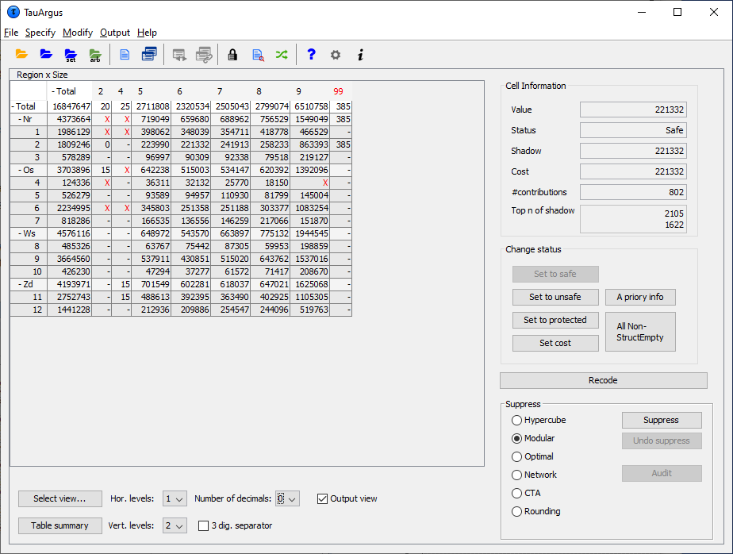{width="13cm"
> height="12.476cm"}

> For some windows, the complete table cannot be seen on the screen. In
> these cases there will be scrollbars at the bottom and the right of
> the table above, which can be used to display the unseen columns.

> For large tables one does not want to see the whole table on the
> screen, which is virtually impossible. Therefore τ-argus will show
> only the first two levels of the hierarchal structures. If you want to
> see more you can open and close certain parts of the table by clicking
> on the codes with a '+' or "-"sign. This works similar to the way you
> open and close certain parts in the Windows explorer. Via 'Change
> View' at the bottom of the screen you can also select the level of
> each hierarchy you want to see both horizontally and vertically.

> []{#anchor-124}Example of a 3-dimensional table

> 3-dimensional tables cannot be displayed as a whole. τ-argus can only
> show a 2-dimensional layer of the table. So for higher dimensional
> table two variables are selected to be show. For the other variables
> combo-boxes are shown. These combo-boxes allow for the selection of a
> specific layer of the table. Just select the corresponding code and
> that layer will be shown.

> If you want to see another combination of two explanatory variables,
> go to "Select view" at the bottom of the window. See section
> [4.2.7](#anchor-125).

> {width="15cm"
> height="15.236cm"}

> 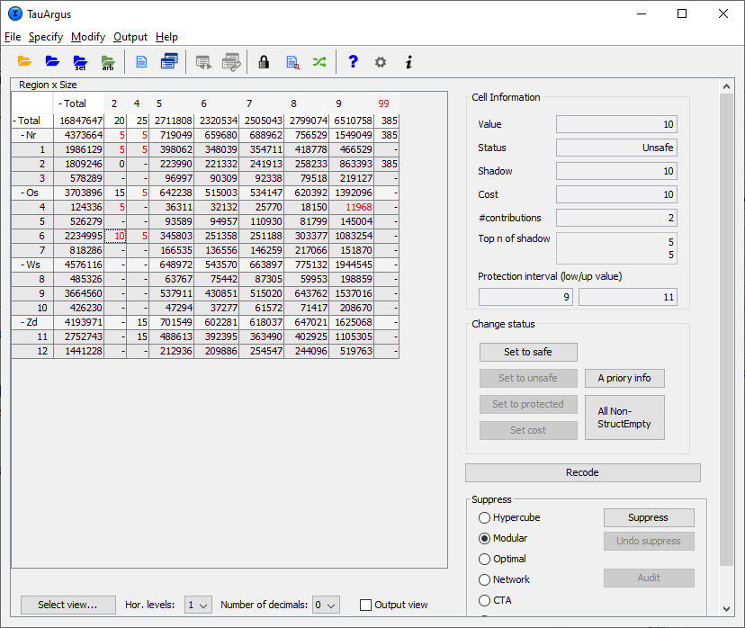{width="13cm"
> height="9.82cm"}

> []{#anchor-126}****Additional information in the View Table window****

> Clicking on a cell in the main body of the table makes information
> about this cell visible in the Cell Information**** pane****.****

> Here, the following information can be seen:

1.  the cell-value

2.  the cell status

3.  the value of cost variable

4.  the value of the shadow variables

5.  the number of contributors

6.  the values of the largest contributors of the shadow variable

> ****In addition for a primary unsafe cell also the required lower and
> upper protection levels are shown. If you put your mouse over this
> value, also the lower and upper protection as a distance to the cell
> value is shown together with the same value as a percentage. ****

> Information about the Holding level and the Request protection
> variable are also displayed here.

> The status of the cell can be:

-   Safe: Does not violate the safety rule

-   Safe (from manual): manually made safe during this session

-   Unsafe: According to the safety rule

-   Unsafe (request): Unsafe according to the Request rule.

-   Unsafe (frequency): Unsafe according to the minimum frequency rule.

-   Unsafe (from manual): manually made unsafe during this session (see
    > 'Change Status' below).

-   Protected: Cannot be selected as a candidate for secondary cell
    > suppression (see 'Change Status' below).

-   Secondary: Cell selected for secondary suppression.

-   Secondary (from manual): Unsafe due to secondary suppression after
    > primary suppressions carried out manually (see 'Change Status' and
    > 'Secondary suppressions' below).

-   Empty: No records contributed to this cell and the cell cannot be
    > suppressed.

> []{#anchor-127}Change Status

> The second pane ('Change Status') on the right will allow the user to
> change the cell--status.

-   Set to Safe: A cell, which was unsafe, e.g. due to the safety rules
    > is made safe by the user.

-   Set to Unsafe: A cell, which has passed the safety rules is made
    > unsafe by the user. Hence the manual safety margin is applied

-   Set to Protected: A safe cell is set so that it cannot be selected
    > for secondary suppression. *Note:* use this option with care as
    > the result might be that no solution can be found. Alternatively
    > consider to set the cost-variable to a very high value.

-   Set Cost: Change the cost function for a cell.

### []{#anchor-128}[]{#anchor-129}A priori info

> This option allows you to feed τ-argus a list of cells where the
> status of the standard rules can be overruled. E.g. a cell must be
> kept confidential or not for other reasons that just because of the
> sensitivity rules. By modifying the cost-function you can influence
> the selection of the secondaries. E.g. the cells suppressed last year
> can get a preference for the suppression this year by giving this cell
> a small value for the cost-function.

> The option 'Expand trivial levels' is important. Often in a table with
> hierarchies, some levels in a hierarchy break down in only one lower
> level. This implies that there are different cells in a table which
> are implicitly the same. Changing the status of one of them might lead
> to inconsistencies and serious problems. E.g. one if the two is unsafe
> and the other is protected, the solution is impossible. If you select
> the option 'Expand trivial levels', τ‑argus will always modify all
> cells that are the same if you modify one of them.

> The format of the file is free format. The separator can be chosen.

> The format is:

> Code of first spanning variable, Code of second spanning variable,...,
> Status of cell (u = unsafe, p = protected (not to be suppressed), s =
> safe).

> Also the cost-function can be changed here for a cell. This will make
> the cell more likely to become secondary cell suppression, when the
> value is low, or less likely when the value is high.

> Normally the sensitivity rules will also give the required protection
> levels for unsafe cells. But sometimes, e.g. in the case of 'manual
> unsafe cells' the user might want to specify the required protection
> level different for a standard percentage. After the keyword 'pl', the
> lower and upper protection levels can be given for a specific cell.
> Note that the protection levels will always have to be positive, as
> they are considered as distances from the cell-value.

> A full description of the apriori file is given in section
> [5.6](#anchor-130).

> Nr, 4, u

> Zd, 6, p

> 5, 5, c, 1

> Zd, 5, pl, 100, 200

> When the apriori file has been applied τ-argus will show an overview
> of the changes that have been made to the table.

> 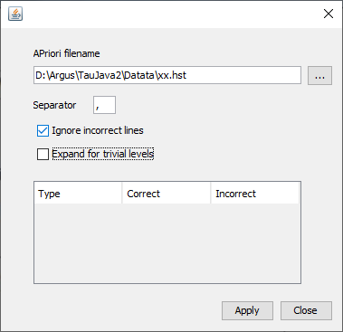{width="13cm"
> height="12.247cm"}

### []{#anchor-131}[]{#anchor-132}Global recoding

> The recode button will open the recoding options. Recoding is a very
> powerful method of protecting a table. Collapsed cells tend to have
> more contributors and therefore tend to be much safer.

> Recoding a variable always starts with the original codes. It is not
> possible to refine a recoding. If required you must start with a
> complete new recoding.

> []{#anchor-133}****Recoding a non-hierarchical variable****

> There is a clear difference in recoding a hierarchical variable
> compared to a non-hierarchical variable.

> In the non-hierarchical case the user can specify a global recoding
> manually. Either enter the recoding described below manually or read
> it from a file. The default extension for this file is .GRC. Details
> can also be found in section [5.4](#anchor-134).

> 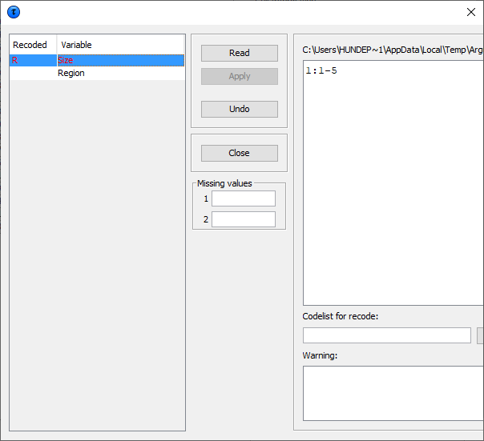{width="13cm"
> height="11.682cm"}

> There are some standards about how to specify a recode scheme.

> Always the new code is specified first followed by a colon (\`:\`).
> After that the set of old codes to be collapsed into the new code is
> specified.

> All codelists are treated as alphanumeric codes. This means that
> codelists are not restricted to numerical codes only. However, this
> also implies that the codes \'01\' and \' 1\' are considered different
> codes and also \'aaa\' and \'AAA\' are different. In a recoding scheme
> the user can specify individual codes separated by a comma (,) or
> ranges of codes separated by a hyphen (-). The range is determined by
> treating the codes as strings and using the standard string
> comparison. E.g. \`0111\`\< \`11\` as the \`0\` precedes the \`1\` and
> \`ZZ'\< \`a\` as the uppercase \`Z\` precedes the lowercase \`a\`.
> Special attention should be paid when a range is given without a left
> or right value. This means every code less or greater than the given
> code. In the first example, the new category 1 will contain all the
> codes less than or equal to 49 and code 4 will contain everything
> larger than or equal to 150.

> *Example:*\
> for a variable with the categories 1,...,182 a possible recode is
> then:

> 1: - 49

> 2: 50 - 99

> 3: 100 -- 149

> 4: 150 --

> for a variable with the categories 01 till 10 a possible recode is:

> 1: 01 , 02

> 2: 03 , 04

> 3: 05 -- 07

> 4: 08 , 09 , 10

> An important point is not to forget the colon (:) if it is forgotten,
> the recode will not work.\
> Recoding 3: 05,06,07 can be shortened to 3: 05-07.

> Additionally, changing the coding for the missing values can be
> performed by entering these codes in the relevant textboxes.

> Also a new codelist with the labels for the new coding scheme can be
> specified. This is entered by means of a codelist file. An example is
> shown here. (note, there are no colons is this file)

> 1,Groningen

> 2,Friesland

> 3,Drenthe

> 4,Overijssel

> 5,Flevoland

> 6,Gelderland

> 7,Utrecht

> 8,Noord-Holland

> 9,Zuid-Holland

> 10,Zeeland

> 11,Noord-Brabant

> 12,Limburg

> Nr,North

> Os,East

> Ws,West

> Zd,South

> Pressing the 'Apply' button will actually restructure the table. The
> variable concerned will be displayed in red and additionally an x is
> shown in front of the variable. If required, recoding can easily be
> undone by pressing \'undo recoding\'. The window will return to the
> originally coding structure. If there is any error in the recoding
> such as certain codes not being found when pressing the 'Apply'
> button, an error message will be shown at the bottom of the screen.
> Alternatively, a warning could be issued; *e.g.* if the user did not
> recode all original codes, τ-argus will inform the user. This may have
> been the intention of the user, therefore the program allows it. In
> the above example a τ-argus message informs the user that 4 codes have
> not been changed.

> At the end of the operation τ‑argus will ask you whether or not a
> modified recoding scheme must be saved or not.

> 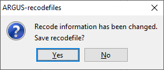{width="8.184cm"
> height="3.641cm"}

> Once the 'Close' button has been pressed, τ-argus will present the
> table with the recoding applied.

> []{#anchor-135}**Recoding a hierarchical variable **

> 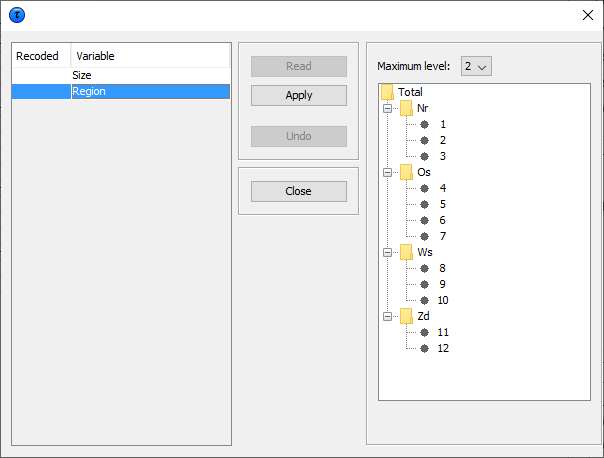{width="14.979cm"
> height="9.857cm"}

> In the hierarchical case the code scheme is typically a tree. To
> global recode a hierarchical variable requires a user to manipulate a
> tree structure. The standard Windows tree view is used to present a
> hierarchical code. Certain parts of a tree can be folded and unfolded
> with the standard Windows actions (clicking on '+' and '-').

> The maximum level box at the top of the screen offers the opportunity
> to fold and unfold the tree to a certain level.

> Pressing the 'Apply' button will actually restructure the table. If
> required, a recoding may always be undone.

### []{#anchor-136}Secondary suppression

> When the table is ready, the most commonly used method to protect a
> table is secondary cell suppression

> With suppress the table will be protected by causing additional cells
> to be suppressed. This is necessary to make a safe table.

> []{#anchor-137}Suppression Options

> There are a number of suppression options, which can be seen on the
> bottom right hand side of the window.

-   Hypercube

-   Modular

-   Optimal

-   Network

> 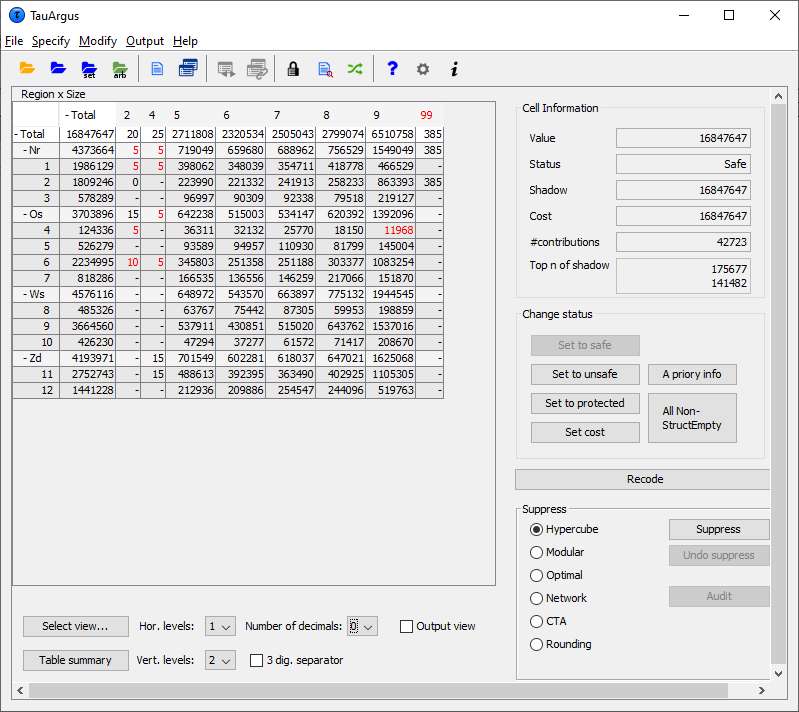{width="14.75cm"
> height="12.511cm"}

#### []{#anchor-138}[]{#anchor-139}Hypercube

> This is also known as the ghmiter method. The approach builds on the
> fact that a suppressed cell in a simple n‑dimensional table without
> substructure cannot be disclosed exactly if that cell is contained in
> a pattern of suppressed, nonzero cells, forming the corner points of a
> hypercube. Selecting the hypercube method will lead to the following
> window being showed by τ-argus.

> ghmiter will select secondary suppressions that protect the sensitive
> cells properly against the risk of inferential disclosure, to some
> extent, if the user activates the option "*Protection against
> inferential disclosure required*". If the option is inactivated, on
> the other hand, ghmiter will not check secondary suppressions to be
> sufficiently large.

> For more explanation, and detailed information on the hypercube see
> section [2.8](#anchor-36).

> The lower part of the window above enables the user to affect the
> setting of two parameters, "Max sub-codelist size" and "Max sub-table
> size" that GHMITER uses for memory allocation.

> If the option 'normal size' is active, the default values mentioned
> below will be used. Ticking the option 'large size' will lead to a
> setting of 250 and 25000, respectively.

> "Max sub-codelist size" must exceed the largest maximum sub-codelist
> size of all explanatory variables of the table. The maximum
> sub-codelist size of a (hierarchical) variable is the largest number
> of categories on the same (hierarchical) level that contribute to the
> same category on the (hierarchical) level just above. The default
> value for "Max sub codelist size" is 200.

> "Max sub-table size" must exceed the number of cells in the largest
> subtable, e.g. the product of the maximum sub-codelist sizes taken
> over all explanatory variables. The default value is 6000.

> Note that we strongly recommend designing tables so that they fit the
> 'normal' setting, e.g. better think about restructuring the table
> rather than using the 'large' option. The better approach (instead of
> using the 'large' option) would be to introduce a (more detailed)
> hierarchical structure into the table, because in this way the table
> will provide more information to the user.

> The Cancel button will bring you back to the main window, without
> protecting the table.

#### []{#anchor-140}Modular

> This partial method will break down the hierarchical table into
> several non-hierarchical tables, protect them and compose a protected
> table from the smaller tables. As this method uses the optimisation
> routines, an LP-solver is required: this can be either Xpress or cplex
> or a free solver. The routine used can be specified in the Options
> box, this will be discussed later.

> After starting the modular procedure a little window will be shown.
> This allows to select three additional rules to be applied. At the end
> of section [2.10](#anchor-49) more information on these three rules
> can be found.

> {width="7.117cm"
> height="5.054cm"}

#### []{#anchor-141}Optimal

> This method protects the (hierarchical) table as a single table
> without breaking it down into smaller tables. As this method uses the
> optimisation routines, an LP-solver is required: this can be either
> Xpress or cplex or a free solver. The routine used can be specified in
> the Options box, this will be discussed later.

> It is the responsibility of the users of τ-argus to apply for a
> licence for one of these commercial packages themselves. Information
> on obtaining one of these licences will be found in a 'read.me' file
> supplied with the software or on the CASC website.

> Almost the same window as in Modular is shown to select the 3
> additional rules; see above.

> {width="7.117cm"
> height="5.054cm"}

> But a further question is asked. The question is 'How much time do you
> allow the system to compute the optimal solution'.

> When the specified time limit has been reached τ‑argus will ask you
> what to do. This can be twofold, you allow τ‑argus to continue for a
> new amount of time, or not. The window below allows you to specify
> this.

> Note that τ‑argus will check only at a specific location in a cycle
> whether or not the time has elapsed.

> 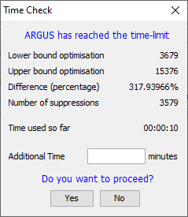{width="6.324cm"
> height="7.276cm"}

#### []{#anchor-142}[]{#anchor-143}Network

> This is a Network Flow approach for large unstructured 2 dimensional
> tables with only one hierarchy (the first variable specified). The
> user has the option of selecting an optimisation method (pprn and
> Dykstra). Both optimisation methods are available free of an
> additional licence. By default the Dykstra solution is advised.

> 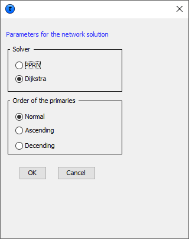{width="9.426cm"
> height="11.571cm"}

> As the network solution is a heuristic to find an approximation of the
> real optimal solution, it cannot be expected that always an optimal
> solution is found. Nevertheless it is guaranteed that at least a good
> feasible solution is found in a relatively short time. The order in
> which the primaries are provided to the network algorithm could
> influence the solution found. Therefore three options are available to
> order the primaries.

#### []{#anchor-144}**After the suppression**

> After selecting one of the options and after clicking the Suppress
> button, τ-argus will run and display a protected table after informing
> the user of the number of cells selected for secondary suppression and
> the time taken to perform the operation.

> {width="7.846cm"
> height="4.177cm"}

> The secondary suppressed cells will be shown in blue.

> {width="15cm"
> height="14.524cm"}

> When the user is satisfied with the table it can be saved (see section
> [4.6.1](#anchor-145) for the possible formats). Via the menu
> Output\|Save table you can specify the format and start the process of
> saving a table.

### []{#anchor-108}Controlled Tabular Adjustment

> A method new in version 4.0 of τ-argus is a method called Controlled
> Tabular Adjustment. Instead of suppressing a set of cells, a selected
> set of cells is modified. The aim is to change the sensitive cells
> such that the cells are replaced by a value larger that the upper
> protection level or smaller than the lower protection level. i.e. far
> enough away from the unsafe value.. And a set of safe cells is
> modified such that the resulting table is additive again. Of course we
> try to minimise the information loss.

> More information can be found in section [2.13](#anchor-55).

> We have implemented two variants. A standard version, suitable for
> general cases, and an expert version for the specialists.

> {width="7.355cm"
> height="3.096cm"}

> The standard version will run CTA without any further questions.

> The expert version will show the following window: You can e.g. select
> the solver and the type of CTA. We further refer to the detailed [CTA
> documentation](../tau-Argus_CTA_help.pdf).

> {width="12.986cm"
> height="8.611cm"}

### []{#anchor-107}[]{#anchor-146}Controlled rounding

> Controlled rounding (see Section [2.14](#anchor-58) for details on
> this method) requires a solver that allows you using the Mixed Integer
> Model (MIP). Already in version 3 of τ‑argus we had access to MIP in
> Xpress, thanks to the friendly cooperation of Dash Inc and later FICO.
> However the restricted version of the cplex licence we used in version
> 3 of τ-argus did not have access to MIP. But from now on you can buy a
> licence for cplex including MIP. This allows you to use Controlled
> Rounding with a new cplex licence.

> Also the free solver, soplex, can be used for Controlled Rounding.

> In general, rounding is more appropriate for frequency tables than for
> magnitude tables.

> The next figure shows the simple frequency table obtained from the
> test data using the variable Size and Region.

> {width="14.471cm"
> height="11.367cm"}

> Rounding can be applied also to tables with no unsafe cells. The
> choice of the minimum threshold and whether zeros are safe or not has
> an effect on the minimal possible rounding base, as it will be
> explained in the *Option* paragraph.

> When rounding has been chosen and the round-button has been pressed,
> the following window will be shown. You can enter a few parameters.

> []{#anchor-147}Rounding Options

> {width="10.081cm"
> height="12.012cm"}

> The controlled rounding window allows to set the following parameters:

-   Rounding Base\
    > Cell values will be changed to multiples of the base. The minimum
    > rounding base is equal to the maximum between the minimum
    > frequency threshold and twice the highest Protection Level set for
    > an unsafe cell (with the Dominance or p-q rule). See the Section
    > [2.2](#anchor-22) for details on safety rules and section
    > [2.6](#anchor-34) protection levels. If no rule is specified the
    > minimum base is 1. Rounding can be used to round a table for
    > "cosmetic" motives.

-   Number of steps allowed\
    > This value specifies the maximum number of *steps* allowed in
    > order to find a feasible solution when a zero-restricted one does
    > not exist. The default value is 0, *i.e.* zero-restricted. Higher
    > values can be chosen by selecting the value from the drop-down
    > menu. Note that the higher the number of steps allowed the
    > lengthier is the search, hence the greater the risk of hitting the
    > time constraint. At any rate, if a zero-restricted solution
    > exists, this is the solution provided, whatever the number of
    > steps allowed.

-   Max computing time\
    > This value determines the time after which the user is prompted
    > for a decision about continuing or stopping the search. The
    > default value is 20 minutes. When the maximum time is hit the user
    > is prompted to enter a new maximum time or to choose to terminate
    > the search.

-   Partitions\
    > This option enables the partitioning of the table into sub-tables
    > corresponding to each category of the first spanning variable.
    > This option is recommended for tables with more than approximately
    > 150,000 cells. Partitioning can only be used in this version when
    > the first variable is non-hierarchical. The first variable should
    > be such that the sub-tables have maximum size of about 150,000
    > cells and also trying to keep their number low; performance may be
    > improved by wisely choosing the partitioning variable. See Section
    > (rounding theory) for further details.

-   Stopping Rule

> These options allow to control the quality of the rounded solution.
> The user can choose:

-   First Rapid\
    > The solution is obtained by rounding conventionally (to the
    > closest multiple of the base) the internal cells and then the
    > marginal values are obtained by addition. This solution is likely
    > to present several values that have a large distance from the
    > original values. This option should be used with extreme care and,
    > likely, when everything else fails;

-   First feasible\
    > The solution provided is the first rounded one that has the
    > specified number of jumps, regardless of its optimality. This
    > means that there could exist other solutions that have a lower
    > overall distance from the original table. In many cases, when
    > optimality is not crucial, this solution is quite close to the
    > optimal one and it can be found in a shorter time;

-   Optimal\
    > This option provides the fully optimal controlled rounded
    > solution.

> 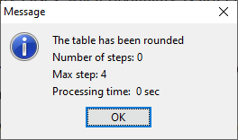{width="6.985cm"
> height="4.128cm"}

> []{#anchor-148}The rounded table

> The next figure shows the rounded table with the values rounded to
> multiples of 5. Note that the values that were originally zero (hence
> empty cells denoted with a dash) are still shown as a dash while the
> values that have been rounded down to zero are shown as zeros.

> 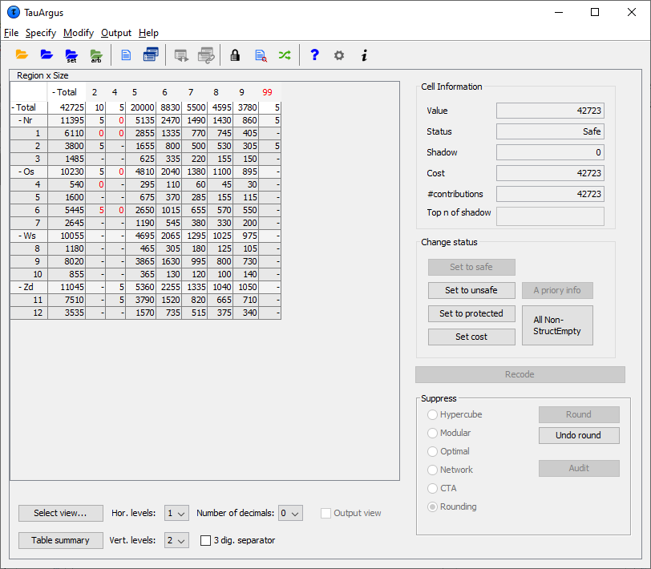{width="15cm"
> height="13.115cm"}

### []{#anchor-149}The audit procedure

> After the secondary cell suppression procedure has been carried out
> all cells should have been properly protected. Cell suppression
> guarantees that unsafe cells cannot be estimated to a narrower
> interval that the required protection interval. The realised upper and
> lower bounds can be computed by solving two linear programming
> problems for each unsafe cell. This can be rather an effort doing it
> all manually, but the audit procedure will do this. Note that the
> Model solved by the audit procedure will check only for the required
> protection levels, but not for the additional singleton protection.
> See also section [2.15](#anchor-67).

> The Audit option will only be active after secondary cell suppression.
> By activating the procedure all the linear programming problems for
> all unsafe (both primary and secondary) cell will be computed. When
> completed a message will be showing whether all cells were protected
> correctly.

> {width="7.752cm"
> height="3.625cm"}

> If in the unfortunate case the protection was not optimal according to
> the audit procedure a list of problems will be shown. Also the
> problematic cells will be highlighted.

> For each unsafe cell the realised lower and upper bounds will be
> shown. If you put your mouse on the value also the distance to the
> real value and the corresponding percentage will be shown

> {width="13cm"
> height="11.846cm"}

### []{#anchor-125}[]{#anchor-150}The Options at the Bottom of the table

> At the bottom of this window there are a few additional options. These
> options will be described here.

> []{#anchor-151}Select View

> By clicking on Select View a dialog box below pops up. The user can
> specify which variable is preferred in the row and the column. In the
> two-dimensional case, the table can only be transposed. In the higher
> dimensional case, the remaining variables will be in the layer. For
> these layer variables a combo-box will appear at the top of the table,
> where the user can select a code. This will show the corresponding
> slice of the table.

> 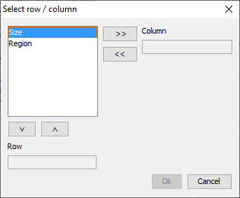{width="9.075cm"
> height="7.488cm"}

> For a 3 dimensional table, this window is as follows:

> {width="9.075cm"
> height="7.488cm"}

> []{#anchor-152}**Table summary**

> Pressing \'table summary\' provides a table summary giving an overview
> of the number of cells according to their status. The example shown
> here refers to the case after secondary suppression has been
> performed.

> **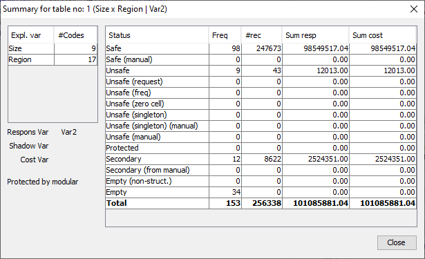{width="13cm"
> height="7.925cm"}**

> The headings in the summary window are as follows:

> *Freq*: The number of cells in each category

> *\# rec*: The number of observations in each category

> *Sum resp*: Total cell value in each category

> *Sum cost*: The sum of the cost variable.

> Hor. Levels and Vert. levels

> []{#anchor-153}A large (hierarchical) table can never be shown
> completely on the screen. Therefor τ-argus will start by showing only
> the top-2 levels of the hierarchy. With these options you can specify
> that more levels of the table must be shown.

> []{#anchor-154}Alternatively you can click on the + and -- symbols of
> the hierarchical codes in the table to fold and unfold parts of the
> table.

> []{#anchor-155}****3 dig separator****

> This removes or inserts the character separating the thousands for the
> values in the table.

> []{#anchor-156}Output View

> This option allows the table to be shown as it will be output, with
> suppressed cells (primary and secondary) replaced by a X.

## []{#anchor-157}[]{#anchor-158}The File menu

> τ-argus can read data in two ways. The first option is that τ-argus
> will read the data from a microdata file (fixed format, free format
> and a SPSS_systemfile), which is explained in section
> [4.3.1](#anchor-159). From this microdata τ-argus can then build one
> or more tables and during this tabulation process compute all
> necessary additional information, needed to fully protect a table.
> This is the most flexible way allowing using all the functionality of
> τ-argus.

> The second option is the input and treatment of a pre-tabulated data
> and is dealt with in section [4.3.2](#anchor-160). Only one of these
> options can be used at one time, a pre-tabulated table and tables
> computed from microdata cannot be read in τ-argus simultaneously.

> A set of pre-tabulated tables can be read into τ-argus and via the
> linked tables procedure be protected. See section
> [4.3.3](#anchor-161).

> τ-argus can also be used in batch, see section [4.3.4](#anchor-162).

> Finally the τ-argus can be closed.

### []{#anchor-163}[]{#anchor-159}[]{#anchor-164}[]{#anchor-165}[]{#anchor-166}[]{#anchor-167}[]{#anchor-168}[]{#anchor-169}[]{#anchor-89}[]{#anchor-170}[]{#anchor-171}[]{#anchor-172}File \| Open Microdata

> The File\|Open microdata menu allows the user to specify the microdata
> file (both fixed and free format or a SPSS-system file) and optionally
> the metadata file.

> Note that a valid licence for SPSS must be available on your PC, at
> τ‑argus will use the functionality of SPSS to extract the microdata
> from SPSS to a scratch file. This file will then be used to construct
> the tables to be protected.

> {width="13cm"
> height="4.964cm"}

> In this dialog box the user can select the microdata-file or the SPSS
> system file and optionally the corresponding metadata file

> By default the microdata-file has extension .asc and the metafile
> .rda. .(Note, the user may use any file extension, but is advised to
> use default names).

> {width="1.044cm"
> height="0.587cm"}When the user clicks on he will get the traditional
> open file dialog box.

> 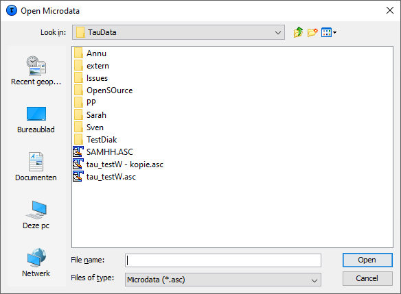{width="15cm"
> height="11.017cm"}

> This box enables searching for the required files. Other
> file-extensions can be chosen when clicking on the files of type
> listbox. When the user has selected the microdata file a suggestion
> for the metafile (with the same name but with the extension .rda) is
> given but only when this file exists. Note, both files do not
> necessarily have to have the same name.

> If a user selects a data file with another extension,τ-argus will
> remember this and will suggest this extension in a future use of
> τ-argus.

> A full description of the metadata file can be found in section
> [5.1](#anchor-173).

> When the data file has been selected and optionally the meta data
> file, you can proceed to the menu options Specify\|Metafile to
> edit/modify the meta data file and to Specify\|Tables to specify the
> tables required. See section [4.4](#anchor-174) and
> [4.4.4](#anchor-45).

### []{#anchor-88}[]{#anchor-87}[]{#anchor-175}[]{#anchor-160}[]{#anchor-176}[]{#anchor-177}[]{#anchor-178}[]{#anchor-179}[]{#anchor-180}[]{#anchor-181}File \| Open Table 

> This is the option allowing the input of tabular data into τ-argus. In
> this case, an already-constructed table is read in. This is reached by
> selecting 'Open Table' in the file menu of τ-argus.

> {width="14.49cm"
> height="5.084cm"}

> The name of the file containing the table to be opened (in the format
> given below) needs to be specified in the first line. Optionally the
> name of the file containing the metadata is entered in the second
> line. Later on you will be offered the option of adapting the metadata
> or even enter the metadata from scratch.

> There is a great flexibility with this option.

> The structure of the file is that each line/record describes one cell
> in free format. The separator is to be specified in the metadata. The
> more detail is given for each cell, the more τ-argus can do for you.

> In any case for each cell the codes of the explanatory variables and
> the cell value need to be given. Optionally the following information
> can be specified:

-   Frequency

-   Status

-   Cost variable

-   Shadow variable

-   Top-n variables

-   Lower and upper protection levels

> The more details are given for each cell to more flexibility τ-argus
> offers in a later stage to apply sensitivity rules etc.

> If only the cell status is provided, τ-argus can only use that and
> give each unsafe cell a fixed protection level of some percentage to
> be specified. If also the largest say 2 contributors are provided,
> τ-argus can apply most of the sensitivity rules, like a p% rule of a
> dominance rule (up to n=2).

> It is important

1.  To stress that all the cells of a table have to be specified as
    > τ-argus will not compute any (sub-)totals. In most situations this
    > is simply impossible.

2.  A table has to be additive. Theoretically this is trivial, but many
    > methods to protect a table even require strict additivity.

> After clicking 'OK' you can either proceed by adapting the metadata
> via Specify\|Metafile or by specifying the table details via
> Specify\|Table.

> This (artificially generated) datafile shows 2 explanatory variables,
> cell value, cell frequency and the top 3 values in each cell. With
> this information τ‑argus is still able to apply the primary
> sensitivity rules, like p% rule.

> An example of a 2 dimensional table

> T, T, 2940 ,48, 200,200,200

> T, A, 745 ,12, 200,100,100

> T, B, 810 ,12, 200,100,100

> T, C, 685 ,12, 200,100,100

> T, D, 700 ,12, 200,100,100

> 1, T, 795 ,12, 200,100,100

> 1, A, 350 ,3, 200,100,50

> 1, B, 190 ,3, 100,50,40

> 1, C, 150 ,3, 100,40,10

> 1, D, 115 ,3, 50,40,25

> 2, T, 670 ,12, 200,100,100

> 2, A, 115 ,3, 50,40,25

> 2, B, 340 ,3, 200,100,40

> 2, C, 115 ,3, 50,40,25

> 2, D, 120 ,3, 100,10,10

> 3, T, 785 ,12, 200,100,100

> 3, A, 190 ,3, 100,50,40

> 3, B, 115 ,3, 50,40,25

> 3, C, 325 ,3, 200,100,25

> 3, D, 165 ,3, 100,40,25

> 4, T, 690 ,12, 200,100,100

> 4, A, 100 ,3, 50,25,25

> 4, B, 175 ,3, 100,50,25

> 4, C, 115 ,3, 50,40,25

> 4, D, 310 ,3, 200,100,10

> Alternatively if only the status is given to τ‑argus , there is no
> other option than to use the status and treat all unsafe cells as
> 'manually' unsafe and apply the manual safety margin.

> T, T, 2940 ,u

> T, A, 745 ,s

> T, B, 810 ,s

> T, C, 685 ,s

> T, D, 700 ,s

> 1, T, 795 ,s

> 1, A, 350 ,s

> 1, B, 190 ,s

> 1, C, 150 ,s

> 1, D, 115 ,s

> 2, T, 670 ,s

> 2, A, 115 ,s

> 2, B, 340 ,s

> 2, C, 115 ,u

> 2, D, 120 ,u

> 3, T, 785 ,s

> 3, A, 190 ,s

> 3, B, 115 ,s

> 3, C, 325 ,s

> 3, D, 165 ,s

> 4, T, 690 ,s

> 4, A, 100 ,s

> 4, B, 175 ,s

> 4, C, 115 ,s

> 4, D, 310 ,s

> For tables of dimension 3 or higher, additional columns for the
> explanatory variables need to be added as well as additional rows to
> allow for the increased depth of the table.

> The next step will be to optionally edit the metadata and then read
> the table.

### []{#anchor-182}[]{#anchor-183}[]{#anchor-184}[]{#anchor-185}[]{#anchor-186}[]{#anchor-161}[]{#anchor-187}[]{#anchor-188}[]{#anchor-189}[]{#anchor-190}File \| Open Table Set

> When the linked tables procedure will be used in combination with
> tabular input, the option "Open Table Set" must be used to read a set
> of tables in τ‑argus. The "Open Table" option as described above
> ([4.3.2](#anchor-176)) allows for only one single individual table.

> In this option a set of tables with the corresponding metadata files
> (\*.rda) is specified.

> Search for the tables in the familiar way and press "Add" to add the
> table to the det of linked tables being build.

> When the set is complete, press the OK-button.

> 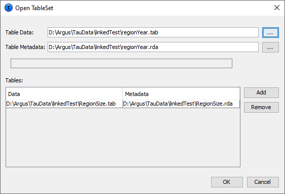{width="13cm"
> height="8.865cm"}

> After pressing the OK-button, you will be guided automatically to the
> Specify Tables window. This is described in section
> [4.4.5](#anchor-191).

> In the linked tables approach it is no longer possible to modify the
> metadata.

> As the same rules will be applied to each individual table, you will
> be guided to the Specify Tables window only once. The choices will be
> applied to each table.

> This implies that all tables in a linked set should have the same
> additional variables, as described in the previous section
> [4.3.2](#anchor-177).

> Please note that it is advisable to read each table individually in
> τ‑argus before. This to be sure that the specification of the tables
> and the metadata is correct, before starting the linked tables
> procedure.

### []{#anchor-162}[]{#anchor-192}File \| Open Batch Process

> This option allows the user to run the commands in batch mode from
> opening the microdata and metadata, protecting the table and creating
> the output of the final table(s).

> If the last line of the batch-file is \<GOINTERACTIVE\> τ-argus will
> first perform all the actions as specified in the batch-file and then
> open the main menu and giving the control to the user to continue the
> work in the interactive modus.

> The lay-out of the batch-file is described in section
> [5.7](#anchor-193).

> Note that a log file is maintained of all actions. This is the place
> to look if something might go wrong, as a batch-process typically does
> not report to a GUI. By default the log file is "Logbook.txt" in the
> temp-directory, but in the batch-file a different file can be chosen.
> Also from the command-line a log file name can be specified. See also
> section [5.7](#anchor-193).

### []{#anchor-194}[]{#anchor-195}File \| Exit

> Exits the τ-argus-session.

## []{#anchor-174}[]{#anchor-196}The Specify menu

> []{#anchor-197}[]{#anchor-198}[]{#anchor-199}[]{#anchor-200}[]{#anchor-201}[]{#anchor-202}[]{#anchor-203}[]{#anchor-204}The
> metadata structure is different for describing microdata and tabular
> data. Therefor the structure of the metadata file (RDA-file) is
> different and also the window to specify and modify the metadata is
> different. The version presented depends on the type of data that has
> been selected. We will first describe the situation for microdata
> (section [4.4.1](#anchor-205)) and then for tabular data (section
> [4.4.3](#anchor-206)).

### []{#anchor-205}[]{#anchor-92}[]{#anchor-207}[]{#anchor-208}Specify \| Metafile \[for microdata\]

> Clicking on 'Specify\|Metafile' gives the user the opportunity to
> either edit a metafile already read in or to enter the metadata
> information directly at the computer from scratch.

> In this dialog box all attributes of the variables can be specified.
> This is a good alternative to manually edit the rda-file outside
> τ-argus. τ-argus does a moderate checking of the rda-file, but no
> guarantee can be given for a proper functioning of a manually edited
> rda-file. The rda-file has been explained in detail in section
> [5.1](#anchor-173). Here, the editing of a rda-file within τ-argus is
> looked at.

> 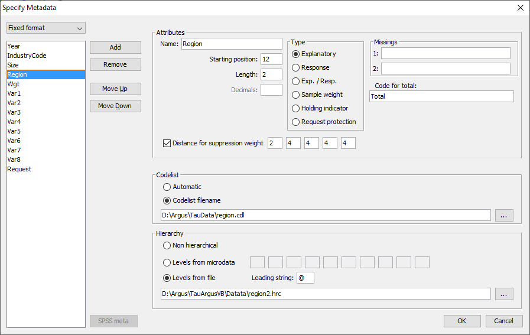{width="13cm"
> height="8.216cm"}

> If under File\|Open Microdata an rda-file has been specified, this
> dialog box shows the contents of this file. If no .rda-file has been
> specified the information can be specified in this dialog box after
> pushing the New button. As default \"New\" is substituted as the
> variable name, but the user is expected to fill in a correct name.
> Apart from defining a new variable, an existing one can be modified or
> deleted.

> In the left top field the file type (fixed, free format or SPSS) can
> be specified.

> The following attributes for each variable can be specified or edited:

-   name of the variables

-   its first position in the data file (for fixed format)

-   its field-length

-   the number of decimals (for numerical variables).

-   Furthermore, the role of variable can be specified or edited (more
    > detail on these can be seen in section [4.3.1](#anchor-165)):

-   *explanatory variable*: This can be used as a spanning variable in
    > the row or column of the table

-   *response variable*: This can be used as a cell-item

-   *weight variable*: This specifies the sampling-weight of the record
    > and is based on the sampling design used.

> The following are special variable types and have not been previously
> described. As they are specific to designating safety rules, more
> detail is given in section [4.4.4](#anchor-45).

> Holding Indicator

> The Holding indicator: sometimes groups of records belong together.
> E.g. if a set of records describe the contributions of one business to
> various cells. So it could be better to apply the confidentiality
> protection at the business level in all cells of the table, especially
> the marginal cells. This variable is the group identifier. τ-argus
> expects the records of a group to be together in the input datafile.
> An example is shown in section [4.4.4](#anchor-45).

> Request Protection

> The Request protection option is used if the Request Rule under
> 'Specify tables' is to be applied. This variable indicates whether or
> not a record asked for protection. This is further explained in
> section [4.4.4](#anchor-45). Additionally the codes specifying whether
> a respondent asked for asking protection is to be specified; two
> different codes are possible, corresponding to two different sets of
> parameters in the sensitivity rule. This rule is often used in Foreign
> Trade Statistics.

> Distance function

> When finding a pattern of secondary suppressions, most methods try to
> minimalize some kind of cost function. Often the costs are some value
> linked to each cell.\
> Some users like to group the secondaries close to the primaries. The
> advantage is that loss of information is grouped in certain parts of
> the table.

> This can be achieved by used the distance function. The costs for each
> cell depend on the number of steps the cell is apart from a primary.
> For each step the cost can be specified, with a maximum of 5.

> The distance function can only be applied in combination with the
> modular suppression method.

> Total code

> Optionally a code for the total can be chosen; the default is
> \"Total\".

> []{#anchor-209}Additional Specifications

> Other attributes, which may be edited or specified are missing value
> options, (optional, not required) codelist files, (optional, not
> required) hierarchies.

> Details on these options have been given in section
> [4.3.1](#anchor-166).

> In summary, for codelist the 'automatic' option simply generates the
> codes from the data. Specifying a codelist, allows the user to supply
> an additional file (usually .cdl) containing the labels attached to
> the codes. These labels are used to enhance the information by τ-argus
> on the screen. In both cases τ-argus will use the codes that it finds
> in the datafile.

> Hierarchies can either be derived from the digits in the codes or from
> a file (usually .hrc)

> []{#anchor-210}**The RDA file**

> Here is an example of a rda file for microdata. This has already been
> shown in section [4.3.1](#anchor-167) and is shown here for
> completeness. (Note, the dots at the bottom just means that here a
> shortened version of the file is presented.)

> Year 1 2

> \<RECODEABLE\>

> IndustryCode 4 5 99999

> \<RECODEABLE\>

> \<HIERARCHICAL\>

> \<HIERLEVELS\> 3 1 1 0 0

> \<DISTANCE\> 1 3 5 7 9

> Size 9 2 99

> \<RECODEABLE\>

> \<TOTCODE\> Alles

> Region 12 2

> \<RECODEABLE\>

> \<CODELIST\> \"REGION.CDL\"

> \<HIERARCHICAL\>

> \<HIERCODELIST\> \"region2.hrc\"

> \<HIERLEADSTRING\> \"@\"

> \<DISTANCE\> 2 4 4 4 4

> Wgt 15 4 9999

> \<DECIMALS\> 1

> \<WEIGHT\>

> Var1 19 9 999999999

> \<NUMERIC\>

> Var2 28 10 9999999999

> \<NUMERIC\>

> \<DECIMALS\> 2 ..................

> See also section [5.1.1](#anchor-211) for a more detailed description

> τ‑argus can also read free format data files. In that case there are
> slight differences. You select free format in the combo box in the
> left upper corner. And specify the separator used. The parameter
> starting position is no longer valid and will not be visible.

### []{#anchor-212}[]{#anchor-213}[]{#anchor-214}[]{#anchor-215}[]{#anchor-216}Specify \| Metafile \[SPSS System files\]

> When τ-argus works with a SPSS system file the specification of the
> meta data is twofold. The data is stored in the SPSS system file and
> also the metadata. But the metadata available in the SPSS system file
> is not enough for τ‑argus. E.g. no information on hierarchies is
> available. So the SPSS metadata is only a starting point. The metadata
> has to be extended. The procedure is that τ‑argus will retrieve the
> SPSS meta data and then expects the user to extend the metadata, using
> the familiar window; see section [4.4.1](#anchor-92). However certain
> variables in the metadata cannot be changed any more as we have to
> guarantee that the extended metadata is still applicable to the SPSS
> system file. E.g. the length of the variables cannot be modified nor
> the number of decimals nor the name.

> **Selecting the variables.**

> If no RDA file but only the SPS-system file has been specified you
> have to select the variables of interest running τ-argus. At the
> bottom of the metadata window you will find a button "SPSS meta". This
> will bring you to a window showing all variables available. Make a
> selection.

> {width="7.056cm"
> height="11.289cm"}

> If the RDA-file has been specified too this step is not needed.

> []{#anchor-217}**Extending the metadata**

> Secondly the meta data has to be filled in that could not be
> automatically retrieved from the system file. SPSS gives only the
> basic information like variable names, field length. But northing
> about SDC-specific information

> The working of τ-argus when using a SPSS system file is very similar
> to the fixed format version, However you will see that certain fields
> cannot be changed as they are implied by SPSS. This is to guarantee
> that the τ-argus metadata is still applicable to the SPSS system file.

> Often τ-argus cannot decide whether a variable from SPSS is a spanning
> variable or a response variable (eg AGE recoded numerically in SPSS).
> Also the hierarchical information has to be added. Refer to section
> [4.4.1](#anchor-92).

> When the metadata is ready, you can save it in the traditional way.
> This RDA file can also be used if you want to use this SPS system file
> again.

> For the rest will behave exactly as if a fixed format microdata input
> file had been used. Only if you start computing tables computing the
> tables τ-argus will automatically first extract the data from SPSS
> before computing the tables. Apart from a small delay you will not
> notice this.

> {width="13cm"
> height="9.931cm"}

### []{#anchor-206}[]{#anchor-218}Specify \| Metafile \[for tabular data\]

> When a tabular datafile has been selected, the metadata window will
> have a different form. Clicking on 'Specify\|Metafile' gives the
> opportunity to either edit the metafile already read in or to enter
> the metafile information directly at the computer. In section
> [5.1.4](#anchor-219) a detailed description of the metafile for
> tabular data can be found

> Below is displayed the 'Specify metafile' window for tabular input
> data.

> Above the list of variables the separator used to separate the
> variables in the datafile can be specified.

> Here, the variables can be specified or edited as required.

> The options are:

-   'Explanatory' -- The spanning variables used to produce the table.

-   'Response'-- The variable used to calculate the cell total.

-   'Shadow'-- The variable is used as a shadow variable.

-   'Cost'-- The variable is used as the cost-variable.

-   'Lower prot .Level' -- The lower protection level

-   'Upper prot. Level' -- The upper protection level

-   'Frequency' -- This indicates the number of observations making up
    > the cell total. If there is no frequency variable each cell is
    > assumed to consist of a single observation.

-   'topN variable' -- This shows if this variable is defined as one of
    > the top N contributors to the cell. The pre-defined value for TopN
    > is 1. The first variable declared as 'topN' will contain the
    > largest values in each cell, the second variable so declared will
    > contain the second largest values etc.

-   'Status indicator' -- allows a variable in the left-hand pane to be
    > declared as a Status Indicator. Typically cells can be declared as
    > Safe, Unsafe or Protected.

> {width="14.471cm"
> height="9.319cm"}

> The codelist and the hierarchy are the same as for microdata, so we
> refer to section [4.4.1](#anchor-205).

> For explanatory variables the code for the total has to be specified.
> We strongly recommend strongly that the user also provides the values
> for the totals himself, but if needed he can ask τ-argus to compute
> these totals. However it should be noted that when the option to
> compute the totals by τ-argus is selected you will lose vital
> information as the cell status. See also section [4.4.5](#anchor-220)
> In any case, τ-argus needs these totals as they play an important role
> is the structure of a table and also are important for the suppression
> models.

### []{#anchor-45}[]{#anchor-221}[]{#anchor-222}Specify \| Specify Tables \[for microdata\]

> In this dialog box the user can specify the tables which require
> protection. In one run of τ-argus more than one table can be
> specified, but the tables will be protected separately unless they are
> linked (have at least one variable in common). In that case they can
> be protected simultaneously if required. In section
> [4.5.2](#anchor-223) the idea of linked tables will be discussed.

> Also, the user has to specify the parameters for the dominance rule or
> p% rule and the minimum number of contributors in a cell, etc. At
> present τ-argus allows up to 6-dimensional tables, but due to the
> capacities of the LP-solver used (either Xpress or cplex depending on
> the user's license or the free solver) and the complexity of the
> optimisations involved, tables of this complexity can only be
> protected by the hypercube method (see section [2.8](#anchor-36) in
> the Theory chapter). The solutions based on optimisation are limited
> to 4 dimensions.

> Below is a typical window obtained when specifying tables with the
> p%-rule applied.

> {width="15cm"
> height="14.33cm"}

> In section [4.4](#anchor-174) details of variable definitions in the
> metafile were explained. Now consider how the variables defined in the
> metafile are used to create a table along with an associated safety
> rule.

> []{#anchor-224}The explanatory (or spanning) variables

> On the left is the listbox with the explanatory variables.

> When the user clicks on '\>' or '\<' the selected variable is
> transported to the next box. From the left box with explanatory
> variables the user can select the variables that will be used as the
> spanning variables in the row or the column of the table.

> []{#anchor-225}Cell items

> Here, is a list of variables that can be used as response, shadow or
> cost variables in the disclosure control. By pressing the \'\>\' or
> \'\<\' they can be transferred to or from the windows on the right.

> []{#anchor-226}The response variable

> From the list of cell items the user can select a variable as a
> response variable. This is the variable for which the table to be
> protected is calculated.

> If \<freq\> is selected a frequency table will be computed. As the
> neither dominance rule nor the p% rule are meaningful in this
> situation, they cannot be used for frequency tables.

> []{#anchor-227}The shadow variable

> The shadow variable is the variable that is used to apply the safety
> rule. By default this is the response variable, but it is possible to
> select another variable. The safety rules are built on the principle
> of the characteristics of the largest contributors to a cell. If a
> variable other than the response variable is a better indicator this
> variable can be used here; e.g. the turnover (a proxy for the size of
> the enterprise) can be a suitable variable to apply the safety rule,
> although the table is constructed using another (response) variable.

> []{#anchor-228}The cost variable

> This variable describes the costs of suppressing each individual cell;
> these costs are used by the internal workings of the secondary
> suppression routines. Note that the choice of the cost variable does
> not have any effect when the hypercube method is used for secondary
> cell suppression. See 2.7.1 for information about how cell costs are
> determined during execution of the hypercube method. With exception of
> the hypercube method, these costs are minimised when the secondary
> suppressed cells are determined. By default, this is the response
> variable but two other choices are possible as well as the use of a
> different response variable.

> Use the frequency of the cells as a cost-function: this will minimise
> the number of records contributing to the cells to be suppressed.

> The number of cells to be suppressed is minimised, irrespective of the
> size of their contributions (Unity option). However this might lead to
> the suppression of many marginal.

> A Box-Cox like-transformation can be applied to the individual values
> of the cost variable before minimisation of the cost function. The
> simplified Box Cox function used here is x^λ^ where x is the cost
> variable and λ is the transformation parameter. For example if λ = 0.5
> a square root transformation is used and if λ =0 a log transformation
> will be applied. Applying this to the unity-choice is rather
> meaningless.

> []{#anchor-229}**Weight**

> If the data file has a sample weight, specified in the metadata, the
> table can be computed taking these weights into account.

> If the 'Apply Weights' box is ticked, the weights are applied to the
> cell entries as for the simple application of normal sampling weights
> in a survey. In addition these weights are used in applying the safety
> rules. When we have a sample the normal idea behind the sensitivity
> rules that the largest contributions can make a good estimate of each
> other is no longer valid. The solution is that we artificially create
> a complete cell by assuming that each contribution is in fact as many
> contributions as its sample weight. And we apply the sensitivity rules
> on this cell. An example might help here.

> For example if there is a cell with two contributions:

> 100, weight 4

> 10, weight 7

> The cell value = (4 x 100) + (7 x 10) = 470. Without considering the
> weights there are only two contributors to the cell 100 and 10.
> However by taking account of the sampling weights the cell values are
> approximately 100, 100, 100, 100, 10, 10, 10, 10, 10, 10 and 10. The
> largest two contributors are now 100 and 100. These are regarded as
> the largest two values for application of the safety rules. If the
> weights are not integers, a simple extension is applied.

> []{#anchor-230}The safety rule

> The concept of safety rules is explained in section [2.2](#anchor-22)
> On the left side of the window the type of rule that can be selected
> along with the value of the parameters is shown. The possible rules
> are:

-   Dominance Rule

-   P% Rule

-   Request Rule (this rule is described in detail later in this
    > section)

> Additionally, the minimum number of contributors may be chosen (in the
> \'minimum frequency\' box).

> Two dominance rules and two P% rules can be applied to each table.
> When 2 rules are specified, for a cell to be declared non-disclosive,
> it must satisfy both rules.

> []{#anchor-231}Dominance Rule

> This is sometimes referred to as the (n,k) rule where n is the number
> of contributors to a cell contributing more than k% of the total value
> of the cell (if the cell is to be defined as unsafe). A popular choice
> would be to set n equal to 3 and k equal to 75%. An example of the
> window when specifying a single dominance rule is shown at the start
> of this section.

> []{#anchor-232}P% rule

> The p% rule says that if *x*~*1*~ can be determined to an accuracy of
> better than P% of the true value then it is disclosive where *x*~*1*~
> is the largest contributor to a cell.

> The rule can be written as:

> $${{\sum\limits_{i = 3}^{c}x_{i}} \geq \frac{p}{100}}x_{1}$$ for the
> cell to be non-disclosive where *c* is the total number of
> contributors to the cell and the intruder is a respondent in the cell.

> It is important to know that when entering this rule in τ-argus the
> value of *N* refers to the number of intruders in coalition (who wish
> to group together to estimate the largest contributor).

> A typical example would be that the sum of all reporting units
> excluding the largest two must be at least 10% of the value of the
> largest. Therefore, in τ-argus set p=10 and n =1 as there is just one
> intruder in the coalition, respondent *x*~*2*~.

> For the dominance rule and the *p%*-rule the safety ranges required
> (as a result of applying the rule) can be derived automatically. The
> theory gives formulas for the upper limit only, but for the lower
> limit there is a symmetric range. See e.g. Loeve (2001). (This is
> referenced in Section [2.2](#anchor-22) (Theory))

> As this rule focusses better on the protection of individual
> contributors the τ-argus team is convinced that the p%-rule is to be
> preferred over the dominance rule. This is also the advice in Europe.

> []{#anchor-233}Request Rule

> This is a special option applicable in certain countries relating to
> e.g. foreign trade statistics. Here, cells are protected only when the
> largest contributor represents over (for example) 70% of the total and
> that contributor asked for protection. Therefore, a variable
> indicating the request is required.

> This option requires an additional variable in the data, with e.g. 0
> representing no request for that particular business, and 1
> representing a request where the particular cell value is \> x% of the
> cell total. In fact there is an option for two different thresholds.
> The min freq is interpreted such that if a cell has at least one
> request and the cell-freq is below the freq-threshold, that cell is
> considered to be unsafe as well. Even if the request is not the
> largest one. The idea is that in that case a large non requesting
> contributor could reveal the smaller requesting contributor.

> Note that the 3 rules (dom. rule, p% rule and request rule) do not
> make any sense if there are positive and negative contributions to a
> cell.

> []{#anchor-234}Minimum Frequency

> If this box is checked, a rule controlling the minimum number of**
> **contributors to a cell will be specified. If the number of
> contributors is less than this value, the cell is considered unsafe.

> []{#anchor-235}Freq

> Here, the minimum number of** **contributors can be stated. This is
> sometimes known as the threshold rule. It is also possible to specify
> no safety rule apart from a minimum frequency value.

> []{#anchor-236}Frequency-range

> As described above, for the dominance rule and the *P%*-rule safety
> ranges can be derived automatically. However, the theory does not
> provide any safety range for the minimum frequency rule. Therefore,
> the user must provide a safety-range percentage required to allow
> secondary suppressions to be carried out. For example, if this value
> was set to equal 30%, it would mean an attacker would not be able to
> calculate an interval for this cell to within 30% of the actual value
> when looking at the safe output. Following this, the secondary
> suppressions may be carried out.

> []{#anchor-237}Manual Safety Range

> When a cell is set manually unsafe (an option to discussed later),
> τ-argus cannot calculate safety-ranges itself. Therefore, the user
> must supply a safety-percentage for this option for the same reasons
> as in the above section, to allow secondary suppressions to be
> applied.

> []{#anchor-238}Zero Unsafe

> If all contributions to a cell are zero, the cell value will be zero
> too. Applying sensitivity rules here has some problems. Is the sum of
> the largest 3 zeros larger than zero? Nevertheless all contributions
> to this cell can be easily disclosed. If cells with total
> contributions of zero are to be regarded as unsafe, this box has to be
> checked. A manual safety range will also be required, not as a
> percentage but as a value at the level of the cell-item.

> []{#anchor-239}Missing = safe

> If one of the spanning variables of a cell has a code missing, this
> cell is often no longer sensitive. The idea behind this is that the
> respondent in this cell is not identifiable. When this option is
> checked, all cells for which at least one spanning variable has a
> missing value is considered safe, whatever all the sensitivity rules
> say. If this option is not checked the normal procedures as for all
> other cells are applied.

> []{#anchor-240}**Holding Indicator** ****

> *This section on the Holding Indicator is best read after section
> [4.2](#anchor-122)*

> In some countries, confidentiality protection is applied to businesses
> at different levels. For example, as in the U.K. a number of
> 'reporting units' (the lower level of unit) within a cell might belong
> to an 'enterprise group' (higher level). The level at which the
> confidentiality rule is applied clearly matters. The holding indicator
> allows such groupings to be defined and used in one or more of the
> safety rules.

> This is now illustrated with an example looking at both the p% rule
> and the threshold rule at the same time.

> {width="15cm"
> height="14.33cm"}

> []{#anchor-241}Consider the following dataset

+-------------+-------------+--------------------+--------------------+
| > Cell Ref  | > Cell Ref  | > Cell value\      | > Enterprise group |
|             |             | > (reporting unit) |                    |
+-------------+-------------+--------------------+--------------------+
| > 800       | > 20        | > 599              | > 1                |
+-------------+-------------+--------------------+--------------------+
| > 800       | > 20        | > 344              | > 1                |
+-------------+-------------+--------------------+--------------------+
| > 800       | > 20        | > 244              | > 1                |
+-------------+-------------+--------------------+--------------------+
| > 800       | > 30        | > 355              | > 1                |
+-------------+-------------+--------------------+--------------------+
| > 800       | > 20        | > 644              | > 2                |
+-------------+-------------+--------------------+--------------------+
| > 800       | > 30        | > 433              | > 2                |
+-------------+-------------+--------------------+--------------------+
| > 800       | > 30        | > 323              | > 3                |
+-------------+-------------+--------------------+--------------------+
| > 800       | > 30        | > 343              | > 3                |
+-------------+-------------+--------------------+--------------------+
| > 900       | > 20        | > 23               | > 4                |
+-------------+-------------+--------------------+--------------------+
| > 900       | > 20        | > 43               | > 5                |
+-------------+-------------+--------------------+--------------------+
| > 900       | > 20        | > 34               | > 5                |
+-------------+-------------+--------------------+--------------------+
| > 900       | > 20        | > 53               | > 5                |
+-------------+-------------+--------------------+--------------------+
| > 900       | > 30        | > 700              | > 6                |
+-------------+-------------+--------------------+--------------------+
| > 900       | > 30        | > 200              | > 6                |
+-------------+-------------+--------------------+--------------------+
| > 900       | > 30        | > 60               | > 7                |
+-------------+-------------+--------------------+--------------------+
| > 900       | > 30        | > 40               | > 8                |
+-------------+-------------+--------------------+--------------------+
| > 900       | > 30        | > 10               | > 9                |
+-------------+-------------+--------------------+--------------------+

> Assume the following safety rules

-   Threshold rule: At least 3 enterprise groups (higher level units) in
    > a cell

-   P% rule: The sum of all the reporting units (lower level units)
    > excluding the largest 2 must be at least 10% of the value of the
    > largest.

> There are 4 cells in the table along with the margins. The cell we are
> interested in here is *Cellref 900,30*: 5 reporting units, 4
> enterprise groups

> At the reporting unit the values are 700,200,60,40,10

> At the enterprise group the values are 900,60,40,10

> This rule has been designed so that when the P% rule is applied to
> this cell:

> With reporting units the cell is safe. 10+60+40 = 110. This is greater
> than 10% of the largest value (70) so the cell is safe.

> With enterprise groups the cell is unsafe. 40+10 = 50. This is less
> than 10% of the largest value (90) so the cell is unsafe.

> Apply the threshold rule to the enterprise groups (Hold. =3) and P%
> rule to the reporting units.

> Once again a safety range percentage is required.

> The output from the application of this rule is shown below. Two cells
> fail the threshold rule with the holding rule applied.

> The threshold rule has been applied correctly using the holding
> indicator as the correct cells are safe (that would be unsafe if the
> holding indicator was not being used).

> After all the options have been selected compute the table

> When all the necessary information has been given, click \'˅\' to
> transport all the specified parameters to the 'listwindow' on the
> bottom. As many tables as required can be specified but as the size of
> the memory of a computer is restricted it is not advisable to select
> too many tables. To modify an already made table press the '\^'
> button.

> Click on 'Compute Tables' to compute the tables. In case of a SPSS
> system file SPSS will first be called to export the necessary
> microdata automatically to a scratch fixed format ASCII file in the
> TEMP directory.

> When the table(s) has been computed, the first table will be shown.

### []{#anchor-220}[]{#anchor-191}[]{#anchor-242}[]{#anchor-243}[]{#anchor-244}Specify \| Specify tables \[for tabular data\]

> When the 'Specify\|Metafile' option is followed the 'Specify\|Table
> metadata' option is also available and the window is displayed here.
> This will allow the application of safety rules such as the Dominance
> Rule and the P% rule. Section [4.4.4](#anchor-45) (specifying tables
> from microdata) will explain these safety rules and other options in
> detail.

> {width="13cm"
> height="9.527cm"}

> In the safety rule frame, the type of rule can be selected along with
> the value of the parameters. These are the dominance rule and P% rule.
> Additionally, the minimum number of contributors can be chosen
> (threshold rule), via ticking and filling-in the minimum frequency
> box. If both the status and some information to apply the sensitivity
> rules have been supplied, both options 'use given status' and 'use
> safety rules' are enabled and the user can chose which one to use.

> Depending one the amount of detail in the table file some options will
> be disabled. If no top1 and top2 information is provided, the p%-rule
> cannot be used.

> There is an option to calculate the possibly missing marginals and
> totals. This option should be used only as an emergency. It is always
> better to provide τ‑argus with a full, complete table. When τ-argus
> has to compute these marginals all safety information will be ignored.

> When all the options have been completed, pressing the 'OK' button
> will invoke τ-argus to actually compute the table requested. Now the
> process of disclosure control can begin.

## []{#anchor-245}[]{#anchor-246}The Modify menu

### []{#anchor-247}[]{#anchor-248}[]{#anchor-249}[]{#anchor-250}Modify \| Select Table

> This dialog box enables the user to select the table they want to see.
> If the user has specified only one table, this table will be selected
> automatically and this option cannot be accessed. In the example
> window shown here the first table is a 2 dimensional table (Size x
> Region) followed by a 3 dimensional table (Size x Region x
> IndustryCode). Select the table to be processed and press the
> OK-button.

> {width="12.22cm"
> height="10.837cm"}

### []{#anchor-223}[]{#anchor-251}[]{#anchor-252}[]{#anchor-253}[]{#anchor-254}[]{#anchor-255}Modify \| Linked Tables

> This option is available when the tables specified have at least one
> explanatory or spanning variable in common and have the same response
> variable.

> When the tables are built from micro data, the tables can be specified
> using the screen below. See also section [4.4.4](#anchor-221).

> An example is shown.

> {width="15cm"
> height="14.33cm"}

> When the tables are supplied to τ‑argus as tabular input see section
> [4.3.3](#anchor-161) (Open Table set). When supplying a set of ready
> made tables it should be clear to τ‑argus which explanatory variables
> are in fact the same dimension. They should have the same name, even
> if the level of detail is different.

> The next step is to further define the tables. This is similar to the
> procedure in Specify Tables (see section [4.4.5](#anchor-243)). The
> same choices for the parameters etc. are applied to each table. It
> will be clear that all tables should have the same amount of detail.
> Otherwise the choices cannot be applied to all tables. So it is not
> possible that one table just has a Status indicator and another table
> has the top-2 allowing for applying the p%-rule.

> {width="16cm"
> height="11.726cm"}

> E.g. if a regional variable is an explanatory variable in two tables,
> but in one table it is at the level of province and in the other at
> the level of municipality, they should nevertheless have the same
> name. If not τ‑argus will not recognise them as a link.

> The set of linked tables can be protected using the hypercube (see
> section [2.8](#anchor-39)) and the extended modular approach
> ([]{#anchor-256}see section [2.11](#anchor-51)).

> When protecting a set of linked tables the restriction is that all
> tables are a sub-set of a theoretical cover table. The cover table is
> formed by building a table spanned by all explanatory variable from
> the individual tables and using the longest code list for each
> dimension. The dimensions are decided by looking for different names
> of explanatory variables.

> As long as the cover table does not have more than 10 dimensions and
> all the individual tables have not more that 4 dimensions, the linked
> tables approach is possible.

> In the current implementation there is one restriction. For each of
> the spanning variables in the cover table the codelist and the
> hierarchy should be present in one of the linked tables. For all other
> tables the codelists and the hierarchy should be a subset of this
> cover hierarchy. And of course the set of linked tables should be
> consistent. The cells that are logical the same should have exactly
> the same value and status. If not the protection of the cover table
> will fail.

> When tabular data is the starting point, it is the responsibility of
> the user that the tables are consistent. This means that the cell
> values of corresponding cells** **are the same and also the status. If
> not this is an inconsistent situation. The modular approach is very
> strict on complete additivity, as the optimisation routines behind
> modular require this. The hypercube is a bit more relaxed.

> 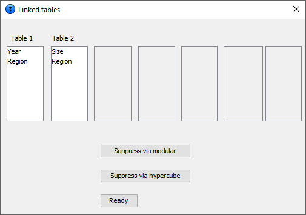{width="14.499cm"
> height="10.084cm"}

> The set of linked tables can now be protected by pressing 'Suppress
> via modular' or 'suppress via hypercube'. τ-argus will then start an
> automatic procedure.

> When the modular approach is selected, the subtables will be loaded in
> the cover table. The cover table will then be protected via an extra
> batch-run of τ‑argus and in the end the results (suppression pattern)
> will be transferred to the original subtables. If this procedure might
> fail, information could be found in the log-file of τ‑argus. See also
> section [5.8](#anchor-257).

> Modular will ask for the selection of the singleton rules as usual.

> 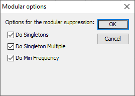{width="7.117cm"
> height="5.054cm"}

> When making the cover table τ-argus will check for consistencies. E.g
> cells that are in the overlapping part of a table and who are by
> definition equal should have the same value status, protection level
> etc. If τ-argus finds some inconsistencies, it will be reported.

> {width="8.546cm"
> height="4.128cm"}In the example the value of cell "Total,Nr"
> (4373664.0) and "12,Total" (1441228.0) are not correct. In two
> different input files the status is not equal.

> {width="12.039cm"
> height="13.388cm"}

> When the hypercube is selected, all the input files for the hypercube
> will be prepared and the linked table procedure of the hypercube will
> be started to protect the set of tables. Also the hypercube does not
> like inconsistencies in e.g. the status. These will be reported in the
> file PROTO002 in the temp-directory.

> 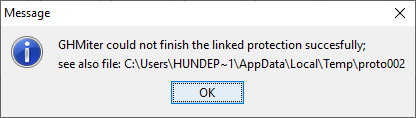{width="11.007cm"
> height="3.122cm"}

> If successful the following information will be shown:

> {width="9.624cm"
> height="4.713cm"}

> When the protection has been completed, the linked tables procedure
> can be closed and the individual protected subtables can be inspected
> and stored as normal tables.

## []{#anchor-258}[]{#anchor-259}The Output menu

### []{#anchor-145}[]{#anchor-110}[]{#anchor-260}[]{#anchor-261}[]{#anchor-262}Output \| Save Table

> There are six options of saving the tables

> 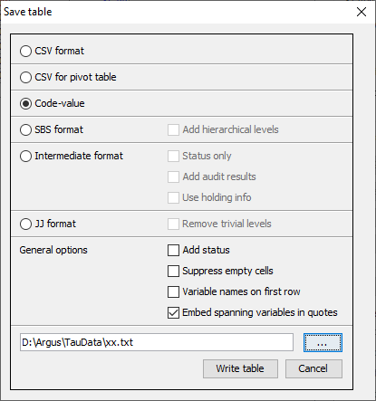{width="11.351cm"
> height="12.012cm"}

> **As a CSV file**. This Comma Separated file can easily be read into
> Excel. Please note the Excel should interpret the comma as a
> separator. If your local settings are different you could use the
> Excel option 'Data\|Text to Columns', This a typical tabular output
> maintaining the appearance of the table in τ-argus.

> **CSV-file for a pivot table**. This offers the opportunity to make
> use of the facilities of pivot table in Excel. The status of each cell
> can be added here as an option (Safe, Unsafe or Protected for
> example). The information for each cell is displayed on a single line
> unlike standard csv format

> **A text file** in the format code-value, this is separated by commas.
> Here, the cell status is again an option. Also empty cells can be
> suppressed from the output file if required. The information for each
> cell is displayed on a single line similar to the CSV file for a pivot
> table. There are two possibilities. Either the unsafe cells are shown
> as an 'x', as it should be in the final publication or the exact
> status can be printed in the output file in addition to the cell
> value. Optionally empty cells can be suppressed.

> When the status is added to the output file τ-argus can use 14
> different statuses. They can also be found in the report file.

+----------+-------------------------+
| > Number | > Status                |
+----------+-------------------------+
| > 1      | > Safe                  |
+----------+-------------------------+
| > 2      | > Safe (manual)         |
+----------+-------------------------+
| > 3      | > Unsafe                |
+----------+-------------------------+
| > 4      | > Unsafe (request)      |
+----------+-------------------------+
| > 5      | > Unsafe (Freq)         |
+----------+-------------------------+
| > 6      | > Unsafe (Zero cell)    |
+----------+-------------------------+
| > 9      | > Unsafe (manual)       |
+----------+-------------------------+
| > 10     | > Protected             |
+----------+-------------------------+
| > 11     | > Secondary             |
+----------+-------------------------+
| > 12     | > Secondary (from man.) |
+----------+-------------------------+
| > 13     | > Empty (non-struct.)   |
+----------+-------------------------+
| > 14     | > Empty                 |
+----------+-------------------------+

> Note: 7 and 8 are no longer used. But in order to be compatible with
> older versions of τ-argus we did not change the numbers.

> **A SBS-format file**. This file contains the information required by
> Eurostat for different surveys like the SBS-survey. Each line
> describes one cell in the table. First all the spanning variables,
> with the levels in the hierarchy, then the cell value, the cell
> frequency, the status and the dominance percentage. If the 2 largest
> contributors have been computed this percentage is the sum of the
> largest two, otherwise the largest one. It will be obvious that this
> output format is not possible if a table has been used as input, with
> only the status or maybe a cell frequency.

> The cell status can be:

+------+------------------------------------------+
| > A  | > Frequency unsafe                       |
+------+------------------------------------------+
| > B  | > Dominance unsafe with one contributor  |
+------+------------------------------------------+
| > C  | > Dominance unsafe with two contributors |
+------+------------------------------------------+
| > D  | > Secondary unsafe                       |
+------+------------------------------------------+
| > V  | > Safe                                   |
+------+------------------------------------------+

> **A file in intermediate format** for possible input into another
> program. This contains protection levels and external bounds for each
> cell. This file could even be read back into τ-argus, using the read
> tables option

> The options are:

-   Write only the status

-   Add the results of the audit procedure (realised lower and upper
    > bounds)

-   Write information at the holding level, like the frequency.

-   Suppress the empty cells.

> Of course certain options are only available if appropriate.

> Finally, a report will be generated to a user specified directory.
> This report will be shown, when the table has been written. As this is
> an HTML-file; it can be viewed easily later.

> A **file in JJ-format**. This is an intermediate format used in
> τ‑argus. See section [5.5](#anchor-263).

> Some options are applicable to several output-versions. These are
> grouped together under "General Options".

### []{#anchor-264}[]{#anchor-265}[]{#anchor-266}[]{#anchor-114}[]{#anchor-267}[]{#anchor-268}[]{#anchor-269}Output \| View Report

> Views the report file which has been generated with Output\|Save
> Table. An example of a part of the output HTML file is shown here.

> As can be seen the essential information, for somebody other than the
> user, about which rules have been applied to make the data safe is
> displayed along with details of any recoding. If required the report
> can be printed as well.

> {width="13cm"
> height="17.452cm"}

> A nicer view of the report will be obtained if you open the report in
> a web-browser:

> {width="13.049cm"
> height="16.806cm"}

### []{#anchor-270}[]{#anchor-271}Output \| Generate apriori

> In many situations it is desirable to coordinate the secondary
> suppressions between tables. This can be because of links between
> tables. Suppressions in one table should also be suppressions on the
> other table.

> But also when protecting monthly tables it could be a good idea to
> coordinate suppressions between the different months. A secondary
> suppression in month 1 could be an ideal candidate for secondary
> suppression in month 2. This could be achieved by changing the
> suppression weights for these cells.

> The apriori option is the way to change the default suppression
> weights etc. But this leaves the task of generating the apriori file.

> Via this option the protected file as generated by τ-argus can be
> converted into an apriori file. The table has to be saved in the
> format code-value with the 'Add Status'-option selected.

> For each status the user can select which action in the apriori file
> has to be created. This can be a change of the suppression weight,
> give a new status, or nothing at all.

> The user has to specify the protected file (written in the right
> format (saved as code/value plus status) and the apriori file to be
> generated.

> Also the correspondence between the variables must be specified. It is
> not always the case that the first spanning variable is also the first
> spanning variable in the apriori file. Even the number of variable can
> be different. If not all variables of the safe file will be available
> in the newly to be protected file, only the score for the total will
> be used. This is often the case if the apriori file is generated for a
> linked tables problem.

> The separator to be used in the apriori file must be specified as
> well; a comma is the default.

> Pressing the 'Go'-button will generate the apriori file and the
> 'ready'-button will bring you back to the main menu of τ-argus.

> 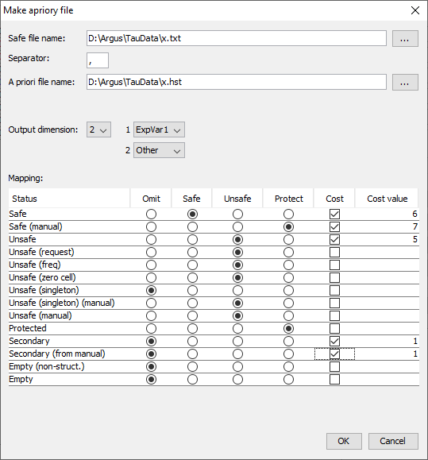{width="12.388cm"
> height="13.963cm"}

### []{#anchor-272}[]{#anchor-273}[]{#anchor-274}[]{#anchor-275}[]{#anchor-276}Output \| Write Batch File

> The commands used in interactive mode can be saved into a file for
> future use. τ-argus will write a batch file containing the commands
> necessary to achieve the current situation of the τ-argus run so far.
> For more information on the batch facility see section
> [4.3.3](#anchor-182)

> For example the following shows the dominance rule (n=3, k= 75)
> applied to the Size by Region table with Var2 as the response
> variable. The threshold value = 5 with a safety range = 30%. Modular
> secondary suppression was applied. The last line indicates that
> τ-argus will not stop after these commands but become an interactive
> program.

> \<OPENMICRODATA\> \"C:\\Program Files\\TauARGUS\\data\\tau_testW.asc\"

> \<OPENMETADATA\> \"C:\\Program Files\\TauARGUS\\data\\tau_testW.rda\"

> \<SPECIFYTABLE\> \"Size\"\"Region\"\|\"Var2\"\|\"\"\|\"\"

> \<SAFETYRULE\> NK(3,75)\|NK(0,0)\|FREQ(5,30)\|

> \<READMICRODATA\>

> \<SUPPRESS\> MOD(1)

> \<GOINTERACTIVE\>

## []{#anchor-277}[]{#anchor-278}[]{#anchor-279}The Help menu

### []{#anchor-280}[]{#anchor-281}Help \| Contents

> This shows the contents page of the help file and from there makes the
> help available. This program has context-sensitive help. By pressing
> F1, the relevant page of the manual will be shown.

### []{#anchor-282}[]{#anchor-283}[]{#anchor-284}Help \| News

> Information on the latest developments is shown. Old friends can see
> here which new extensions have been included in this version of
> τ-argus and information about bugs is shown here as well.

### []{#anchor-285}[]{#anchor-106}[]{#anchor-286}[]{#anchor-287}Help \| Options

> There are a number of options, which can be changed here. The colours
> indicating the status of a cell can be altered.

> In order to make a hierarchical table more readable, the different
> levels of the hierarchy will be indicated with an increasing grey
> background. If you like different colours, you can adapt this.

> For the modular solution the maximum computing time per subtable can
> be specified. This could speed up the computations, but on the other
> hand might give a less optimal solution.

> Also the name of the logfile (see section [5.8](#anchor-257)) can be
> changed here. By default it is Logbook.txt in the temp-directory.

> Finally the solver for the optimisation routines must be specified.
> The options are: cplex or Xpress or a free solver. τ-argus can work
> with all three solvers.

> If the cplex optimisation routine is being used, the location of the
> licence file can be specified here. For Xpress the name of the licence
> file is prescribed and fixed (XPAUTH.XPR) The Xpress licence file has
> to be stored in the τ-argus program directory.

> τ-argus will store the information of all these options in the
> registry and will use it in future runs. It is advisable but not
> necessary to open this window at the start of a τ-argus session to
> ensure the correct solver has been chosen.

> {width="12.859cm"
> height="8.255cm"}

### []{#anchor-288}[]{#anchor-289}Help \| About

> Shows the about box.

> {width="10.781cm"
> height="10.178cm"}

# []{#anchor-290}[]{#anchor-16}[]{#anchor-118}Further descriptions

## []{#anchor-173}[]{#anchor-291}Meta data files

> The meta data plays a vital role in τ-argus. The meta data is always
> specified and stored in a separate file. As τ-argus can read both
> micro data as input as tabular data, the meta data descriptions will
> be different as well. Nevertheless there are many similarities,
> especially between meta data for fixed and free format micro data.

> The meta data can always be changed/adapted/entered via the menu item
> Specify\|Metadata, see sections [4.4.1](#anchor-92),
> [4.4.2](#anchor-215) and [4.4.3](#anchor-218).

> As no standard meta data system is available which is powerful enough
> to manage the complete metadata specification necessary for
> Statistical Disclosure Control we had to develop something specially
> for τ-argus.

> The metadata file (default extension .RDA) has globally the same
> structure for all the different file types that can be handled by
> τ-argus. i.e fixed format/free format microdata, SPSS system files or
> tabular data.

> For each variable the name is specified followed by its position in
> the file and possible missing values. Following this specification
> additional information can be specified. These specifications always
> start with a keyword enclosed by "\<"and"\>" followed by the
> specifications.

> The metadata is always stored in a plain text file without any tabs or
> so. If you wish you could enter/modify the metadata file with e.g.
> Notepad, but not with Word. It is then your own risk that the metadata
> is syntactically correct. τ-argus will check the meta data file when
> it is read, but to a certain limit. The best way is to modify the
> metadata via the τ‑argus program.

> Files mentioned in meta-files are assumed to reside in the same
> directory as the meta-file. If not, the complete directory-path should
> be specified.

> We will first describe in section [5.1.1](#anchor-211)the meta data
> file a fixed format micro data file. In the subsequent sections the
> special issues for the other file formats (free format and SPSS) will
> be described. In section [5.1.4](#anchor-219) the meta data for
> tabular data files will be dscribed.

### []{#anchor-292}[]{#anchor-211}[]{#anchor-293}Meta data for fixed format micro data 

> For fixed format for each variable the starting position and the field
> length have to be specified. Also the possible missing values must be
> specified as well as the role that a variable can play in the
> SDC-analysis, like spanning variable (also known as explanatory
> variable), cell item, weight, etc. Additional extra specifications can
> be entered. as well, like codelists and hierarchical structures.

> The metafile describes the variables in the microdata file, both the
> record layout and some additional information necessary to perform the
> SDC-process. Each variable is specified on one main line followed by
> one or more option lines.

> The first line gives the name of the variable followed by the starting
> position for each record, the width of the field and optionally one or
> two missing value indicators for the record. Missing values are not
> required in τ-argus, but they can play a role when deciding whether or
> not a cell is unsafe.

> For fixed format microdata it is not necessary to specify all the
> variables in the file. Only the variables used in τ‑argus have to be
> specified. When reading the data τ‑argus will ignore the fields not
> described. This will improve the speed of processing.

> The following lines explain specific characteristics of the variable:

+--------------------------+------------------------------------------+
| -   \<RECODEABLE\>       | > This variable can be recoded and used  |
|                          | > as an explanatory variable in a table  |
+--------------------------+------------------------------------------+
| -   \<CODELIST\>         | > This explanatory (or spanning)         |
|                          | > variable can have an associated        |
|                          | > codelist which gives labels to the     |
|                          | > codes for this particular variable.    |
|                          | > The name of the codelist file follows  |
|                          | > this \<CODELIST\> command. The default |
|                          | > extension is .CDL. See section         |
|                          | > [5.3](#anchor-294)                     |
+--------------------------+------------------------------------------+
| -   \<NUMERIC\>          | > This numeric variable can be used as   |
|                          | > cell-item.                             |
+--------------------------+------------------------------------------+
| -   \<DECIMALS\>         | > The number of decimal places specified |
|                          | > for this variable                      |
+--------------------------+------------------------------------------+
| -   \<WEIGHT\>           | > This variable contains the weighting   |
|                          | > scheme                                 |
+--------------------------+------------------------------------------+
| -   \<HIERARCHICAL\>     | > This variable is hierarchical. The     |
|                          | > codings are structured so that there   |
|                          | > is a top code such as Region (N,S,E,W) |
|                          | > and within each of these are smaller   |
|                          | > more specific areas (and possibly      |
|                          | > sub-areas). Tables may be viewed at    |
|                          | > different levels of hierarchy.         |
+--------------------------+------------------------------------------+
| -   \<HIERLEVELS\>       | > The hierarchy is derived from the      |
|                          | > digits of the codes itself. The        |
|                          | > specification is followed by a list of |
|                          | > integers denoting the width of each    |
|                          | > level. The sum of these integers       |
|                          | > should be the width of the total code. |
|                          | > An example is shown beneath the rda    |
|                          | > file below.                            |
+--------------------------+------------------------------------------+
| -   \<HIERCODELIST\>     | > The name of the file describing the    |
|                          | > hierarchical structure. Default        |
|                          | > extension .HRC. See section            |
|                          | > [5.2](#anchor-295).                    |
+--------------------------+------------------------------------------+
| -   \<HIERLEADSTRING\>   | > The string/character that is used to   |
|                          | > indicate the depth of a code in the    |
|                          | > hierarchy***.*** See section           |
|                          | > [5.2](#anchor-296)                     |
+--------------------------+------------------------------------------+
| -   \<REQUEST\>          | > This variable contains the status      |
|                          | > denoting whether or not a respondent   |
|                          | > asked for protection                   |
+--------------------------+------------------------------------------+
| -   \<HOLDING\>          | > This variable contains the indication  |
|                          | > whether a group of records belong to   |
|                          | > the same group/holding                 |
+--------------------------+------------------------------------------+

> Here is an example of a rda file for microdata. (Note, the dots at the
> bottom just means that here a shortened version of the file is
> presented.)

> YEAR 1 2 99

> \<RECODEABLE\>

> IndustryCode 4 5 99999

> \<RECODEABLE\>

> \<HIERARCHICAL\>

> \<HIERLEVELS\> 3 1 1 0 0

> Size 9 2 99

> \<RECODEABLE\>

> Region 12 2 99

> \<RECODEABLE\>

> \<CODELIST\> Region.cdl

> \<HIERCODELIST\> Region2.hrc

> \<HIERLEADSTRING\> @

> \<HIERARCHICAL\>

> Wgt 14 4

> \<NUMERIC\>

> \<DECIMALS\> 1

> \<WEIGHT\>

> Var1 19 9 999999999

> \<NUMERIC\>

> Var2 28 10 9999999999

> \<NUMERIC\>

> \<DECIMALS\> 2

> ............

> Explanation of the details of the variables

> *'Year'*: For this explanatory/spanning variable each record begins on
> position 1, is 2 characters long and missing values are represented by
> 99. It is also recodeable implicitly stating that it is an explanatory
> or spanning variable used to create the tables.

> *'IndustryCode'*: For this variable each record begins on position 4
> and is 5 characters long. Missing values are represented by 99999. As
> well as being recodeable this variable is hierarchical and the
> hierarchy structure is specified. The first 3 characters are in the
> top hierarchy level, the 4^th^ character in the second level and the
> 5^th^ character in the lowest level. As 'Industry' is a 5 digit
> variable there are 5 digits specified for the hierarchical structure.
> This is the reason for the 2 zeros at the end.

> *'Size':* For this variable each record begins on position 9 and is 2
> characters long, and missing values are represented by 99. It is also
> recodeable.

> *'Region'*: For this variable each record begins on position 12 and is
> 2 characters long. Missing values are represented by 99. Region has a
> codelist. See section [5.3](#anchor-297). Region is also a
> hierarchical variable. As the hierarchical structure cannot be derived
> from the structure of the coding scheme itself the hierarchical
> structure is described in a special .HRC file. See section
> [5.2](#anchor-298). The hierarchical structure is described with an
> indentation structure. Therefore the indentation character
> (HIERLEADSTRING) has to be specified. Here an @ was chosen.

> *'Wgt'*: For this variable each record begins on position 14 and is 4
> characters in length. There is 1 decimal place for these values and
> the variable is defined as a weight. A missing value is not allowed
> here.

> Two numeric variables are also shown in the above rda file. These
> numeric variables (not defined as weights) are those to be used as
> cell items *i.e.* response variables used in creating the table.

> *'Var1'*: This variable begins on position 19 and is 9 characters
> long. Missing values are represented by 999999999 and it is numeric.
> However the missing values for numerical variables will be ignored.
> The missing values problem should have been solved by e.g. imputation
> techniques, but it is outside of the scope of τ‑argus.

> *'Var2'*: This variable begins on position 28 and is 10 characters
> long. Missing values are represented by 9999999999 and it is numeric.
> This variable has 2 decimal places.

> The representation in an rda file for the Request rule and Holding
> Indicator are shown here for completeness.

> Request rule

> Request 99 1

> \<REQUEST\> \"1\" \"2\"

> Here the request indicator is in column 99 and is one character long.
> Individuals (or companies) wishing to make use of this rule are
> represented by 1 or 2, Any other value will be interpreted as 'no
> request'. Two different parameters-sets for the request rule can be
> specified, the first set will be applied to the companies where the
> first code has been specified, the second set to the companies with
> the second code. The request rule is further explained in section
> [4.4.4](#anchor-45).

> This rule is used in foreign trade statistics and based on a special
> regulation..

> Holding Indicator

> entgroup 101 4

> \<HOLDING\>

> Here the variable 'entgroup' is in column 101 and is four characters
> long. This variable is to act as the holding indicator (see section
> 4.3.1 for further explanation). The records of a holding should be
> grouped together in the input datafile. τ-argus will not search
> through the whole file to try to find all records for a holding.
> Before applying the sensitivity rules all records of one holding are
> grouped together and treated as one contribution.

### []{#anchor-299}Meta data for free format micro data 

> For a free-format datafile the RDA is a little bit different. Notably
> the first line specifies the separator used. This indicates to τ-argus
> that the record description is for a free-format file. And for each
> variable the starting position is no longer specified, as this is
> meaningless in a free-format datafile. For the rest there are no
> differences compared to the fixed format version. The example given
> above for a fixed format file will now looks as:

> \<SEPARATOR\> \",\"

> YEAR 2 99

> \<RECODEABLE\>

> Sbi 5 99999

> \<RECODEABLE\>

> \<HIERARCHICAL\>

> \<HIERLEVELS\> 3 1 1 0 0

> GK 2 99

> \<RECODEABLE\>

> Regio 2 99

> \<RECODEABLE\>

> \<CODELIST\> REGION.CDL

> \<HIERARCHICAL\>

> \<HIERCODELIST\> region2.hrc

> \<HIERLEADSTRING\> @

> Wgt 4 9999

> \<NUMERIC\>

> \<DECIMALS\> 1

> \<WEIGHT\>

> Var1 9 999999999

> \<NUMERIC\>

> Var2 10 9999999999

> \<NUMERIC\>

> \<DECIMALS\> 2

> ..

> ..

### []{#anchor-300}Meta data for SPSS system files

> When the microdata is stored in a SPSS System file τ-argus can also
> read this data. However some special rules have to be taken into
> account. It is assumed that a valid license for SPSS is available on
> the computer, because τ-argus will call SPSS to read the data from the
> systemfile. Also part of the metadata will be retrieved from SPSS.
> However not all meta data needed for τ‑argus is available in SPSS, so
> the user has to enter the additional metadata himself. See section
> [4.4.2](#anchor-216)

> In fact τ-argus will call SPSS to export the data and will create a
> fixed format scratch file in the temp-directory. After that τ‑argus
> will work similar to working with fixed format ASCII files.

> The first time you open a SPSS systemfile, no metadata file can and
> has to be specified.

> After opening the SPSS system file in this menu option SPSS will be
> called and the meta data (Variable names, field length, missing
> values) available in SPSS will be read. This is a process that takes a
> bit of time and should not be interrupted by pressing any key or so.
> However no progress information can be showed on the screen.

> If you reopen an SPSS system file with a meta data file, τ-argus will
> check whether all the variables in the RDA file are really available
> in the system file.

> The RDA file is very similar to the RDA file for a fixed format ASCII
> file. One exception is that the first line will read

> \<SPSS\>

### []{#anchor-219}[]{#anchor-301}Meta data for tabular data files

> When a tabular datafile has been selected, the metadata file will have
> a different structure. Clicking on 'Specify\|Metafile' gives the
> opportunity to either edit the metafile already read in or to enter
> the metafile information directly at the computer.

> As tabular input is always expected to be free format, first the
> separator has to be specified.

> The variables can have the following role:

+--------------------------------+------------------------------------+
| -   \<RECODEABLE\>             | > The spanning variables used to   |
|                                | > produce the table. The same as   |
|                                | > for microdata input files, like  |
|                                | > hierarchical structures and      |
|                                | > codelist                         |
+--------------------------------+------------------------------------+
| -   \<TOTCODE\>                | > Code for the total of a codelist |
+--------------------------------+------------------------------------+
| -   \<NUMERIC\>                | > Response Variable -- The         |
|                                | > variable used to calculate the   |
|                                | > cell total.                      |
+--------------------------------+------------------------------------+
| -   \<NUMERIC\> \<SHADOW\>     | > Shadow variable -- The variable  |
|                                | > is used as a shadow variable.    |
+--------------------------------+------------------------------------+
| -   \<NUMERIC\> \<COST\>.      | > Cost variable -- The variable is |
|                                | > used as the cost-variable        |
+--------------------------------+------------------------------------+
| -   \<NUMERIC\> \<LOWERPL\>    | > Lower protection level -- The    |
|                                | > lower protection level           |
+--------------------------------+------------------------------------+
| -   \<NUMERIC\> \<UPPERPL\>    | > Upper protection level -- The    |
|                                | > upper protection level           |
+--------------------------------+------------------------------------+
| -   \<FREQUENCY\>.             | > Frequency -- This indicates the  |
|                                | > number of observations making up |
|                                | > the cell total. If there is no   |
|                                | > frequency variable each cell is  |
|                                | > assumed to consist of a single   |
|                                | > observation                      |
+--------------------------------+------------------------------------+
| -   \<MAXSCORE\>               | > 'topN variable' -- This shows if |
|                                | > this variable is defined as one  |
|                                | > of the top N contributors to the |
|                                | > cell. The pre-defined value for  |
|                                | > TopN is 1. The first variable    |
|                                | > declared as 'topN' will contain  |
|                                | > the largest values in each cell, |
|                                | > the second variable so declared  |
|                                | > will contain the second largest  |
|                                | > values etc.                      |
+--------------------------------+------------------------------------+
| -   \<STATUS\>                 | > \>'Status Indicator' -- allows a |
|                                | > variable in the left-hand pane   |
|                                | > to be declared as a Status       |
|                                | > Indicator. Typically cells can   |
|                                | > be declared as Safe, Unsafe or   |
|                                | > Protected                        |
+--------------------------------+------------------------------------+
| -   \<SAFE\>                   | > The code used for indicating     |
|                                | > that a cell is safe              |
+--------------------------------+------------------------------------+
| -   \<UNSAFE\>                 | > The code used for indicating     |
|                                | > that a cell is unsafe            |
+--------------------------------+------------------------------------+
| -   \<PROTECT\>                | > The code used for indicating     |
|                                | > that a cell is protected and     |
|                                | > cannot be used for secondary     |
|                                | > suppression                      |
+--------------------------------+------------------------------------+

> For explanatory variables the code for the total has to be specified.
> We recommend strongly that the user also provides the values for the
> totals himself, but if needed he can ask τ-argus to compute these
> totals. In any case, τ-argus needs these totals as they play an
> important role is the structure of a table and also are important for
> the suppression models.

> \<SEPARATOR\> ","

> \<SAFE\> s

> \<UNSAFE\> u

> \<PROTECT\> p

> expvar1

> \<RECODABLE\>

> \<TOTCODE\> T

> expvar2

> \<RECODABLE\>

> \<TOTCODE\> T

> respvar

> \<NUMERIC\>

> freq

> \<FREQUENCY\>

> top1

> \<MAXSCORE\>

> top2

> \<MAXSCORE\>

> top3

> \<MAXSCORE\>

> stat

> \<STATUS\>

## []{#anchor-295}[]{#anchor-296}[]{#anchor-298}[]{#anchor-93}Hierarchy file

> Hierarchical structures play an important role in τ-argus. The
> hierarchical structures can often be derived from the code itself.
> E.g. the NACE classification is an example of this. In other
> situations the structure is not so clear. In that case the whole
> structure has to be specified. A hierarchical structure is in fact a
> tree. And a tree can be described easily by indentation. In τ‑argus a
> hierarchical structure can be described in a simple text-file, using
> Notepad or something similar. The default extension is .HRC.

> One level deeper means a new sub-node in the tree. In the example
> given below only two levels are shown, but many more levels are
> allowed. The indentation (an @ in this example) character has to be
> specified separately in the RDA file.

> Note that the total code is never specified in these .HRC files, as
> τ‑argus always assumes that the total will be computed.

> Note also that in this situation the codes 1 to 9 in a fixed format
> file have a leading space. This space should be used in the HRC-file
> as well.

> region2.hrc

> Nr

> @ 1

> @ 2

> @ 3

> Os

> @ 4

> @ 5

> @ 6

> @ 7

> Ws

> @ 8

> @ 9

> \@10

> Zd

> \@11

> \@12

## []{#anchor-294}[]{#anchor-297}[]{#anchor-98}Codelist file

> Codelists can be specified for explanatory variables. The codes are
> stored in a separate file (default extension .CDL).

> However the codes are only used to enhance certain windows during the
> processing. τ-argus itself will create the coding schemes for the
> variables used during the processing of the datafile. So a code not
> specified in the .CDL-file will not cause any problem, only the label
> is not available. Also codes specified but not found in the data file
> will be ignored.

> The structure of the file is simple. Each line contains a code and a
> label separated by a ","

> region.cdl

> 1,Groningen

> 2,Friesland

> 3,Drenthe

> 4,Overijssel

> 5,Flevoland

> 6,Gelderland

> 7,Utrecht

> 8,Noord-Holland

> 9,Zuid-Holland

> 10,Zeeland

> 11,Noord-Brabant

> 12,Limburg

> Nr,North

> Os,East

> Ws,West

> Zd,South

## []{#anchor-134}[]{#anchor-302}Global recode file

> Global recoding is a powerful method to reduce the number of primary
> unsafe cells. It reduces the size of the table, but the advantage is
> also that the number of primary unsafe cells is reduced. It is a
> classical balance to decide how far you should go when applying global
> recodes, but often the resulting table contains much more information,
> compared to a table with many, but suppressed cells.

> For a hierarchical coding scheme τ-argus allows recoding via
> collapsing the tree structure of the hierarchy. But for non-structured
> codelists the global recode must be specified manually

> The structure is always: A new code is assigned to a set of old codes.
> So all the old codes are collapsed into the new code. A set can be
> either a list of individual codes, separated by a comma, or an
> interval indicated by a lower code, dash upper code. If the upper or
> lower code is not specified an open interval is assumed.

> Examples:

> For a variable with the categories 1,...,182 a possible recode is
> then:

> 1: - 49

> 2: 50 - 99

> 3: 100 -- 149

> 4: 150 --

> This implies that every code below 49 will be recoded into the new
> code 1,all codes between 50 and 99 will be the new code 2 etc.

> For a variable with the categories 01 till 10 a possible recode is:

> 1: 01 , 02

> 2: 03 , 04

> 3: 05 -- 07

> 4: 08 , 09 , 10

> An important point is not to forget the colon (:) if it is forgotten,
> the recode will not work.

> Recoding 3: 05,06,07 can be shortened to 3: 05-07.

> And the two different schemes can be combined as well

> 1: 02 - 06, 09

> is a valid recode as well.

## []{#anchor-303}[]{#anchor-263}The JJ-file format

> The JJ-file format has been introduced to establish a link between the
> (hierarchical) tables and the structures required for the optimisation
> routines used in Cell-suppression etc.

> Basically it is a set of table-cells and a set of relations between
> them. The layout is free-format separated by one or more spaces.

> The first line is a zero

> The second line is the number of cells.

> Then all cells are described. The entries on a line are:

-   A sequence number

-   The cell value

-   The value of the cost-function

-   The status (s = safe, m = secondary suppression, u = primary unsafe,
    > z = protected cell or empty)

-   The lower bound

-   The upper bound

-   The lower protection level

-   The upper protection level

-   The sliding protection level (never used in τ‑argus)

> Then the number of relations

> Then follow all the relations.

> Each relation starts with a '0'followed by the number of cells in that
> relations and a colon (':'). Then the sequence-number of the total
> cell (followed by a (-1) and all the sub-cells (followed by a (1).

> Example of a part of a JJ-file:

> 0

> 162

> 0 16847646.84 20000 s 0.00 25271470.26 0.0100 0.0100 0.00

> 1 4373664.00 5192 s 0.00 25271470.26 0.0100 0.0100 0.00

> 2 1986129.00 2358 s 0.00 25271470.26 0.0100 0.0100 0.00

> 3 1809246.00 2148 s 0.00 25271470.26 0.0100 0.0100 0.00

> 4 578289.00 686 s 0.00 25271470.26 0.0100 0.0100 0.00

> 5 3703896.00 4397 s 0.00 25271470.26 0.0100 0.0100 0.00

> \...

> \...

> \...

> \...

> 63

> 0 9 : 0 (-1) 18 (1) 36 (1) 54 (1) 72 (1) 90 (1) 108 (1) 126 (1) 144
> (1)

> 0 9 : 1 (-1) 19 (1) 37 (1) 55 (1) 73 (1) 91 (1) 109 (1) 127 (1) 145
> (1)

> 0 9 : 2 (-1) 20 (1) 38 (1) 56 (1) 74 (1) 92 (1) 110 (1) 128 (1) 146
> (1)

> 0 9 : 3 (-1) 21 (1) 39 (1) 57 (1) 75 (1) 93 (1) 111 (1) 129 (1) 147
> (1)

> 0 9 : 4 (-1) 22 (1) 40 (1) 58 (1) 76 (1) 94 (1) 112 (1) 130 (1) 148
> (1)

> \...

> \...

> \...

> \...

## []{#anchor-304}[]{#anchor-305}[]{#anchor-306}[]{#anchor-130}[]{#anchor-103}The apriori file

> The apriori file can be used to modify the characteristics of a cell
> before the secondary cell suppression routines are called. You can
> modify the following characteristics:

-   Cell status

-   Cost-function

-   Protection levels

> The apriori file is a simple text-file that can be created with
> notepad and similar programs. The layout of the apriori file is
> simple. First the codes of the spanning variables are given, separated
> by a semicolon (";"), then the code indicating the change requested
> and the depending on the code some additional parameters

+--------+------------------------+-----------------------------+
| > Code | > Parameters           | > Description               |
+--------+------------------------+-----------------------------+
| > S    | > \-                   | > Status becomes safe       |
+--------+------------------------+-----------------------------+
| > U    | > \-                   | > Status become (manually)  |
|        |                        | > unsafe                    |
+--------+------------------------+-----------------------------+
| > P    | > \-                   | > Status becomes protected  |
+--------+------------------------+-----------------------------+
| > C    | > New cost value       | > A low cost-value will     |
|        |                        | > make it more likely that  |
|        |                        | > this cell becomes a       |
|        |                        | > candidate for secondary   |
|        |                        | > suppressions. A high      |
|        |                        | > value will decrease this  |
|        |                        | > chance.                   |
|        |                        |                             |
|        |                        | > This can be used to       |
|        |                        | > coordinate suppression    |
|        |                        | > patterns between          |
|        |                        | > successive years of a     |
|        |                        | > certain table             |
+--------+------------------------+-----------------------------+
| > PL   | > New protection level | > If smaller or larger      |
|        |                        | > protection is required,   |
|        |                        | > this can be indicated     |
|        |                        | > here                      |
+--------+------------------------+-----------------------------+

> Note: changing the status of a cell is of course limited. E.g. a
> primary unsafe cell cannot become protected, nor can a protected cell
> become unsafe.

> The cost function must always be positive.

> It is recommended to restrict the use of setting a cell status to
> protected. If you want to prevent that a cell will become a secondary
> suppression, give it a high cost value. If this cell is nevertheless
> suppressed, there will be a good reason for this. Putting a cell to
> protected, might lead to infeasible problems with all the consequences
> of that.

> An example:

> Nr, 4, u

> Zd, 6, p

> 5, 5, c, 1

> {width="13cm"
> height="12.333cm"}

> The apriori file allows you to feed τ-argus a list of cells where the
> status of the standard rules can be overruled. E.g. a cell must be
> kept confidential or not for other reasons that just because of the
> sensitivity rules. By modifying the cost-function you can influence
> the selection of the secondaries. E.g. the cells suppressed last year
> can get a preference for the suppression this year by giving this cell
> a small value for the cost-function.

> The option 'trivial levels' is important. Often in a table with
> hierarchies, some levels in a hierarchy break down in only one lower
> level. This implies that there are different cells in a table which
> are implicitly the same. Changing the status of one of them might lead
> to inconsistencies and serious problems. E.g. one of the two is unsafe
> and the other is protected, the solution is impossible. If you select
> the option 'Expand for trivial levels', τ‑argus will always modify all
> cells that are the same if you modify one of them.

## []{#anchor-193}[]{#anchor-307}The Batch command file

> τ-argus has originally been designed as an interactive program. A
> complete menu-driven design guides you through all steps of the
> process. However a growing need for a batch version emerged after
> that. Since then τ-argus has been extended with a batch version. The
> batch commands are stored in a separate text-file. These commands can
> be executed from the command line or via the menu (File\|Open Batch
> process. See section [4.3.4](#anchor-162).

> Alternatively the batch file can be used in a real batch environment
> as well. Just invoke τ-argus with the command

> Taupath\\TAUARGUS param1 param2 param3 param4

> where Taupath is the name of the directory where you installed
> τ-argus, param1 is the name of the file with batch commands; see
> below. Param2 is optional, and is the name of the logfile. If omitted
> τ-argus will write a logbook in the file logbook.txt in the
> temp-directory. See also section [5.8](#anchor-257). Param3 is the
> parameter specifying the temp-directory. If omitted the default
> temp-directory will be used. Param4 specifies the batch data
> directory.

> When using τ-argus interactively a batch file can be generated via the
> menu Output\|Write Batch file. See section [4.6.4](#anchor-272). But
> we advise you to inspect the results of this action before using this
> generated batch-file as certain details might have been omitted.

> Layout of the batch-file

> A file can be written in a text editor and called from this command.
> Lines starting with "//" will be considered as comment and will be
> ignored.

> Files mentioned in batch-file are assumed to reside in the same
> directory as the batch-file. If not, the complete directory-path
> should be specified.

> The possible commands are shown here.

+-----------------+---------------------------------------------------+
| > Command       | > Parameters                                      |
+-----------------+---------------------------------------------------+
| > LOGBOOK       | > Name of the logbook file; If not specified the  |
|                 | > default logbook file will be used.              |
+-----------------+---------------------------------------------------+
| > COMMENT       | > Just a comment for your convenience.            |
|                 |                                                   |
|                 | > This is equal to starting a line with //        |
+-----------------+---------------------------------------------------+
| > OPENMICRODATA | > Data file name with microdata                   |
+-----------------+---------------------------------------------------+
| > OPENTABLEDATA | > File name containing tabular data               |
+-----------------+---------------------------------------------------+
| > OPENMETADATA  | > Metadata file name                              |
+-----------------+---------------------------------------------------+
| > SPECIFYTABLE  | >                                                 |
|                 | \"ExpVar1\"\"ExpVar2\"\"ExpVar3\"\|\"RespVar\"\|\ |
|                 | > \"ShadowVar\"\|\"Costvar\"\|Lambda              |
|                 |                                                   |
|                 | > For frequency tables you can specify \<FREQ\>   |
|                 | > as Response Variable                            |
|                 |                                                   |
|                 | > ShadowVar, Costvar and Lambda are optional. If  |
|                 | > not specified then ShadowVar, Costvar equal the |
|                 | > Response Variable. For lambda the default is 1. |
|                 |                                                   |
|                 | > If the cost variable is specified either a      |
|                 | > numerical variable can be specified or '-1' is  |
|                 | > chosen for frequency or '-2' for unity or -3    |
|                 | > for the distance function.                      |
|                 |                                                   |
|                 | > (See section [4.4.4](#anchor-45) for the        |
|                 | > explanation for the use of lambda)              |
+-----------------+---------------------------------------------------+
| > CLEAR         | > Clears all and starts a new session.            |
+-----------------+---------------------------------------------------+
| > SAFETYRULE    | > This command is used for primary suppression.   |
|                 |                                                   |
|                 | > All these parameters are described in the       |
|                 | > section Specify tables, [4.4.4](#anchor-45)     |
|                 |                                                   |
|                 | > A set of safety rule specifications separated   |
|                 | > by a "\|"                                       |
|                 |                                                   |
|                 | > Each safety spec starts with \"P\", \"NK\"      |
|                 | > \"ZERO\", \"FREQ\", \"REQ\",\"WGT\",\"MIS\" or  |
|                 | > \"MAN\" and between brackets the parameters     |
|                 |                                                   |
|                 | > **P**: (p,n) with the n optional. (default =    |
|                 | > 1). So (20,3). A p% rule with p=20% and n=3    |
|                 |                                                   |
|                 | > **NK: (**n,k**).** A n,k-dominance rule****     |
|                 | > ****with n = the size of the coalition and k    |
|                 | > the max. percentage.****                        |
|                 |                                                   |
|                 | > **ZERO**: (ZeroSafetyRange)                     |
|                 |                                                   |
|                 | > **FREQ**:(MinFreq, FrequencySafetyRange)        |
|                 |                                                   |
|                 | > **REQ**: (Percent1, Percent2, SafetyMargin)     |
|                 |                                                   |
|                 | > All rules can appear several times,             |
|                 |                                                   |
|                 | > The first two **P, NK** are for the individual  |
|                 | > level; the following two for the holding level, |
|                 |                                                   |
|                 | > The first **FREQ** and **REQ** are at the       |
|                 | > individual level the second one is for the      |
|                 | > holding.                                        |
|                 |                                                   |
|                 | > **ZERO**, the zero safety range parameter, can  |
|                 | > be given only once for each safety rule.        |
|                 |                                                   |
|                 | > **MIS**: 0 = cells with a missing code are      |
|                 | > unsafe if the safety-rules are violated; 1 =    |
|                 | > these cells are always safe. (Default = 0.)     |
|                 |                                                   |
|                 | > **WGT**: 0 no weights are used, 1 = apply       |
|                 | > weights for computing the tables and in the     |
|                 | > safety rules Default = 0                        |
|                 |                                                   |
|                 | > **MAN**: (Manual safety margin). This margin is |
|                 | > used e.g. of a table with only the status is    |
|                 | > read, or if via the apriori option a cell is    |
|                 | > set to manually unsafe. The default value = 20. |
+-----------------+---------------------------------------------------+
| > READMICRODATA | > Just reads the microdata file and calculates    |
|                 | > the table(s), no parameters are required        |
+-----------------+---------------------------------------------------+
| > READTABLE     | > Just reads the tabular inputfile;               |
|                 |                                                   |
|                 | > If the only parameter = 1 the "compute missing  |
|                 | > totals" procedure will be used.                 |
|                 |                                                   |
|                 | > If the parameter = 2 then non-additivity will   |
|                 | > be allowed.\                                    |
|                 | > But this might cause problems in the further    |
|                 | > process.                                        |
|                 |                                                   |
|                 | > Default: do not compute the missing totals. But |
|                 | > an error will be reported if the totals are not |
|                 | > correct.                                        |
+-----------------+---------------------------------------------------+
| > APRIORI       | > This reads an a-priori file                     |
|                 |                                                   |
|                 | > The parameters are: Filename, Table number, the |
|                 | > separator, IgnoreError, ExpandTrivial           |
|                 |                                                   |
|                 | > The Separator should now be enclosed in         |
|                 | > double-quotes                                   |
|                 |                                                   |
|                 | > IgnoreError: if 1 then lines causing an error   |
|                 | > will be ignored.                                |
|                 |                                                   |
|                 | > ExpandTrivial: if 1 then a line will be applied |
|                 | > to all trivial levels in the hierarchy; see     |
|                 | > also section [5.6](#anchor-130)                 |
+-----------------+---------------------------------------------------+
| > SUPPRESS      | > This command applies the secondary suppression. |
|                 |                                                   |
|                 | > The possible options are:                       |
|                 |                                                   |
|                 | > GH: Hypercube                                   |
|                 |                                                   |
|                 | > MOD: Modular                                    |
|                 |                                                   |
|                 | > OPT: Optimal                                    |
|                 |                                                   |
|                 | > NET: Network                                    |
|                 |                                                   |
|                 | > RND: Controlled rounding                        |
|                 |                                                   |
|                 | > CTA: Controlled Tabular Adjustment              |
|                 |                                                   |
|                 | > The parameters are a few parameters between     |
|                 | > brackets; The first parameter is always the     |
|                 | > table number.                                   |
|                 |                                                   |
|                 | > **GH**(TabNo, A priori Bounds Percentage,       |
|                 | > ModelSize, ApplySingleton)                      |
|                 |                                                   |
|                 | > ModelSize 0 = normal, 1 indicates the large     |
|                 | > model.                                          |
|                 |                                                   |
|                 | > ApplySingleton: 1 = yes,0 = no; default = yes   |
|                 | > if the table has frequency-information, no if   |
|                 | > not.                                            |
|                 |                                                   |
|                 | > **MOD**(TabNo, MaxTimePerSubtable,              |
|                 | > SingleSingle, SingleMultiple, MinFreq)          |
|                 |                                                   |
|                 | > The last 3 parameters are the singleton         |
|                 | > options. Each parameter can be 0 or 1. If 1 the |
|                 | > option is activated.                            |
|                 |                                                   |
|                 | > **OPT**(TabNo, MaxComputingTime)                |
|                 |                                                   |
|                 | > **NET**(TabNo)                                  |
|                 |                                                   |
|                 | > **RND(**TabNo, RoundingBase, Steps, MaxTime,    |
|                 | > Partitions, StopRule**)**                       |
|                 |                                                   |
|                 | > **- **Steps: number of steps allowed, normally  |
|                 | > 0 (default)                                     |
|                 |                                                   |
|                 | > \- MaxTime: Max computing time (10 = default)   |
|                 |                                                   |
|                 | > \- Partitions: 0, 1 (0 = no partitioning        |
|                 | > (default), 1 = apply the partitioning           |
|                 | > procedure)                                      |
|                 |                                                   |
|                 | > \- StopRule: 1 = Rapid only, 2 = First feasible |
|                 | > solution, 3 = optimal solution (3 =default)     |
|                 |                                                   |
|                 | > **CTA**(TabNo)                                  |
+-----------------+---------------------------------------------------+
| > SOLVER        | > Indicate whether you will be using cplex,       |
|                 | > Xpress or the free solver. Only needed when the |
|                 | > type of solver has not yet been specified on    |
|                 | > the computer during a previous interactive      |
|                 | > session of τ-argus or if you want to use a      |
|                 | > different solver. The only parameter allowed is |
|                 | > cplex, xpress or free.                          |
|                 |                                                   |
|                 | > If you select cplex the name of the cplex       |
|                 | > licence file can be specified here. But if you  |
|                 | > have already made known this licence file to    |
|                 | > τ-argus in a previous session you can omit it   |
|                 | > here.                                           |
+-----------------+---------------------------------------------------+
| > WRITETABLE    | > TabNo, P1, P2,Filename                          |
|                 |                                                   |
|                 | > P1: Output type:                                |
|                 |                                                   |
|                 | > 1\. CVS-file                                    |
|                 |                                                   |
|                 | > 2\. CSV file for pivot table                    |
|                 |                                                   |
|                 | > 3\. Code, value file                            |
|                 |                                                   |
|                 | > 4\. SBS-output format                           |
|                 |                                                   |
|                 | > 5\. Intermediate file                           |
|                 |                                                   |
|                 | > 6\. JJ format file                              |
|                 |                                                   |
|                 | > P2: Options String. This string contains a      |
|                 | > series of 3 letter combinations, the first two  |
|                 | > are the option and the third one can only be +  |
|                 | > or -, indicating whether or not this option is  |
|                 | > selected or not                                 |
|                 |                                                   |
|                 | > The options are:                                |
|                 |                                                   |
|                 | > AR: write the audit results in an intermediate  |
|                 | > file                                            |
|                 |                                                   |
|                 | > AS: write additionally the status; i.e. do not  |
|                 | > replace the cell value by an x for unsafe       |
|                 | > cells, but give the value and a status          |
|                 | > indicator. This is a number between 1 and 14    |
|                 | > see section [4.6.1](#anchor-110).\              |
|                 | > For CTA and rounding this means that the        |
|                 | > original and the modified value are written.    |
|                 |                                                   |
|                 | > FL: write variable names on the first line      |
|                 |                                                   |
|                 | > HI: write holding level information in an       |
|                 | > intermediate file                               |
|                 |                                                   |
|                 | > HL: write also the hierarchical levels in a SBS |
|                 | > file                                            |
|                 |                                                   |
|                 | > QU: embed codes in quotes                       |
|                 |                                                   |
|                 | > SE: Suppress empty cells                        |
|                 |                                                   |
|                 | > SO: write only the status in an intermediate    |
|                 | > file                                            |
|                 |                                                   |
|                 | > TR: remove trivial levels in the output file.   |
|                 |                                                   |
|                 | > *Note:* not all options can be used in all      |
|                 | > situations. Such options will simply be ignored |
|                 | > and do not cause an error. See the Save Table   |
|                 | > option in the interactive mode to see which     |
|                 | > options are valid in which situation or section |
|                 | > [4.6.1](#anchor-145).                           |
+-----------------+---------------------------------------------------+
| > VERSIONINFO   | > Writes the version of τ‑argus to a file.        |
|                 |                                                   |
|                 | > The name of the file is the only parameter of   |
|                 | > this command. Warning: An existing file will be |
|                 | > overwritten.                                    |
+-----------------+---------------------------------------------------+
| > GOINTERACTIVE | > This will start the GUI of τ‑argus and allows   |
|                 | > to continue interactively.                      |
|                 |                                                   |
|                 | > However if you start the batch file             |
|                 | > interactively from the menu of τ‑ argus you     |
|                 | > will always end in the GUI.                     |
+-----------------+---------------------------------------------------+

> A typical batch file would look like this: (note that everything after
> a // will be treated as comment)

> Example of a batch file using micro data

> //datafile

> \<OPENMICRODATA\> \"C:\\Program Files\\TauARGUS\\data\\tau_testW.asc\"

> //metafile

> \<OPENMETADATA\> \"C:\\Program Files\\TauARGUS\\data\\tau_testW.rda\"

> //Exp\|resp\|shadow\|cost -1=unit -2=freq -3=dist

> \<SPECIFYTABLE\> \"Size\"\"region\"\|\"var2\"\|\"var3\"\|\"var3\"

> \<SAFETYRULE\> P(15,3)\|FREQ(3,20)\|ZERO(10)

> \<SPECIFYTABLE\> \"Size\"\"Year\"\|\"var2\"\|\"var3\"\|\"var3\"

> \<SAFETYRULE\> NK(3,70)\|FREQ(3,20)\|ZERO(20)

> \<READMICRODATA\>

> \<SUPPRESS\> GH(1,75)

> \<WRITETABLE\> (1,1,AS+,\"D:\\TauJava3\\Datata\\x1.csv\")

> \<SUPPRESS\> GH(2,75)

> \<WRITETABLE\> (2,2,QU+,\"D:\\TauJava3\\Datata\\y11.csv\")

> \<SUPPRESS\> MOD(1)

> \<WRITETABLE\> (1,3,AS-,\"D:\\TauJava3\\Datata\\x20.txt\")

> \<SUPPRESS\> MOD(2)

> \<WRITETABLE\> (2,4,SE+,\"D:\\TauJava3\\Datata\\y20.tab\")

> \<SUPPRESS\> OPT(1,5)

> \<WRITETABLE\> (1,1,AS+,\"D:\\TauJava3\\Datata\\x3.csv\")

> \<GOINTERACTIVE\>

> Eample of a batch file using tabular data

> \<OPENTABLEDATA\> \"E:\\TauArgusVB\\Datata\\Nace3Size.tab\"

> \<OPENMETADATA\> E:\\TauArgusVB\\Datata\\Nace3Size.RDA\"

> \<SPECIFYTABLE\>
> \"IndustryCode\"\"Size\"\|\"Var2\"\|\"Var2\"\|\"Var2\"

> //\<SAFETYRULE\>

> \<READTABLE\>

> \<SUPPRESS\> MOD(1)

> \<WRITETABLE\> (1,3,3,\"E:\\TauArgusVB\\Datata\\Nace3SizeSafe.txt\")

> \<GOINTERACTIVE\>

> In the above example the \<SAFETYRULE\> command was disabled as in
> this example it is assumed that that table already contains the status
> of each cell. However if the tabular input contains more information
> (frequency, TopN) the safety rule command could easily be used here as
> well.

> If more than one table has to be processed, the \<CLEAR\> command
> could make a new start in a session.

## []{#anchor-257}[]{#anchor-308}Log file

> τ-argus will write a log-file. This describes among others the
> commands used during the runs of τ-argus. If gives a log of the use of
> τ-argus. Especially for the batch process this file could give some
> information about the progress of the process. Notably is some error
> has occurred, as a batch version cannot inform the user interactively.
> Below is given a small example. Please note that new information is
> always added to this file. So from time to time the user should delete
> this file to clean his computer.

> By default the logfile is the file taulogbook.txt in the
> temp-directory. In the options window the name of the logfile can be
> changed for the remainder of the current session and future sessions.

> The Temp directory is normally something like

> C:\\Users\\*YOURNAME*\\AppData\\Local\\Temp

> where yourname is the name of the current user. Of course in specific
> circumstances the network administrator might have a chosen different
> location.

> When running in batch-mode it is possible to change the name of the
> log-file with a batch command in the batch-file or as the second
> parameter on the commandline. See section [4.3.4](#anchor-192)

> 23-Oct-2014 16:17:27 : Start of TauArgus run

> 23-Oct-2014 16:17:27 : Version 4.0.1 (beta) build 3

> 23-Oct-2014 16:17:27 :
> \-\-\-\-\-\-\-\-\-\-\-\-\-\-\-\-\-\-\-\-\-\-\-\-\--

> 23-Oct-2014 16:17:35 : Start of batch procedure; file:
> D:\\TauJava3\\Datata\\manual.arb

> 23-Oct-2014 16:17:35 : \<OPENMICRODATA\> \"C:\\Program
> Files\\TauARGUS\\data\\tau_testW.asc\"

> 23-Oct-2014 16:17:35 : \<OPENMETADATA\> \"C:\\Program
> Files\\TauARGUS\\data\\tau_testW.rda\"

> 23-Oct-2014 16:17:35 : \<SPECIFYTABLE\>
> \"Size\"\"region\"\|\"var2\"\|\"var3\"\|\"var3\"

> 23-Oct-2014 16:17:35 : \<SAFETYRULE\> P(20,3)\|FREQ(3,30)\|ZERO(20)

> 23-Oct-2014 16:17:35 : \<SPECIFYTABLE\>
> \"Size\"\"Year\"\|\"var2\"\|\"var3\"\|\"var3\"

> 23-Oct-2014 16:17:35 : \<SAFETYRULE\> NK(3,70)\|FREQ(3,30)\|ZERO(20)

> 23-Oct-2014 16:17:35 : \<READMICRODATA\>

> 23-Oct-2014 16:17:35 : Start explore file: C:\\Program
> Files\\TauARGUS\\data\\tau_testW.asc

> 23-Oct-2014 16:17:35 : Start computing tables

> 23-Oct-2014 16:17:36 : Table: Size x Region \| Var2 has been specified

> 23-Oct-2014 16:17:36 : Table: Size x Year \| Var2 has been specified

> 23-Oct-2014 16:17:36 : Tables have been computed

> 23-Oct-2014 16:17:36 : Micro data file read; processing time 1 seconds

> 23-Oct-2014 16:17:36 : Tables from microdata have been read

> 23-Oct-2014 16:17:36 : \<SUPPRESS\> GH(1,75)

> 23-Oct-2014 16:17:36 : Start of the hypercube protection for table
> Size x Region \| Var2

> 23-Oct-2014 16:17:37 : End of hypercube protection. Time used 1
> seconds

> Number of suppressions: 10

> 23-Oct-2014 16:17:37 : The hypercube procedure has been applied

> 10 cells have been suppressed

> 23-Oct-2014 16:17:37 : \<WRITETABLE\>
> (1,1,AS+,\"D:\\TauJava3\\Datata\\x1.csv\")

> 23-Oct-2014 16:17:37 : Table: Size x Region \| Var2 has been written

> Output file name: D:\\TauJava3\\Datata\\x1.csv

> 23-Oct-2014 16:17:37 : \<SUPPRESS\> GH(2,75)

> 23-Oct-2014 16:17:37 : Start of the hypercube protection for table
> Size x Year \| Var2

> 23-Oct-2014 16:17:39 : End of hypercube protection. Time used 1
> seconds

> Number of suppressions: 5

> 23-Oct-2014 16:17:39 : The hypercube procedure has been applied

> 5 cells have been suppressed

> 23-Oct-2014 16:17:39 : \<WRITETABLE\>
> (2,2,QU+,\"D:\\TauJava3\\Datata\\y11.csv\")

> 23-Oct-2014 16:17:39 : Table: Size x Year \| Var2 has been written

> Output file name: D:\\TauJava3\\Datata\\y11.csv

> 23-Oct-2014 16:17:39 : \<SUPPRESS\> MOD(1)

> 23-Oct-2014 16:17:39 : Start of the modular protection for table Size
> x Region \| Var2

> 23-Oct-2014 16:17:39 : End of modular protection. Time used 0 seconds

> Number of suppressions: 10

> 23-Oct-2014 16:17:40 : \<WRITETABLE\>
> (1,3,AS-,\"D:\\TauJava3\\Datata\\x20.txt\")

> 23-Oct-2014 16:17:40 : Table: Size x Region \| Var2 has been written

> Output file name: D:\\TauJava3\\Datata\\x20.txt

> 23-Oct-2014 16:17:40 : \<SUPPRESS\> MOD(2)

> 23-Oct-2014 16:17:40 : Start of the modular protection for table Size
> x Year \| Var2

> 23-Oct-2014 16:17:40 : End of modular protection. Time used 0 seconds

> Number of suppressions: 5

> 23-Oct-2014 16:17:41 : \<WRITETABLE\>
> (2,4,SE+,\"D:\\TauJava3\\Datata\\y20.tab\")

> 23-Oct-2014 16:17:41 : Table: Size x Year \| Var2 has been written

> Output file name: D:\\TauJava3\\Datata\\y20.tab

> 23-Oct-2014 16:17:41 : \<SUPPRESS\> OPT(1,5)

> 23-Oct-2014 16:17:41 : End of Optimal protection. Time used 0 seconds

> Number of suppressions: 12

> 23-Oct-2014 16:17:42 : \<WRITETABLE\>
> (1,1,AS+,\"D:\\TauJava3\\Datata\\x3.csv\")

> 23-Oct-2014 16:17:42 : Table: Size x Region \| Var2 has been written

> Output file name: D:\\TauJava3\\Datata\\x3.csv

> 23-Oct-2014 16:17:42 : \<GOINTERACTIVE\>

# []{#anchor-309}Index

[^1]:
    > See Anco Hundepool et al., 2014, μ-argus version 5.1 user's
    > manual, Statistics Netherlands, The Hague, The Netherlands.

[^2]:
    > This interpretation is due to Peter Kooiman, former head of the
    > methodology department at Statistics Netherlands.

[^3]:
    > The original copy of this engraving is in the collection of 'Het
    > Leidsch Prentenkabinet' in Leiden, The Netherlands.

[^4]:
    > Anco Hundepool, Josep Domingo-Ferrer, Luisa Franconi, Sarah
    > Giessing, Eric Schulte Nordholt, Keith Spicer, Peter-Paul de Wolf
    > (2012), [Statistical Disclosure
    > Control](http://eu.wiley.com/WileyCDA/WileyTitle/productCd-1119978157.html),
    > ISBN: 978-1-119-97815-2, Wiley.

[^5]:
    > See section 4.2
    > *D*[]{#anchor-24}[]{#anchor-25}[]{#anchor-26}*isclosure risk
    > assessment I: primary sensitive cells* of the SDC-Handbook
    > (Hundepool et all (2012)).

[^6]:
    > Loeve, Anneke, 2001, Notes on sensitivity measures and protection
    > levels, Research paper, Statistics Netherlands. Available at
    > [*http://research.cbs.nl/casc/related/marges.pdf*](http://research.cbs.nl/casc/related/marges.pdf)

[^7]:
    > See section 5.2 Disclosure risks of the SDC-Handbook (Hundepool et
    > all (2012)).

[^8]:
    > See section 4.6 *Information loss measures for tabular data* of
    > the SDC-Handbook (Hundepool et all (2012).

[^9]:
    > The section on GHMiter has been contributed by Sarah Giessing,
    > *Federal Statistical Office of Germany *65180 Wiesbaden; E-mail:
    > [**sarah.giessing@destatis.de**](mailto:sarah.giessing@destatis.de?subject=Tau-ARGUS%20Manual)*.
    > *See section 4.4.3 *Algorithms for secondary cell suppressio*n of
    > the SDC-Handbook (Hundepool et all (2012)).

[^10]:
    > The optimisation models have been built by a team of researchers
    > headed by Juan-José Salazar-Gonzalez of the University La Laguna,
    > Tenerife, Spain. Other members of the team were: G. Andreatta, M.
    > Fischetti, R. Betancort Villalva, M.D. Montesdeoca Sanchez and M.
    > Schoch

[^11]:
    > See section 4.4.4 *Secondary cell suppression in hierarchical and
    > linked tables* of the SDC-Handbook, Hundepool et all (2012).

[^12]:
    > See section 4.5.2 A post-tabular method: Controlled tabular
    > adjustment of the Handbook

[^13]:
    > See section 5.4.3 Rounding of the Handbook.

[^14]:
    > For further details see Salazar, Staggermeier and Bycroft (2005
    > [****Controlled rounding
    > implementation****](http://www.unece.org/stats/documents/ece/ces/ge.46/2005/wp.36.e.pdf)**,
    > UN-ECE Worksession on SDC, Geneva**)

[^15]:
    > Fischetti, M, Salazar Gonzales, J.J. (2000), *Models and
    > Algorithms for Optimizing Cell Suppression Problem in Tabular Data
    > with Linear Constraints*, in Journal of the American Statistical
    > Association, Vol. 95, pp 916
